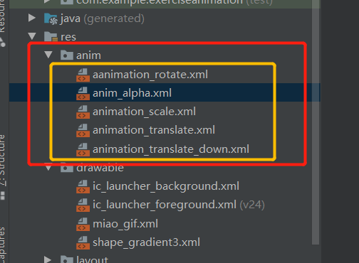
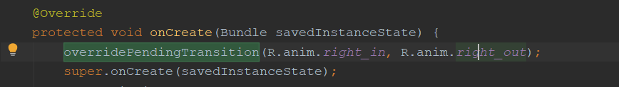
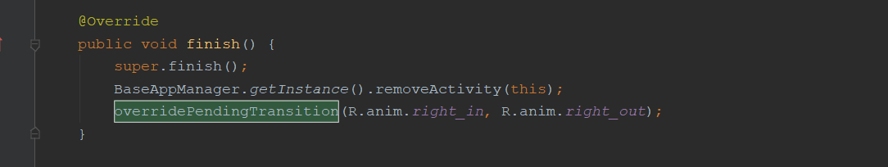

# Android的动画

[参考文章]https://www.jianshu.com/p/420629118c10

[参考文章]https://www.jianshu.com/p/0eb89d43eea4

*Android中的动画 分为三大类，***逐帧动画(Frame)***以及***补间动画(Tween)***，还有Android 3.0以后引入的***属性动画** **(Property)**

[视图动画（View 动画）](https://github.com/OCNYang/Android-Animation-Set/tree/master/view-animation)

[帧动画（Frame 动画、Drawable 动画）](https://github.com/OCNYang/Android-Animation-Set/tree/master/drawable-animation)

[属性动画](https://github.com/OCNYang/Android-Animation-Set/tree/master/property-animation)

[触摸反馈动画（Ripple Effect）](https://github.com/OCNYang/Android-Animation-Set/tree/master/ripple-animation)

[揭露动画（Reveal Effect）](https://github.com/OCNYang/Android-Animation-Set/tree/master/reveal-animation)

[转场动画 & 共享元素（Activity 切换动画）](https://github.com/OCNYang/Android-Animation-Set/tree/master/transition-animation)

[视图状态动画（Animate View State Changes）](https://github.com/OCNYang/Android-Animation-Set/tree/master/state-animation)

[矢量图动画（Vector 动画）](https://github.com/OCNYang/Android-Animation-Set/tree/master/vector-animation)

[约束布局实现的关键帧动画（ConstraintSet 动画）](https://github.com/OCNYang/Android-Animation-Set/tree/master/constraint-animation)

## 视图动画（View动画）

## View动画的一般用法

### xml文件的形式

第一步：编写xml文件

在res/anim/ 文件夹下定义如下的动画实现方式



```
<?xml version="1.0" encoding="utf-8"?>
<set xmlns:android="http://schemas.android.com/apk/res/android">
 <!-- 平移动画 -->
    <translate
        android:duration="2000"
        android:fromXDelta="0"
        android:fromYDelta="0"
        android:toXDelta="0"
        android:toYDelta="200" />
 <!-- 缩放动画 -->
    <scale
        android:duration="2000"
        android:fillAfter="true"
        android:fromXScale="1"
        android:fromYScale="1"
        android:pivotX="50%"
        android:pivotY="50%"
        android:startOffset="1000"
        android:toXScale="1.5"
        android:toYScale="1.5" />
    <!-- 旋转动画 --> 
    <rotate
        android:duration="2000"
        android:fromDegrees="0"
        android:pivotX="50%"
        android:pivotY="50%"
        android:fillAfter="true"
        android:startOffset="4000"
        android:toDegrees="45" />
         <!--透明度动画标签-->
    <alpha
        android:fromAlpha="1.0"
        android:toAlpha="0.2"
        android:duration="4000"/>
 
</set>
```

```
/** 在Activity中引用*/
animation = AnimationUtils.loadAnimation(this, R.anim.animation_translate_down);
imageView.startAnimation(animation);
animation.setFillAfter(true);//停止在变化后的位置
```

而Android中已经为我们提供了五个可供选择的实现类：

- **LinearInterpolator**：动画以均匀的速度改变
- **AccelerateInterpolator**：在动画开始的地方改变速度较慢，然后开始加速
- **AccelerateDecelerateInterpolator**：在动画开始、结束的地方改变速度较慢，中间时加速
- **CycleInterpolator**：动画循环播放特定次数，变化速度按正弦曲线改变： Math.sin(2 * mCycles * Math.PI * input)
- **DecelerateInterpolator**：在动画开始的地方改变速度较快，然后开始减速
- **AnticipateInterpolator**：反向，先向相反方向改变一段再加速播放
- **AnticipateOvershootInterpolator**：开始的时候向后然后向前甩一定值后返回最后的值
- **BounceInterpolator**： 跳跃，快到目的值时值会跳跃，如目的值100，后面的值可能依次为85，77，70，80，90，100
- **OvershottInterpolator**：回弹，最后超出目的值然后缓慢改变到目的值

而这个东东，我们一般是在写动画xml文件时会用到，属性是：**android:interpolator**， 而上面对应的值是：**@android:anim/linear_interpolator**，其实就是驼峰命名法变下划线而已 AccelerateDecelerateInterpolator对应：@android:anim/accelerate_decelerate_interpolator！透明动画：AlphaAnimation

透明度渐变效果，创建时许指定开始以及结束透明度，还有动画的持续 时间，透明度的变化范围(0,1)，0是完全透明，1是完全不透明；对应<**alpha**/>标签！

### View动画动态设置

```
@Override
public void onClick(View v) {
    switch (v.getId()) {
        //放大: 1.0：不变，>1.0:放大，<1.0:缩小
        case R.id.btn1：
            ScaleAnimation scaleAnimation = new ScaleAnimation(1, 1.5f, 1, 1.5f);
            scaleAnimation.setDuration(3000);
            set.addAnimation(translateAnimation1);
            set.addAnimation(scaleAnimation);
            imageView.startAnimation(scaleAnimation);
            scaleAnimation.setFillAfter(true);//动画停止以后是否停止在动画结束的位；
            break;
        //上移：-200:上移，200：下移
        case R.id.btn2:
            TranslateAnimation translateAnimation = new TranslateAnimation(-centerX, 0, -centerY, -200);
            translateAnimation.setDuration(3000);
            imageView.startAnimation(translateAnimation);
            translateAnimation.setFillAfter(true)；
            break;
        //旋转四十度加速下落
        case R.id.btn3:
           AnimationSet  set = new AnimationSet(false);//动画的集合
            RotateAnimation rotateAnimation = new RotateAnimation(0, rotation);
            TranslateAnimation translateAnimation2 = new TranslateAnimation(-centerX, 0, -centerY, 200);
            translateAnimation2.setDuration(3000);
            rotateAnimation.setDuration(3000);
            set.addAnimation(rotateAnimation);
            set.addAnimation(translateAnimation2);
            imageView.startAnimation(set);
            set.setFillAfter(true);
            break;
    }
```

### View动画的属性详解

- Animation属性详解：

  |          xml属性          |                           java方法                           |                            解释                            |
  | :-----------------------: | :----------------------------------------------------------: | :--------------------------------------------------------: |
  |     android:duration      |                      setDuration(long)                       |                  动画持续时间，毫秒为单位                  |
  | android:ShareInterpolator |                setInterpolator(Interpolator)                 |          设定插值器（指定的动画效果，譬如回弹等）          |
  |     android:fillAfter     |                    setFillAfter(boolean)                     |            控件动画结束时是否保持动画最后的状态            |
  |    android:fillBefore     |                    setFillBefore(boolean)                    |          控件动画结束时是否还原到开始动画前的状态          |
  |    android:repeatMode     |                      setRepeatMode(int)                      | 重复类型有两个值，reverse表示倒序回放，restart表示从头播放 |
  |    android:startOffset    | setStartOffset(long)<span class="Apple-tab-span" style="white-space:pre"></span> |      调用start函数之后等待开始运行的时间，单位为毫秒       |

- TranslateAnimation属性详解：

  |      xml属性       |                  java方法                  |                    解释                     |
  | :----------------: | :----------------------------------------: | :-----------------------------------------: |
  | android:fromXDelta |  TranslateAnimation(float fromXDelta, …)   | 起始点X轴坐标，数值，百分比，百分比p，*注①* |
  | android:fromYDelta | TranslateAnimation(…, float fromYDelta, …) |           起始点Y轴从标，同上规律           |
  |  android:toXDelta  |  TranslateAnimation(…, float toXDelta, …)  |           结束点X轴坐标，同上规律           |
  |  android:toYDelta  |   TranslateAnimation(…, float toYDelta)    |           结束点Y轴坐标，同上规律           |

  **注①：** 数值、百分数、百分数p，譬如50表示以当前View左上角坐标加50px为初始点、50%表示以当前View的左上角加上当前View宽高的50%做为初始点、50%p表示以当前View的左上角加上父控件宽高的50%做为初始点

- ScaleAnimation属性详解：

  |      xml属性       |              java方法              |                     解释                      |
  | :----------------: | :--------------------------------: | :-------------------------------------------: |
  | android:fromXScale |   ScaleAnimation(float fromX, …)   |        初始X轴缩放比例，1.0表示无变化         |
  |  android:toXScale  |  ScaleAnimation(…, float toX, …)   |                结束X轴缩放比例                |
  | android:fromYScale | ScaleAnimation(…, float fromY, …)  |                初始Y轴缩放比例                |
  |  android:toYScale  |  ScaleAnimation(…, float toY, …)   |                结束Y轴缩放比例                |
  |   android:pivotX   | ScaleAnimation(…, float pivotX, …) | 缩放起点X轴坐标，数值，百分比，百分比p，*注①* |
  |   android:pivotY   |  ScaleAnimation(…, float pivotY)   |           缩放起点Y轴坐标，同上规律           |

- RotateAnimation属性详解：

  |       xml属性       |                Java方法                |                       解释                       |
  | :-----------------: | :------------------------------------: | :----------------------------------------------: |
  | android:fromDegrees | RotateAnimation(float fromDegrees, …)  | 旋转开始角度，正代表顺时针度数，负代表逆时针度数 |
  |  android:toDegrees  | RotateAnimation(…, float toDegrees, …) | 旋转结束角度，正代表顺时针度数，负代表逆时针度数 |
  |   android:pivotX    |  RotateAnimation(…, float pivotX, …)   |  缩放起点X坐标，数值，百分比，百分比p，**注①**   |
  |   android:pivotY    |    RotateAnimation(…, float pivotY)    |             缩放起点Y坐标，同上规律              |

- AlphaAnimation属性详解：

  |      xml属性      |              java方法              |                          解释                          |
  | :---------------: | :--------------------------------: | :----------------------------------------------------: |
  | android:fromAlpha | AlphaAnimation(float fromAlpha, …) | 动画开始的透明度（0.0到1.0，0.0是全透明，1.0是不透明） |
  |  android:toAlpha  |  AlphaAnimation(…, float toAlpha)  |                 动画结束的透明度，同上                 |

- AnimationSet属性详解：
  AnimationSet继承自Animation，是上面四种的组合容器管理类，没有自己特有的属性，他的属性继承自Animation，所以特别注意，***当我们对set标签使用Animation的属性时会对该标签下的所有子控件都产生影响。\***譬如我们在set标签下加入duration=“1000”，子控件的duration属性会失效。

##  View动画的特殊用法

比如在ViewGroup中可以控制子元素的出场效果，在Activity中可以实现不同Activity之间的切换效果。

### 切换Activity时的动画

**overridePendingTransition(A，B)解析**

Activity有默认的切换效果，但是这个效果我们是可以自定义的，主要用到overridePendingTransition(int enterAnim, int exitAnim)这个方法，这个方法必须在startActivity(Intent)或者finish()之后被调用才能生效，它的参数含义如下：· enterAnim——Activity被打开时，所需的动画资源id；· exitAnim——Activity被暂停时，所需的动画资源id。

overridePendingTransition这个方法必须位于startActivity或者finish的后面，否则动画效果将不起作用。





### 2.2  LayoutAnimation

## 自定义动画

只需要继承Animation这个抽象类，然后重写它的initialize和applyTransformation方法，在 initialize方法中做一些初始化工作，在applyTransformation方法中进行相应的矩阵变换即可，很多时候需要采用Camera来简化矩阵变换的过程。

### Android-ColorTrackView（设置变化）

【参考文章】https://blog.csdn.net/weixin_34405925/article/details/92294764

```
mColorTrackView = findViewById(R.id.color_view);
mColorTrackView.setDirection(0);
ObjectAnimator.ofFloat(mColorTrackView, "progress", 0, 1).setDuration(2000).start();
```

## 动画的监听

```
Animation.addListener(newAnimatorListener() {
    @Override
    public void onAnimationStart (Animation animation){
        //动画开始时执行
    }

    @Override
    public void onAnimationRepeat (Animation animation){
        //动画重复时执行
    }

    @Override
    public void onAnimationCancel () (Animation animation){
        //动画取消时执行
    }

    @Override
    public void onAnimationEnd (Animation animation){
        //动画结束时执行
    }
});
```

## 逐帧动画(Frame)

原理：就是将一张图片（图片为一系列动作下的图片）进行连续的播放

*在有些代码中，我们还会看到android：oneshot="false" ，这个oneshot 的含义就是动画执行一次（true）还是循环执行多次。*

步骤：

第一步：放置一系列图片资源放到res/drawable下面，并且写一个res/drawabale/xx.xml文件，定义animation-list动画，animation-list定义的动画将顺次从上往下执行，设置oneshot=false则反复循环执行，true则执行一次。

第二步：在对应的Activity中设置ImageView,将src= xx.xml,或者background = xx.xml，

第三步：代码中启动或停止

```
private AnimationDrawable anim;
 anim = (AnimationDrawable) img_show.getBackground();
//src的时候 anim= (AnimationDrawable) mImageView.getDrawable()；
 anim.start();
```


## 属性动画** 

【参考文章】https://blog.csdn.net/qq475703980/article/details/93243968?utm_medium=distribute.pc_relevant_t0.none-task-blog-BlogCommendFromBaidu-1.control&depth_1-utm_source=distribute.pc_relevant_t0.none-task-blog-BlogCommendFromBaidu-1.control

【参考文章】https://carsonho.blog.csdn.net/article/details/79860980?utm_medium=distribute.pc_relevant.none-task-blog-BlogCommendFromBaidu-1.control&depth_1-utm_source=distribute.pc_relevant.none-task-blog-BlogCommendFromBaidu-1.control


相对于View animation，功能更加强大的。而且是真正的视图移动，点击移动后的视图会有点击效果。属性动画有两个类：**ValueAnimator**和**ObjectAnimator。**

**ValueAnimator：可以设置开始值和结束值来动态改变view的移动位置**

**ObjectAnimator：功能更加强大，可以控制位移、透明度、旋转、缩放。**

## ObjectAnimator

可实现平移、旋转、透明度、颜色、背景色等。

```
/*ObjectAnimator的使用*/
fun playObjectAnimation () {
  AnimatorSet set = AnimatorSet()
  //控制透明度的，我用ofInt没好使，还是用float吧
   ObjectAnimator animator1 = ObjectAnimator.ofFloat(photo_id, "alpha", 0f, 1f) 
    animator1 ?.duration = 2000
    //延X轴移动
  ObjectAnimatoranimator2 = ObjectAnimator.ofFloat(photo_id, "translationX", 0f, 300f)
    animator2 ?.duration = 2000
    animator2 ?.interpolator = DecelerateInterpolator()
    //延y轴移动,起始位置和结束位置
   ObjectAnimator animator3 = ObjectAnimator.ofFloat(photo_id, "translationY", 0f, 500f, 200f)
    animator3 ?.duration = 2000
    animator3 ?.interpolator = DecelerateInterpolator()
    //沿X轴旋转
   ObjectAnimator animator4 = ObjectAnimator.ofFloat(photo_id, "rotationX", 0f, 720f)
    animator4 ?.duration = 2000
    //沿Y轴旋转
    ObjectAnimator animator5 = ObjectAnimator.ofFloat(photo_id, "rotationY", 0f, 720f)
    animator5 ?.duration = 2000
    //缩放,可以根据X轴和Y轴缩放
    ObjectAnimator animator6 = ObjectAnimator.ofFloat(photo_id, "scaleX", 0f, 4f, 2f)
    animator6 ?.duration = 3000
    //改变颜色
   ObjectAnimator animator7 = ObjectAnimator.ofInt(photo_id, "backgroundColor", Color.RED, Color.BLUE, Color.GRAY, Color.GREEN)
    animator7 ?.duration = 2000
    set.play(animator1).before(animator2) //先执行anim动画之后在执行anim2
    set.play(animator2).before(animator3)
    set.play(animator3).before(animator4)
    set.play(animator4).before(animator5)
    set.play(animator5).before(animator6)
    set.play(animator6).before(animator7)
    set.start()
}
```

# 自定义View

