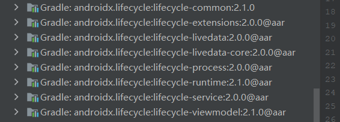

# JetPack

Android 复习资料汇总
https://github.com/733gh/GH-Android-Review-master
高级面试
https://github.com/733gh/Android-Notes
Jetpack架构组件简析与AndroidX


Android Jetpack架构组件(三)之ViewModel
https://zhuanlan.zhihu.com/p/334996058
Android Jetpack架构组件(四)之LiveData
https://zhuanlan.zhihu.com/p/336566452
Android Jetpack架构组件(五)之Navigation
https://zhuanlan.zhihu.com/p/338437260
Android Jetpack架构组件(六)之Room
https://segmentfault.com/a/1190000038623117
Android Jetpack架构组件(七)之WorkManager
https://zhuanlan.zhihu.com/p/340360085

Android Jetpack架构组件(八)之DataBinding
https://zhuanlan.zhihu.com/p/340910179
Android Jetpack架构组件(九)之Paging
https://segmentfault.com/a/1190000038953354
Android Jetpack架构组件(十)之Slices
https://my.oschina.net/u/241554/blog/5240036

Android Jetpack架构组件(十一)之
Android Jetpack架构组件(十二)之Hilt
https://segmentfault.com/a/1190000039039120?utm_source=tag-newest

## Jetpack架构组件简析与AndroidX

参考学习1：https://segmentfault.com/a/1190000037626996

参考学习2：https://www.jianshu.com/p/0650c9489ca8

Android Jetpack组件主要分为四大类：

- 基础 - Foundation

- 架构 - Architecture

- 行为 - Behavior

- 界面 - UI

  

databinding进行数据的绑定，单向或者双向。viewmodel进行数据管理，绑定view和数据。lifecycle进行生命周期管理。LiveData进行数据的及时反馈。

**Navigation**：一个用于管理`Fragment`切换的工具类，可视化、可绑定控件、支持动画等是其优点。

**Data Binding**：不用说，都知道，加速`MVVM`的创建。

**Lifecycle**：虽然我没有写文章介绍，但是不代表它的作用不够强大，他是我们能够处理`Activity`和`Fragment`的生命周期的重要原因，在`AndroidX`的`Fragment`和`Activity`已经对`Lifecycle`提供了默认支持。

**ViewModel**：当做`MVVM`的`ViewModel层`，并具有声明周期意识的处理和UI相关的数据。

**LiveData**：同`RxJava`的作用一样，对数据进行监听，优点就是无需处理生命周期、无内存泄漏等。

**Room**：强大的ORM数据库框架。

**Paging**：易于使用的数据分页库，支持`RecyclerView`。

**WorkManager**：灵活、简单、延迟和保证执行的后台任务处理库。
链接：https://juejin.cn/post/6844903889574051848

## Android Jetpack架构组件(一)与AndroidX

参考学习：https://zhuanlan.zhihu.com/p/269437734

## Android Jetpack架构组件(二)之Lifecycle

参考学习：https://www.jianshu.com/p/32f1d226107f

参考学习：https://www.jianshu.com/p/09d6b3d8c3de

### 背景

Lifecycle用来管理Activity和fragment的生命周期

在Android开发中开发中，普通的组件一般要依赖于系统的组件，有时候，我们不得不在系统组件中去管理普通组件

我们希望我们对自定义组件的管理，不依赖于页面生命周期的回调方法。同时，在页面生命周期发生变化时，也能够及时收到通知。这在组件化和架构设计中显得尤为重要

为此，Google提供了LifeCycle作为解决方案。LifeCycle可以帮助开发者创建可感知生命周期的组件。这样，组件便能够在其内部管理自己的生命周期，从而降低模块间的耦合度，并降低内存泄漏发生的可能性

### 使用

导入依赖：

```java
implementation "android.arch.lifecycle:extensions:1.1.1"
```

当导入成功以后就添加了这些库



### LifeCycIe的原理

参考学习：https://www.jianshu.com/p/09d6b3d8c3de

Jetpack为我们提供了两个类：LifecycleOwner（被观察者）和LifecycleObserver（观察者）。即通过观察者模式，实现对页面生命周期的监听。


### 使用

第一步：对于组件中那些需要在页面生命周期发生变化时得到通知的方法，我们让该组件实现LifecycleOwner，并我们需要在这些方法上使用**＠OnLifecycleEvent（Lifecycle.Event.ON_XXX）**标签进行标识。这样，当页面生命周期发生变化时，这些被标识过的方法便会被自动调用

第二步：在系统组件中 getLifecycle().addObserver(new MyObserver())

### **自定义LifecycleOwner**

如果想实现自定义LifecycleOwner，可以使用LifecycleRegistry，它是Lifecycle的实现类。

### LifecycleService

在Android开发中除了Activity和fragment有生命周期意外，service服务

为了便于对Service生命周期的监听，达到解耦Service与组件的目的，Android提供了一个名为LifecycleService的类。该类继承自Service，并实现了LifecycleOwner接口

其源码：

```
public class LifecycleService extends Service implements LifecycleOwner {

    private final ServiceLifecycleDispatcher mDispatcher = new ServiceLifecycleDispatcher(this);

    @CallSuper
    @Override
    public void onCreate() {
        mDispatcher.onServicePreSuperOnCreate();
        super.onCreate();
    }

    @CallSuper
    @Nullable
    @Override
    public IBinder onBind(Intent intent) {
        mDispatcher.onServicePreSuperOnBind();
        return null;
    }

    @SuppressWarnings("deprecation")
    @CallSuper
    @Override
    public void onStart(Intent intent, int startId) {
        mDispatcher.onServicePreSuperOnStart();
        super.onStart(intent, startId);
    }

    // this method is added only to annotate it with @CallSuper.
    // In usual service super.onStartCommand is no-op, but in LifecycleService
    // it results in mDispatcher.onServicePreSuperOnStart() call, because
    // super.onStartCommand calls onStart().
    @CallSuper
    @Override
    public int onStartCommand(Intent intent, int flags, int startId) {
        return super.onStartCommand(intent, flags, startId);
    }

    @CallSuper
    @Override
    public void onDestroy() {
        mDispatcher.onServicePreSuperOnDestroy();
        super.onDestroy();
    }

    @Override
    public Lifecycle getLifecycle() {
        return mDispatcher.getLifecycle();
    }
}
```

### ProcessLifecycIeOwner

具有生命周期的系统组件除Activity、Fragment、Service外，还有Application。很多时候

使用和其他的一样，添加依赖，让其实现，让该类实现LifecycleObserver接口，以负责对应用程序生命周期的监听。

