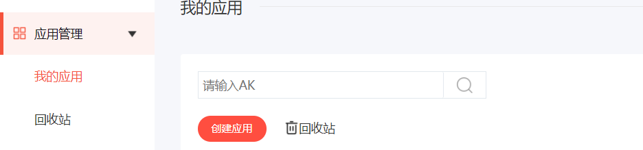
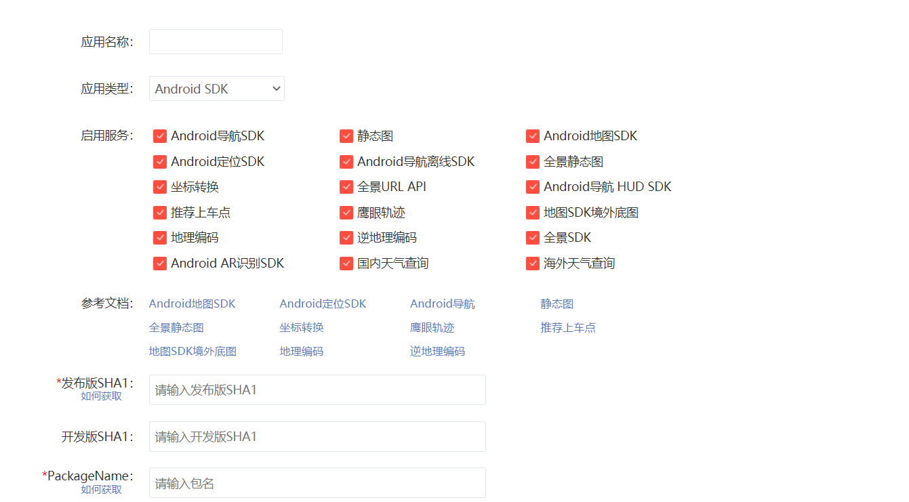
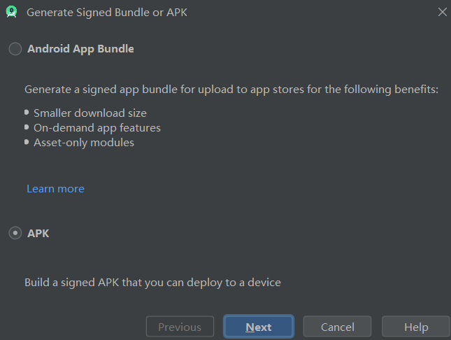
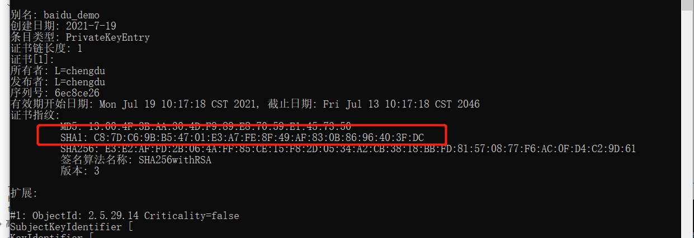
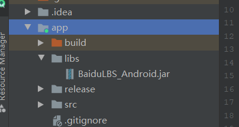
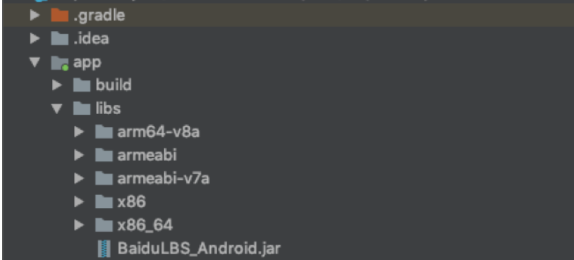
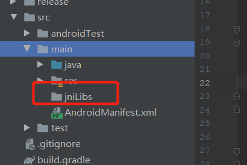
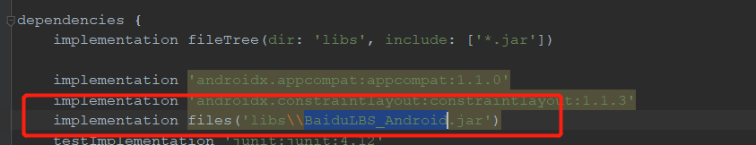
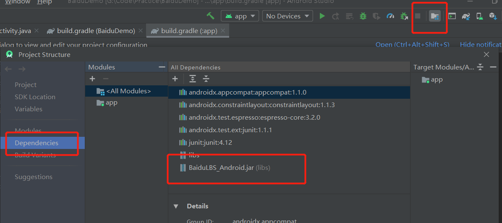

# 地图

## 百度地图

### 配置

[参考官方文档](https://lbsyun.baidu.com/index.php?title=android-locsdk/guide/create-project/key)

**获取AK的流程大致可分为如下四个步骤：（1）登录API控制台；（2）创建应用；（3）配置SHA1和包名；（4）提交生成AK。**

#### **登录API控制台**

API控制台的地址为：http://lbsyun.baidu.com/apiconsole/key

#### **创建应用**

进入控制台以后，选择我的应用-点击"创建应用"，进入创建AK页面，输入应用名称，将应用类型改为：“Android SDK”：



#### **填写信息**



#### **获取SHA1**

1,生成项目得签名

chenhao

2.生成以后在签名文件jks在的目录下打开cmd,在控制面板输入keytool -list -v -keystore debug.keystore；




这时候将生成了的SHA1,填入创建的应用中，包名必须和项目的包名一致哦，当所有的信息填写完成以后，这时候就生成了key

最后将生成的key配置在AndroidManifest.xml中

```
<!-- 百度定位 -->
<meta-data
    android:name="com.baidu.lbsapi.API_KEY"
    android:value="tpRWX6BkG4tIftUyp09IODGGyzGhogsP" />
```

### 创建地图

[官方开发文档](https://lbsyun.baidu.com/index.php?title=androidsdk/guide/create-project/androidstudio)

首先下载jar包https://lbsyun.baidu.com/index.php?title=androidsdk/sdkandev-download

下载完成以后在Android工程中引用jar和so文件

#### 1、添加jar文件

   打开解压后的开发包文件夹，找到BaiduLBS_Android.jar文件将其拷贝至工程的app/libs目录下，如图：



#### 2、添加so文件

 有两种方法可以往项目中添加so文件。
   **方法一：**
  在下载的开发包中拷贝需要的CPU架构对应的so文件文件夹到app/libs目录下



 在app目录下的build.gradle文件中android块中配置sourceSets标签，如果没有使用该标签则新增，详细配置代码如下：

```
sourceSets {
           main {
               jniLibs.srcDir 'libs'
           }
    }
```

注意：Jar文件和so文件的版本号必须一致，并且保证Jar文件与so文件是同一版本包取出的。

**方法二：**
   在src/main/目录下新建jniLibs目录（如果您的项目中已经包含该目录不用重复创建），在下载的开发包中拷贝项目中需要的CPU架构对应的so文件文件夹到jniLibs目录，如图




#### 3，往工程中添加jar文件

 **方法一：**
    在libs目录下，选中每一个jar文件（此处只有一个BaiduLbs_Android.jar）右键，选择Add As Library…，如图：


此时会发现在app目录的build.gradle的dependencies块中生成了工程所依赖的jar文件的对应说明，如下所示：



**方法二：**



#### 地图显示

当开发百度地图配置完成且密钥（AK）配置完成，权限也设置完成以后，就可以添加地图容器了

**第一步 配置AndroidManifest.xml文件**

1.在<application>中加入如下代码配置开发密钥（AK）：

```
<application>  
    <meta-data  
        android:name="com.baidu.lbsapi.API_KEY"  
        android:value="开发者 key" />  
</application>
```

2. 在<application/>外部添加如下权限声明：

```
<!-- 访问网络，进行地图相关业务数据请求，包括地图数据，路线规划，POI检索等 -->
<uses-permission android:name="android.permission.INTERNET" />
<!-- 获取网络状态，根据网络状态切换进行数据请求网络转换 -->
<uses-permission android:name="android.permission.ACCESS_NETWORK_STATE" />
    
<!-- 读取外置存储。如果开发者使用了so动态加载功能并且把so文件放在了外置存储区域，则需要申请该权限，否则不需要 -->
<uses-permission android:name="android.permission.READ_EXTERNAL_STORAGE" />
<!-- 写外置存储。如果开发者使用了离线地图，并且数据写在外置存储区域，则需要申请该权限 -->
<uses-permission android:name="android.permission.WRITE_EXTERNAL_STORAGE" /> 
```

**第二步 在布局文件中添加地图容器**

#### 地图类型

#### 定位

#### 离线地图

### 与地图交互

- 地图Logo
- 指南针
- 比例尺
- 缩放按钮
- 地图手势

  - 地图平移
  - 地图缩放
  - 地图旋转
  - 禁止所有手势
  - 双击地图是否按中心点放大
- 事件交互

  - key验证事件监听
  - 地图事件监听

    - 地图状态改变接口
    - 单击事件监听
    - 双击事件监听
    - 长按事件监听
    - 地图 Marker 覆盖物点击事件监听
- 方法交互

  - 改变地图缩放等级
  - 设置地图操作区域和屏幕的边的距离
  - 设置地图显示范围
  - 改变地图类型和控件显示状
  - 改变地图手势对的中心点
  - 隐藏地图标注
- 地图覆盖物

### 在地图上绘制

- 绘制点

  - 点标记
  - 添加Marker
  - Marker点击和拖拽操作
  - 绘制自定义Marker
  - POI底图标注

- 绘制线

  - 绘制折线
  - 绘制虚线
  - 分段颜色绘制折线
  - 分段纹理绘制折线

- 绘制弧线和面

  - 绘制弧线
  - 绘制圆
  - 绘制多边形

- 添加文字和信息窗

  - 文字覆盖物
  - 添加信息窗（弹窗覆盖物InfoWindow）

- 批量添加和删除

  - 批量删除

    - mBaiduMap.clear();

  - 批量添加

    - mBaiduMap.addOverlays(options);

### 检索地图数据

- POI检索
- 地点输入提示检索
- 地理编码
- 检索行政区边界数据

### 路线规划

- 驾车路线规划
- 步行路线规划
- 骑行路线规划

### 工具

- 距离和面积计算
- 坐标转换

### 官网：https://lbsyun.baidu.com/index.php?title=androidsdk/guide/tool/coordinate

## 高德地图

### 目录参考百度地图

### 官网：https://lbs.amap.com/api/android-sdk/sdk-code-samples

## Arcgis for Android 

官网：https://developers.arcgis.com/android/ui-components/

### 地图

- 显示一个 底图图层 例如街道或卫星图像。
- 访问和显示 数据层基于文件、数据库或服务，包括您创作的数据。使用门户 API 使用来自 ArcGIS Online 或 ArcGIS Enterprise 门户的内容和服务。
- 为显示为的临时点、线、多边形或文本提供上下文 图形.
- 测量距离并探索之间的空间关系 几何图形.
- 检查 特征 从数据层和视图 属性 描述他们。
- 将图层集合另存为 网络地图 在 ArcGIS 平台上共享。
- 旋转 地图视图.
- 根据属性值、感兴趣区域或时间范围过滤要素的显示。
- 集成本地设备功能，例如 GPS、相机、日历和联系人。
- 在与网络断开连接（离线）的情况下使用地图和图层。

### 图层和数据

- 使用多种格式的空间数据（数据层)，例如托管 ArcGIS 服务、开放街道地图、KML、WFS、WMTS、Shapefile 等。
- 在与网络连接或断开连接时使用图层。
- 处理非空间数据和表格。
- 使用户能够在现场收集和编辑数据，并与您的企业级地理数据库同步编辑。


*XMind - Evaluation Version*

