通过坚持学习，记录下每天的成长，希望可以成为想成为的人

***202/12/16.第一天***

# 第1章Activity的生命周期和启动模式以及IntentFilter的匹配规则。

## 1.1 Activity的生命周期全面分析 

在开发的过程中，Activity作为使用最平凡的组件，官方文档中，翻译为活动，作者将其翻译为界面，用于展示UI的效果，本书作为一本进阶开发书籍。作为很重要的组件，理解其生命周期是相当重要的，第一章，作者主要从Activity开发中遇到的问题入手，让我们跟随作者的脚步探索这本书带给我们的惊喜

**生命周期**：  当我们开发一个项目的时候，离不开Activity的配合，一个活动从开始到结束经历了各种的状态，从一个状态到另一个状态的转换，，这样一个过程就是生命周期，当我们需要对UI进行展示的时候，Activity本身会调用自身的生命周期来配合我们Ui界面的展示工作。

**Activity的生命周期**主要讲解一下两方面**

- 典型情况下的生命周期
- 异常情况下的生命周期

### 典型情况下的生命周期

*典型情况下的生命周期，是指在有用户参与的情况下，Activity所经过的生命周期的改变；*

- onCreate():这是Activty的调用的第一个方法，表示活动正在创建，这时候活动也是不可见的，可以通过setContentView来加载布局资源，做一些初始化的工作。

- onRestart();表示活动正在重新启动，一般情况下，当活动由不可见变为可见的时候会调用此方法，当用户点击home或者打开其他Activity时候，onPause和onStop被执行了，接着用户又回到了这个Activity，就会出现这种情况。

- onStart：表示Activity正在被启动，即将开始，这时Activity已经可见了，但是还没有出现在前台，还无法和用户交互。这个时候其实可以理解为Activity已经显示出来了，但是我们还看不到。

- ）onResume：表示Activity已经可见了，并且出现在前台并开始活动。要注意这个和onStart的对比，onStart和onResume都表示Activity已经可见，但是onStart的时候Activity还在后台，onResume的时候Activity才显示到前台.

- onPause：表示Activity正在停止，正常情况下，紧接着onStop就会被调用。在特殊情况下，如果这个时候快速地再回到当前Activity，那么onResume会被调用。笔者的理解是，这种情况属于极端情况，用户操作很难重现这一场景。此时可以做一些存储数据、停止动画等工作，但是注意不能太耗时，因为这会影响到新Activity的显示，onPause必须先执行完，新Activity的onResume才会执.

  **什么时候会执行onPuse**
  第一种：启动一个新的Activity

  第二种：返回上一个Activity

  *可以理解为当需要其他 Activity，当前的 Activity 必须先把手头的工作暂停下来，再来把当前的界面空间交给下一个需要界面的 Activity，而 onPause()方法可以看作是一个转接工作的过程，因为屏幕空间只有那么一个，每次只允许一个 Activity 出现在前台进行工 作。通常情况下 onPause()函数不会被单独执行，执行完 onPause()方法后会继续执行onStop()方法，执行完 onStop()方法才真正意味着当前的 Activity 已经退出前台，存在于后台。*

- onStop：表示Activity即将停止，可以做一些稍微重量级的回收工作，同样不能太耗时。

- onDestroy：表示Activity即将被销毁，这是Activity生命周期中的最后一个回调，在这里，我们可以做一些回收工作和最终的资源释放。

  

​                                                                             **Activity生命周期的切换过程**

**说明****

(1)第一次启动Activity:OnCreate()->OnStart()->onResume()

 (2)当启动新的Activity或者退出到桌面的时候：调用OnPause()->onStop(),*当新启动的Activity主题为透明到的时候，不调用onStop*

(3)当从桌面回到Activity中的时候，调用OnReStart->onStart()->onResume

(4)当按back回退的时候，调用onPause -> onStop -> onDestroy。

（5）当Activity被系统回收后再次打开，生命周期方法回调过程和（1）一样，注意只是生命周期方法一样，不代表所有过程都一样，这个问题在下一节会详细说明。

（6）从整个生命周期来说，onCreate和onDestroy是配对的，分别标识着Activity的创建和销毁，并且只可能有一次调用。从Activity是否可见来说，onStart和onStop是配对的，随着用户的操作或者设备屏幕的点亮和熄灭，这两个方法可能被调用多次；从Activity是否在前台来说，onResume和onPause是配对的，随着用户操作或者设备屏幕的点亮和熄灭，这两个方法可能被调用多次

注意：**问题1:onStart和onResume、onPause和onStop从描述上来看差不多，对我们来说有什么实质的不同呢**

**区别在于是否出现在前台**

onStart和onStop:可见，没出现在前台，仅仅出现在后台，因此我们看不见

onResume和onPause：不仅可见，还出现在前台，我们可以看见

举例说明：

MainActivity

```
@Override
protected void onCreate(Bundle savedInstanceState) {
    super.onCreate(savedInstanceState);
    setContentView(R.layout.activity_main);
    Log.d("MainActivity", "onCreate");
    initView();
}

@Override
protected void onStart() {
    super.onStart();
    Log.d("MainActivity", "onStart");
}

@Override
protected void onResume() {
    super.onResume();
    Log.d("MainActivity", "onResume");

}

@Override
protected void onPause() {
    super.onPause();
    Log.d("MainActivity", "onPause");

}

@Override
protected void onStop() {
    super.onStop();
    Log.d("MainActivity", "onStop");

}

@Override
protected void onDestroy() {
    super.onDestroy();
    Log.d("MainActivity", "onDestroy");

}

```

打印日志：****

启动MainActivity

按home键退出MainActivity到桌面

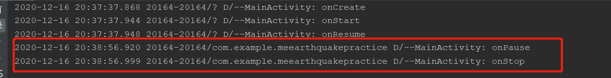

重新进入到MainActivity

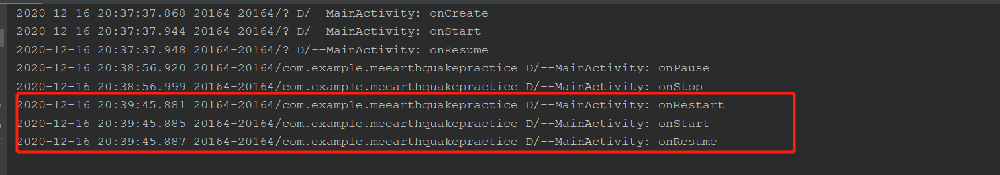

从MainActivity到SecordActivity

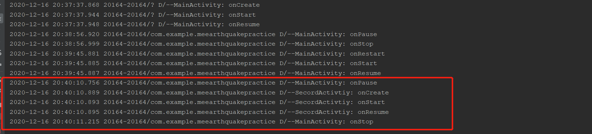

再从SecordActivity返回到MainActivtiy

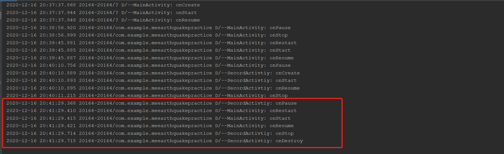

### 异常情况下的生命周期

**异常情况下的生命周期主要有以下几种情况**

#### 情况1：资源相关的系统配置发生改变导致Activity被杀死并重新创建

[参考文章]https://www.cnblogs.com/huaranmeng/p/13804144.html

比如：手机从横屏到竖屏Actvity的生命周期的变化

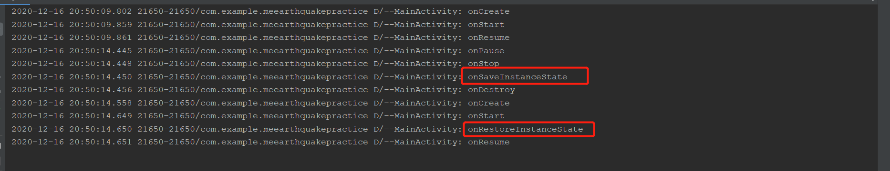

当手机为竖屏的时候，转换为横屏时候调用onPause()和onStop()

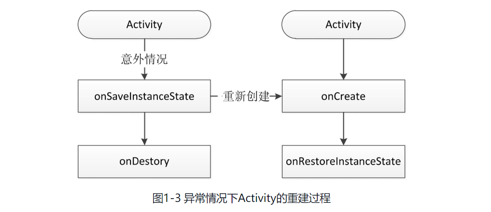

*当系统发生改变的时候，Activity调用onSaveInsatance来保存当前的状态*

当系统配置发生改变后，Activity会被销毁，其onPause、onStop、onDestroy均会被调用，同时由于Activity是在异常情况下终止的，系统会调用onSaveInstanceState来保存当前Activity的状态。这个方法的调用时机是在onStop之前，它和onPause没有既定的时序关系，它既可能在onPause之前调用，也可能在onPause之后调用。需要强调的一点是，这个方法只会出现在Activity被异常终止的情况下，正常情况下系统不会回调这个方法。当Activity被重新创建后，系统会调用onRestoreInstanceState，并且把Activity销毁时onSaveInstanceState方法所保存的Bundle对象作为参数同时传递给onRestoreInstanceState和onCreate方法。因此，我们可以通过onRestoreInstanceState和onCreate方法来判断Activity是否被重建了，如果被重建了，那么我们就可以取出之前保存的数据并恢复，从时序上来说，onRestoreInstanceState的调用时机在onStart之后。

#### 情况2：资源内存不足导致低优先级的Activity被杀死

当系统内存不足时，系统就会按照上述优先级去杀死目标Activity所在的进程，并在后续通过onSaveInstanceState和onRestoreInstanceState来存储和恢复数数据

**强制Activity横屏和竖屏**

找到清单文件AndroidMainfest，在需要的Activity设置

```
<activity
    android:name=".ui.start.register.RegisterActivity"
    android:screenOrientation="portrait" />
<activity
    android:name=".tool.permission.AcpActivity"
    android:screenOrientation="portrait" />
```

系统配置中有很多内容，如果当某项内容发生改变后，我们不想系统重新创建Activity，可以给Activity指定configChanges属性。

**比如不想让Activity在屏幕旋转的时候重新创建，就可以给configChanges属性添加orientation这个值，在配置了这个属性后，android:configChanges 属性就会捕获“屏幕方向”和“键盘显示隐藏”变化，当捕获到这些变化后会调用Activity的onConfigurationChanged()方法。** 
然而上面的配置只在android4.0之前的版本起作用，在android 4.0 以上不起作用，必须要加上screenSize,也就是说android 4.0以后的版本必须这样配置（**注意在配置文件中**）

```
android:configChanges="keyboardHidden|orientation|screenSize"
```

比如，当没有设置configChanges的时候，切换横竖屏

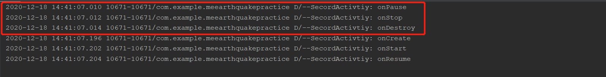

如果设置了加上android:configChanges=”keyboardHidden|orientation|screenSize”再进行旋转日志如下：

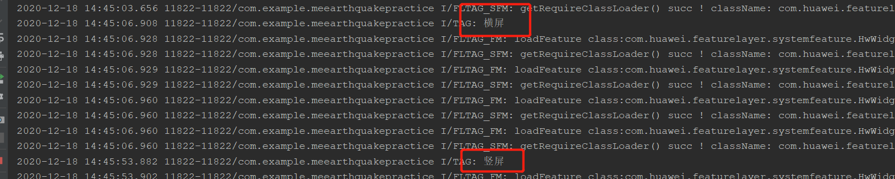

注：configChanges 和screenOrientation的区别

- 在manifest.xml 文件对象activity中添加 android:configChanges 用于捕获手机状态的改变，不设置Activity的android:configChanges时，切屏会重新调用各个生命周期，切横屏时会执行一次，切竖屏时会执行两次。

  ```
  如果不希望重新创建Activity实例，xml配置添加如下
   * android:configChanges="keyboardHidden|orientation|screenSize"
  ```

```
 * 手动设置修改屏幕变化
 * android:screenOrientation 控制变化
 * unspecified，默认值，由系统决定，不同手机可能不一致
 * landscape，强制横屏显示
 * portrait，强制竖屏显
 * behind，与前一个activity方向相同
 * sensor，根据物理传感器方向转动，用户90度、180度、270度旋转手机方向，activity都更着变化
 * sensorLandscape，横屏旋转，一般横屏游戏会这样设置
 * sensorPortrait，竖屏旋转
 * nosensor，旋转设备时候，界面不会跟着旋转。初始化界面方向由系统控制
 * user，用户当前设置的方向
```

```
<p>
 * 1、设置横屏代码：setRequestedOrientation(ActivityInfo.SCREEN_ORIENTATION_LANDSCAPE);//横屏
 * xml文件中设置横屏 android:screenOrientation="landscape"
 * <p>
 * 2、设置竖屏代码：setRequestedOrientation(ActivityInfo.SCREEN_ORIENTATION_PORTRAIT);//竖屏
 * xml文件中设置横屏 android:screenOrientation="portrait"
 * <p>
 * 先判断是否为横竖屏再切屏
 * if(this.getResources().getConfiguration().orientation ==Configuration.ORIENTATION_PORTRAIT){
 * setRequestedOrientation(ActivityInfo.SCREEN_ORIENTATION_LANDSCAPE);
```

## 1.2 Activity的启动模式

[参考文章]https://blog.csdn.net/zy_jibai/article/details/80587083

### 一：启动之前必须了解的知识

来修改系统的默认行为。目前有四种启动模式：standard、singleTop、singleTask和singleInstance

 在正式的介绍Activity的启动模式之前，我们首先要了解一些旁边的知识，这些知识如果说模糊不清，那么在讨论启动模式的时候会一头雾水（笔者亲身感悟）。

1.一个应用程序通常会有多个Activity，这些Activity都有一个对应的action（如MainActivity的action），我们可以通过action来启动对应Activity（隐式启动）。

```java
<action android:name="android.intent.action.MAIN" />
```

2.一个应用程序可以说由一系列组件组成，这些组件以进程为载体，相互协作实现App功能。

3.任务栈（Task Stack）或者叫退回栈（Back Stack）介绍：

> 3.1.任务栈用来存放用户开启的Activity。
>
> 3.2.在应用程序创建之初，系统会默认分配给其一个任务栈（默认一个），并存储根Activity。
>
> 3.3.同一个Task Stack，只要不在栈顶，就是onStop状态：
>
> 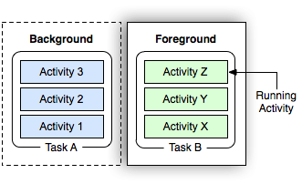
>
> 3.4.任务栈的id自增长型，是Integer类型。
>
> 3.5.新创建Activity会被压入栈顶。点击back会将栈顶Activity弹出，并产生新的栈顶元素作为显示界面（onResume状态）。
>
> 3.6.当Task最后一个Activity被销毁时，对应的应用程序被关闭，清除Task栈，但是还会保留应用程序进程（狂点Back退出到Home界面后点击Menu会发现还有这个App的框框。个人理解应该是这个意思），再次点击进入应用会创建新的Task栈。

4.Activity的affinity：

> 4.1.affinity是Activity内的一个属性（在ManiFest中对应属性为taskAffinity）。默认情况下，拥有相同affinity的Activity属于同一个Task中。
>
> 4.2.Task也有affinity属性，它的affinity属性由根Activity（创建Task时第一个被压入栈的Activity）决定。
>
> 4.3.在默认情况下（我们什么都不设置），所有的Activity的affinity都从Application继承。也就是说Application同样有taskAffinity属性。
>
> ```html
> <application
> 
> 
> 
>      android:taskAffinity="gf.zy"
> ```
>
> 4.4.Application默认的affinity属性为Manifest的包名。

### 二：四种启动模式

首先说一下Activity为什么需要启动模式。我们知道，在默认情况下，当我们多次启动同一个Activity的时候，系统会创建多个实例并把它们一一放入任务栈中，当我们单击back键，会发现这些Activity会一一回退。任务栈是一种“后进先出”的栈结构，这个比较好理解，每按一下back键就会有一个Activity出栈，直到栈空为止，当栈中无任何Activity的时候，系统就会回收这个任务栈。关于任务栈的系统工作原理，这里暂时不做说明，在后续章节会专门介绍任务栈。知道了Activity的默认启动模式以后，我们可能就会发现一个问题：多次启动同一个Activity，系统重复创建多个实例，这样不是很傻吗？这样的确有点傻，Android在设计的时候不可能不考虑到这个问题，所以它提供了启动模式来修改系统的默认行为。目前有四种启动模式：standard、singleTop、singleTask和singleInstance，下面先介绍各种启动模式的含义：

通过AndroidMenifest为Activity指定启动模式

```
<activity
    android:name=".ui.SecordActivtiy"
    android:launchMode="singleTask"
    android:configChanges="keyboardHidden|orientation|screenSize" />
```

#### **（1）standard：标准模式，这也是系统的默认模式**

不管任务栈中是否存在这个活动，当起动的时候都会创建一个新的实例，

在这种模式下，谁启动了这个Activity，那么这个Activity就运行在启动它的那个Activity所在的栈中。比如Activity A启动了Activity B（B是标准模式），那么B就会进入到A所在的栈中

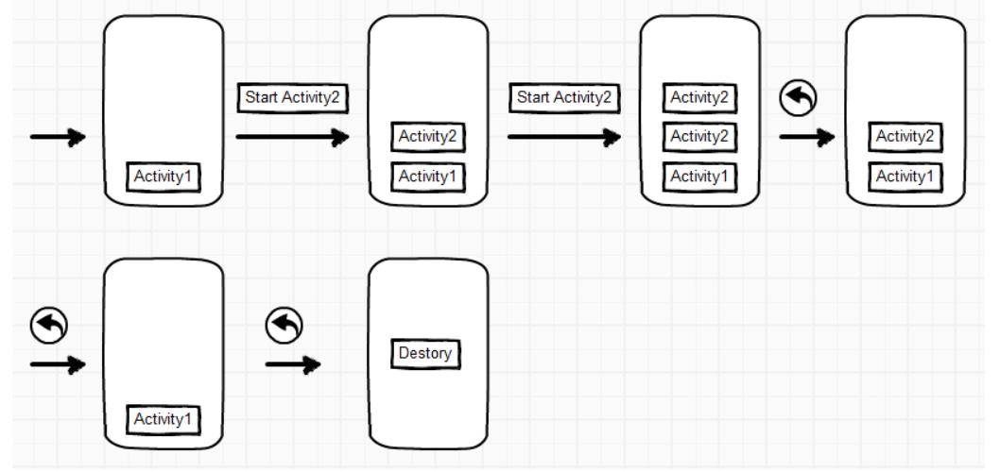

#### （2）singleTop：栈顶复用模式。

在这种模式下，如果新Activity已经位于任务栈的栈顶，那么此Activity不会被重新创建，同时它的onNewIntent方法会被回调，通过此方法的参数我们可以取出当前请求的信息。

**需要注意的是，这个Activity的onCreate、onStart不会被系统调用，因为它并没有发生改变。如果新Activity的实例已存在但不是位于栈顶，那么新Activity仍然会重新重建**

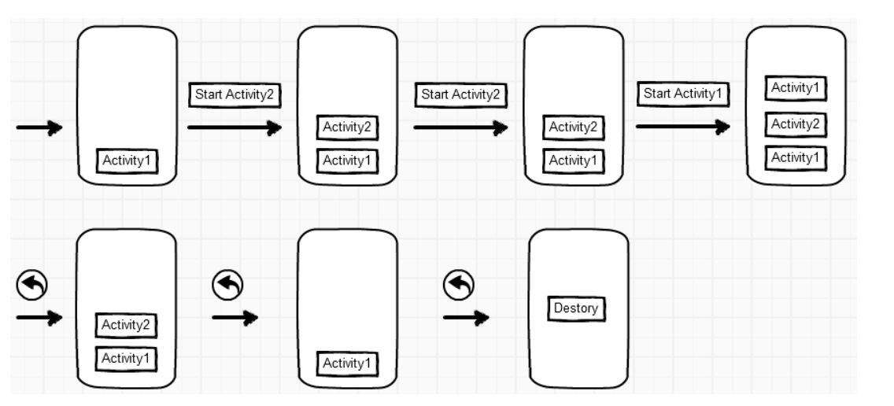

处在同一个TAsk中

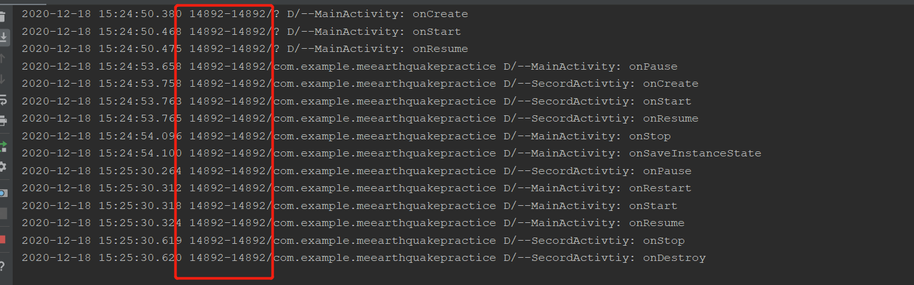

#### **(3).栈内复用模式singleTask：**

这是一种单实例模式，只要栈中存在就不会创建新的实例

与singleTop模式相似，只不过singleTop模式是只是针对栈顶的元素，而singleTask模式下，如果task栈内存在目标Activity实例，则

1. 将task内的对应Activity实例之上的所有Activity弹出栈。
2. 将对应Activity置于栈顶，获得焦点。

：栈内复用模式。这是一种单实例模式，在这种模式下，只要Activity在一个栈中存在，那么多次启动此Activity都不会重新创建实例，和singleTop一样，系统也会回调其onNewIntent。具体一点，当一个具有singleTask模式的Activity请求启动后，比如Activity A，系统首先会寻找是否存在A想要的任务栈，如果不存在，就重新创建一个任务栈，然后创建A的实例后把A放到栈中。如果存在A所需的任务栈，这时要看A是否在栈中有实例存在，如果有实例存在，那么系统就会把A调到栈顶并调用它的onNewIntent方法，如果实例不存在，就创建A的实例并把A压入栈中

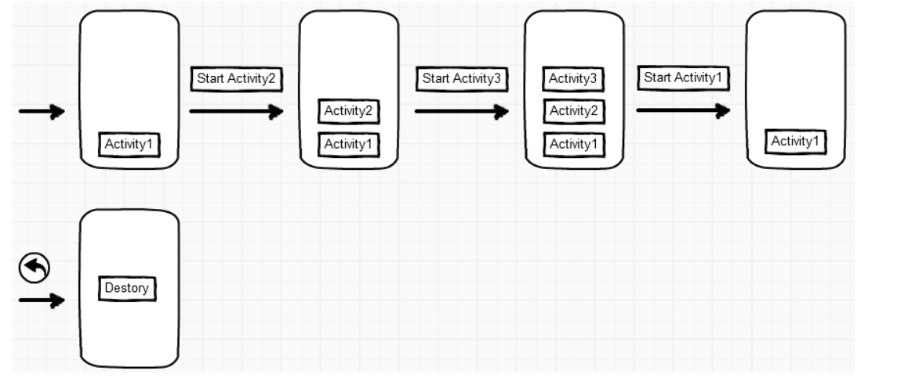

#### （4）.全局唯一模式singleInstance：

这是一种加强的singleTask模式，它除了具有singleTask模式的所有特性外，还加强了一点，那就是具有此种模式的Activity只能单独地位于一个任务栈中，换句话说，比如Activity A是singleInstance模式，当A启动后，系统会为它创建一个新的任务栈，然后A独自在这个新的任务栈中

### 三：任务栈

### 四：Activity的Flags

Activity的Flags有很多，这里主要分析一些比较常用的标记位。标记位的作用很多，有的标记位可以设定Activity的启动模式，比如FLAG_ACTIVITY_NEW_TASK和FLAG_ACTIVITY_SINGLE_TOP等；还有的标记位可以影响Activity的运行状态，比如FLAG_ACTIVITY_CLEAR_TOP和FLAG_ACTIVITY_EXCLUDE_FROM_RECENTS等。下面主要介绍几个比较常用的标记位，剩下的标记位读者可以查看官方文档去了解，大部分情况下，我们不需要为Activity指定标记位，因此，对于标记位理解即可。在使用标记位的时候，要注意有些标记位是系统内部使用的，应用程序不需要去手动设置这些标记位以防出现问题。

## 1.3 IntentFilter的匹配规则

[参考]https://blog.csdn.net/mynameishuangshuai/article/details/51673273

IntentFilter中的过滤信息有action、category、data

# 第2章 IPC机制

[参考文章]https://www.jianshu.com/p/87d49d36df1e

## 2.1 Android IPC简介

（1）IPC是Inter-Process Communication的缩写，含义为进程间通信或者跨进程通信，是指两个进程之间进行数据交换的过程。

**进程**

一般指一个执行单元，所有执行中的任务都对应一个进程，即当一个程序进入内存运行的时候就变成了一个进程，进程是一个运行中的程序资源。而进程一般指一个执行单元，在PC和移动设备上指一个程序或者一个应用

## 2.3 IPC基础概念介绍

### 2.3.1 Serializable接口

**任何类型只要实现了Serializable接口，就可以被保存到文件中，或者作为数据流通过网络发送到别的地方。也可以用管道来传输到系统的其他程序中。这样子极大的简化了类的设计**

java 中进行序列化操作需要实现 Serializable 或 Externalizable 接口。
         序列化的目的有两个，第一个是便于存储，第二个是便于传输。
         一、序列化作用：
            1、 提供一种简单又可扩展的对象保存恢复机制。
            2、 对于远程调用，能方便对对象进行编码和解码，就像实现对象直接传输。
            3、 可以将对象持久化到介质中，就像实现对象直接存储。
            4、 允许对象自定义外部存储的格式。

         二、何时需要实现序列化
           在存储时需要序列化
     
         三、平常实体类没有实现Serializable接口，怎么也能存进数据库呢？
           是因为在声明变量的时候，例如String、int、Boolean等时，数据类型已经实现了序列化

## 2.4 Android中的IPC方式

各种跨进程通信方式:比如可以通过在Intent中附加extras来传递信息，或者通过共享文件的方式来共享数据，还可以采用Binder方式来跨进程通信，另外，ContentProvider天生就是支持跨进程访问的，因此我们也可以采用它来进行IPC

[参考文章]https://www.cnblogs.com/andy-songwei/p/10256379.html

# 第3章 View的事件体系

View，虽然说View不属于四大组件，但是它的作用堪比四大组件，甚至比Receiver和Provider的重要性都要大。在Android开发中，Activity承担这可视化的功能，同时Android系统提供了很多基础控件，常见的有Button、TextView、CheckBox等。很多时候仅仅使用系统提供的控件是不能满足需求的，因此我们就需要能够根据需求进行新控件的定义，而控件的自定义就需要对Android的View体系有深入的理解，只有这样才能写出完美的自定义控件。同时Android手机属于移动设备，移动设备的一个特点就是用户可以直接通过屏幕来进行一系列操作，一个典型的场景就是屏幕的滑动，用户可以通过滑动来切换到不同的界面。很多情况下我们的应用都需要支持滑动操作，当处于不同层级的View都可以响应用户的滑动操作时，就会带来一个问题，那就是滑动冲突。如何解决滑动冲突呢？这对于初学者来说的确是个头疼的问题，其实解决滑动冲突本不难，它需要读者对View的事件分发机制有一定的了解，在这个基础上，我们就可以利于这个特性从而得出滑动冲突的解决方法。

## 3.1 View基础知识

主要介绍的内容有：View的位置参数、MotionEvent和TouchSlop对象、VelocityTracker、GestureDetector和Scroller对象，通过对这些基础知识的介绍

View是Android中所有控件的基类，不管是简单的Button和TextView还是复杂的RelativeLayout和ListView，它们的共同基类都是View。所以说，View是一种界面层的控件的一种抽象，它代表了一个控件。除了View，还有ViewGroup

### 3.1.1 View的位置参数


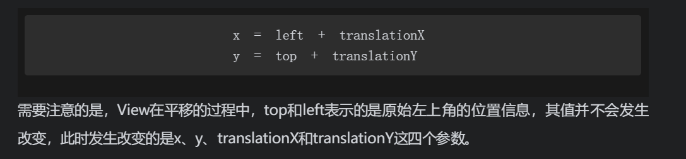

### 3.1.2 MotionEvent和TouchSlop

【参考文章】https://www.jianshu.com/p/0c863bbde8eb

【参考文章】https://www.jianshu.com/p/39e58109a70b

【参考文章】https://blog.csdn.net/lin962792501/article/details/86478589

【参考文章】https://blog.csdn.net/u010707039/article/details/85211658

【参考文章】https://www.jb51.net/article/91335.htm


## 3.4 View的事件分发机制

【参考文章】 https://www.jianshu.com/p/238d1b753e64

