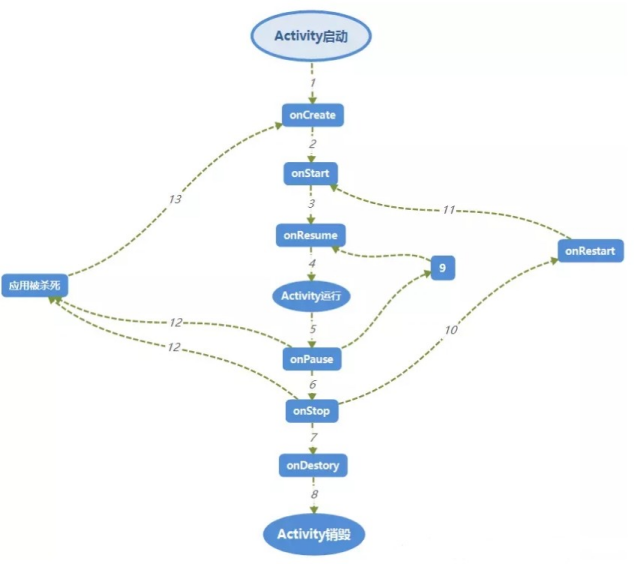
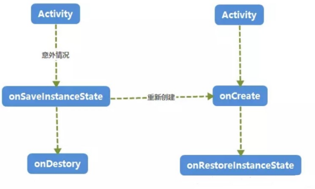

**2021-6-17

计划：2021.6.17----2021-6.27 读完，

[TOC]

# 第一章，开始启程

## 1.1 了解全貌——Android王国简介

### 1.1.1 Android系统架构

#### 1，**描述一下** **android** **的系统架构**

它的系统架构。Android大致自下而上可以分为四层架构：Linux内核层、系统运行库层、应用框架层和应用层。

**Linux内核层：**Android系统是基于Linux内核的，这一层为Android设备的各种硬件提供了底层的驱动，如显示驱动、音频驱动、照相机驱动、蓝牙驱动、Wi-Fi驱动、电源管理等。

**系统运行库层：**通过一些C/C++库来为Android系统提供了主要的特性支持，大部分都为开源的代码函数库，如SQLite库提供了数据库的支持，OpenGL|ES库提供了3D绘图的支持，Webkit库提供了浏览器内核的支持等。

还有Android运行时库，它主要提供了一些核心库，能够允许开发者使用Java语言来编写Android应用。另外，Android运行时库中还包含了Dalvik虚拟机（5.0系统之后改为ART运行环境），它使得每一个Android应用都能运行在独立的进程当中，并且拥有一个自己的Dalvik虚拟机实例。相较于Java虚拟机，Dalvik是专门为移动设备定制的，它针对手机内存、CPU性能有限等情况做了优化处理。

**应用框架层**：提供了构建应用程序时可能用到的各种API, Android自带的一些核心应用就是使用这些API完成的，开发者也可以通过使用这些API来构建自己的应用程序。

**应用层**：所有安装在手机上的应用程序都是属于这一层的，比如系统自带的联系人、短信等程序，或者是你从Google Play上下载的小游戏，当然还包括你自己开发的程序。

#### 2， **java虚拟机和Dalvik虚拟机的区别：**

java虚拟机Dalvik虚拟机 java虚拟机基于**栈**。 基于栈的机器必须使用指令来载入和操作栈上数据，所需指令更多更多dalvik虚拟机是基于**寄存器**的 java虚拟机运行的是java字节码。（java类会被编译成一个或多个字节码.class文件，打包到.jar文件中，java虚拟机从相应的.class文件和.jar文件中获取相应的字节码）

 

|      |      |      |
| ---- | ---- | ---- |
|      |      |      |
|      |      |      |
|      |      |      |
|      |      |      |

## 1.1.3 Android应用开发特色

### 项目结构

1．.gradle和.idea：都是自动生成的

2，app:项目中的代码、资源等内容几乎都是放置在这个目录下的

3．build:编译时自动生成的文件

4．gradle:包含了gradle wrapper的配置文件，使用gradle wrapper的方式不需要提前将gradle下载好，而是会自动根据本地的缓存情况决定是否需要联网下载gradle

5.gitignore这个文件是用来将指定的目录或文件排除在版本控制之外的

6．build.gradle这是项目全局的gradle构建脚本，通常这个文件中的内容是不需要修改的。

7．gradle.properties这个文件是全局的gradle配置文件，在这里配置的属性将会影响到项目中所有的gradle编译脚本

8. proguard-rules.pro：代码混淆

   注意：

   **最外层下面build.gradle**：代码字段自动生成

   

```
buildscript {
    repositories {
        jcenter()//jcenter是一个代码托管仓库
        google()
        maven { url "https://jitpack.io" }
    }
    dependencies {
        classpath 'com.android.tools.build:gradle:3.4.1'
    }
}

allprojects {
    repositories {
        jcenter()
        google()
        maven { url "https://jitpack.io" }
    }
}

task clean(type: Delete) {
    delete rootProject.buildDir
}

```

解析：1，jcenter是一个代码托管仓库

​            2，dependencies闭包中使用classpath声明一个Gradle插件。因为Gradle并不是专门为构建Android项目而开发的，因此如果我们要想使用它来构建Android项目

**app目录下的build.gradle文件**

```
apply plugin: 'com.android.application'------表示这是一个应用程序模块，
android {
    compileSdkVersion 30
    aaptOptions.cruncherEnabled = false
    aaptOptions.useNewCruncher = false
    defaultConfig {
        applicationId "com.yl.traffic.collect"----用于指定项目的包名；修改项目包名可以在这里进行修改	
        minSdkVersion 21     -----用于指定项目最低兼容的Android系统版本，这里设置成15标示最低兼容到Android 4.0系统；
        targetSdkVersion 26  -----指定的值标示你在该项目版本上已经做过了充分的测试，系统将会为你的应用程序启用一些最新的功能和特性；
        versionCode 1        ------用于指定项目的版本号；
        versionName "v1.0.0"  ------用于指定项目的版本名；	
        testInstrumentationRunner "android.support.test.runner.AndroidJUnitRunner" ---单元测试
        ndk {
            abiFilters "armeabi"/*, "armeabi-v7a"*/
        }
    }
------修改生成Apk命名-------	
------android.applicationVariants.all 是固定写法--------
    applicationVariants.all { variant ->  ---variant这个相当于是ApplicationVariants的一个对象，可以随意定义对象名字，例如改成“xixi”
        variant.outputs.all {
            // 输出apk名称为traffic-map-v1.2.2.apk，output是属于BaseVariantOutput的对象，对象名也可以随意定义
            def fileName = "traffic-collect-${defaultConfig.versionName}.apk" --- ${...}里面传入对象 ，名+版本.apk”
            outputFileName = fileName
        }
    }
    ---- 签名信息配置-----signingConfigs 需要写在defaultConfig 和buildTypes 前面，不然会编译报错。

    signingConfigs {
        debug {
            keyAlias 'traffic_collect_key.jks'
            storePassword 'ylkj2021'
            storeFile file('traffic_collect_key.jks')
            keyPassword 'ylkj2021'
        }

        release {
            keyAlias 'traffic_collect_key.jks'
            storePassword 'ylkj2021'
            storeFile file('traffic_collect_key.jks')
            keyPassword 'ylkj2021'
        }
    }
    
----packagingOptions常见的设置项有exclude、pickFirst、doNotStrip、merge。------
-----1，exclude，过滤掉某些文件或者目录不添加到APK中，作用于APK，不能过滤aar和jar中的内容。
-----2，pickFirst，匹配到多个相同文件，只提取第一个。只作用于APK，不能过滤aar和jar中的文件。
-----3doNotStrip，可以设置某些动态库不被优化压缩。
-----4 merge，将匹配的文件都添加到APK中，和pickFirst有些相反，会合并所有文件。

    packagingOptions {
        exclude 'META-INF/LGPL2.1'
        exclude 'META-INF/LICENSE'
        exclude 'META-INF/NOTICE'
    }
----修改SourceSets中的属性，可以指定哪些源文件（或文件夹下的源文件）要被编译，哪些源文件要被排，指定代码及资源的路径
    sourceSets {
        main {
            jniLibs.srcDirs = ['libs']---- SO库的路径 
        }
    }
---Lint工具可选项参数
    lintOptions {
        abortOnError false    ------// 报错不会停止打包，除非很严重的很影响 ----
    }
---- 编译可选项参数---
---注意：没写这个的时候出现这个错误：Static interface methods are only supported starting with Android N (--min-api 24): void butterknife.Unbinder.lambda$static$0()
    compileOptions {
        targetCompatibility 1.8  -----设置代码编译的版本，一般是在使用JDK1.8时，配置这个，使编译出来的jar包让别人使用时更通用 
        sourceCompatibility 1.8
    }

    configurations.all {
        resolutionStrategy.eachDependency { DependencyResolveDetails details ->
            def requested = details.requested
            if (requested.group == 'com.android.support') {
                if (!requested.name.startsWith("multidex")) {
                    details.useVersion '27.1.1' //这里改为你项目使用的版本即可
                }
            }
        }
    }
}
 --------导入第三方jar包-----
dependencies {
    implementation fileTree(include: ['*.jar'], dir: 'libs')
    androidTestImplementation('com.android.support.test.espresso:espresso-core:2.2.2', {
        exclude group: 'com.android.support', module: 'support-annotations'
    })
    /**
     *  androidx
     */
    implementation 'com.android.support.constraint:constraint-layout:2.0.1'
  
```

解析
com.android.library 表示这是一个库模块。
应用程序模块和库模块的最大区别在于，一个是可以直接运行的，一个只能作为代码库依附于别的应用程序模块来运行。
android闭包：在这个闭包中我们可以配置项目构建的各种属性。

compileSdkVersion：用于指定项目构建的版本，这里指定成28标示使用Android 9.0系统的SDK编译。
buildToolsVersion：用于指定项目构建工具的版本，目前最新的28.0.0，如果有更新的版本时，Android Studio会进行提示。修改buildToolsVersion有两种方法

### AndroidManifest

[官方文档](https://link.jianshu.com/?t=https%3A%2F%2Fdeveloper.android.com%2Fguide%2Ftopics%2Fmanifest%2Fmanifest-element%3Fhl%3Dzh-cn)

默认文件

```
<?xml version="1.0" encoding="utf-8"?>
<manifest xmlns:android="http://schemas.android.com/apk/res/android"
    package="com.example.my">

    <application
        android:name=".app.App"
        android:allowBackup="true"
        android:hardwareAccelerated="true"
        android:icon="@drawable/ic_launcher"
        android:label="@string/app_name"
        android:requestLegacyExternalStorage="true"
        android:supportsRtl="true"
        android:theme="@style/Theme.AppCompat.NoActionBar"
        android:usesCleartextTraffic="true"
        tools:targetApi="m">
        <activity android:name=".MainActivity">
            <intent-filter>
                <action android:name="android.intent.action.MAIN" />//默认生成
                <category android:name="android.intent.category.LAUNCHER" />//默认生成
            </intent-filter>
        </activity>
    </application>

</manifest>
```

**解析**

1. #### application

   - 包含于：

   ```
   <manifest>
   ```

   - 可包含：

   - ```
     <activity>`
     `<activity-alias>`
     `<meta-data>`
     `<service>`
     `<receiver>`
     `<provider>`
     `<uses-library>
     ```

- 属性

  - ***tools:targetApi*** 

    指明某个控件只在指定的API 及更高的版本中生效。

  - **android:usesCleartextTraffic**

  指示应用是否打算使用明文网络流量，如明文 HTTP。对于目标 API 级别为 27 或更低级别的应用，默认值为 `"true"`。对于目标 API 级别为 28 或更高级别的应用，默认值为 `"false"`。

  如果将此属性设为 `"false"`，平台组件（例如 HTTP 和 FTP 堆栈、`DownloadManager` 和 `MediaPlayer`）将拒绝应用要使用明文流量的请求。强烈建议第三方库也遵循此设置。避免使用明文流量的主要原因是缺乏机密性、真实性和防止篡改的保护措施；网络攻击者可以窃听传输的数据，还可以在不被检测到的情况下修改数据。

  此标志的遵循只能尽力而为，因为鉴于提供给 Android 应用的访问级别，不可能阻止来自这些应用的所有明文流量。例如，不要期望 `Socket` API 遵循此标志，因为它无法确定其流量是否采用明文形式。不过，来自应用的大部分网络流量都由较高级别的网络堆栈/组件处理，这些堆栈/组件可通过从 `ApplicationInfo.flags` 或 `NetworkSecurityPolicy.isCleartextTrafficPermitted()` 读取来遵循此标志。

  - **android:supportsRtl**

  声明您的应用是否愿意支持从右到左 (RTL) 布局。

  如果设为 `true` 并且 [`targetSdkVersion`](https://developer.android.google.cn/guide/topics/manifest/uses-sdk-element#target) 设为 17 或更高版本，则系统会激活和使用各种 RTL API，以便您的应用可以显示 RTL 布局。如果设为 `false` 或者如果 [`targetSdkVersion`](https://developer.android.google.cn/guide/topics/manifest/uses-sdk-element#target) 设为 16 或更低版本，则 RTL API 将被忽略或不起作用，无论与用户所选语言区域关联的布局方向为何（布局始终是从左到右），应用的行为都相同。

  此属性的默认值为 `false`。

  此属性是在 API 级别 17 中添加的。

  - android:requestLegacyExternalStorage="true"

  [参考](https://blog.csdn.net/woai110120130/article/details/109153724)

  

1. **action**：向 Intent 过滤器添加操作

- 包含于：

  ```
  <intent-filter> //必须可以包含一个或者多个action
  ```

- 属性：

```
android:name  //操作的名称
```

1. **category:**向 Intent 过滤器添加类别名称

- 包含于：

  ```
  <intent-filter> //必须可以包含一个或者多个action
  ```

  **注意**：为了接收隐式 Intent，您必须在 Intent 过滤器中添加 `CATEGORY_DEFAULT` 类别。`startActivity()` 和 `startActivityForResult()` 方法将所有 Intent 当作声明了 `CATEGORY_DEFAULT` 类别一样对待。如果您没有在 Intent 过滤器中声明该类别，则任何隐式 Intent 都不会解析为您的 Activity。

- 属性：

  ```
  android:name //类别的名称
  ```

  1. **Activity**

     - 包含它的文件：

     ```
     <application>
     ```

     - 可包含：

     ```
     <intent-filter>`
     `<meta-data>`
     `<layout>
     ```

Activity的语法属性有很多，这里就不一一的介绍了，读者可以参考官方文档进行查看[更多资料请参考官方文档]([  | Android 开发者  | Android Developers (google.cn)](https://developer.android.google.cn/guide/topics/manifest/activity-element))

这里解析几个我在项目中遇到的情况：

**android:screenOrientation**：Activity 在设备上的显示方向

**android:launchMode：**有关应如何启动 Activity 的指令，有四种启动模式“`standard`”，“`singleTop`”，“`singleTask`”，“`singleInstance`”

- **standard**

​       standard：是每次打开一个activity就会创建一个activity的实例出来，比如你从首页打开一个子页面，点一次就会创建一次，按返回键的时候就要回退很多次

- **singleTop**

  singleTop：在启动活动时，如果发现该返回栈的栈顶已经是该活动时，则认为可以直接使用它，不会在创建新的活动实例，只会保证每次同时只打开一个activity，比如你从首页打开一个子页面，点击打开的时候，系统首先会检查这个子页面有没有被打开，如果已经是打开的则不会再次打开直接展示那一个页面，按返回键的时候点击一次就行就可以回退到主页面

-  **singleTask**

  singleTask:每次启动该活动时，首先会在返回栈中检查是否存在该活动的实例，如果发现已经存在就直接使用该实例，并把这个活动之上的所有活动统统出栈，如果没有发现就会创建一个新的活动实例,如：在 SecondActivity 中启动 FirstActivity 时，会发现返回栈中已经存在一个 FirstActivity 的实例，并且是在 SecondActivity 的下面，于是 SecondActivity 会从返回栈中出栈，而 FirstActivity 重新成为了栈顶活动

- **`singleInstance`**

  singleInstance：指定为singleInstance模式的活动会启用一个新的返回栈来管理这个活动，不管是哪个应用程序来访问这个活动，都共用的同一个返回栈，解决了共享活动实例的问题，

  1. **service**:服务用于实现长时间运

     - 包含它的文件：

     ```
     <application>
     ```

     - 可包含：

       ```
       <intent-filter>
       <meta-data>
       ```

     -   属性

     ```
        <service
                 android:name=".serve.services.VMDaemonService"
                 android:enabled="true"
                 android:exported="false"
                 android:process=":seismic" />
     ```

**android:enabled**

​          系统是否可实例化服务 —“`true`”表示可以，“`false`”表示不可以。默认值为“`true`”。

`<application>` 元素拥有自己的 `enabled` 属性，该属性适用于所有应用组件，包括服务。只有在 `<application>` 和 `<service>` 属性都为“`true`”（因为它们都默认使用该值）时，系统才能启用服务。任何一项为“`false`”都会造成服务停用，从而使系统无法将其实例化。

**android:exported**

​        其他应用的组件是否能调用服务或与之交互 —“`true`”表示可以，“`false`”表示不可以。当该值为“`false`”时，只有同一个应用或具有相同用户 ID 的应用的组件可以启动服务或绑定到服务。

默认值取决于服务是否包含 Intent 过滤器。没有任何过滤器意味着服务只能通过指定其确切的类名称进行调用。这意味着服务专供应用内部使用（因为其他应用不知晓其类名称）。因此，在这种情况下，默认值为“`false`”。另一方面，至少存在一个过滤器意味着服务专供外部使用，因此默认值为“`true`”。

此属性并非是唯一限制向其他应用披露服务的方式。您还可使用权限来限制哪些外部实体可以与服务交互（请参阅 `permission` 属性）。

**android:process**

   将运行服务的进程的名称。正常情况下，应用的所有组件都会在为应用创建的默认进程中运行。该名称与应用软件包的名称相同。`<application>` 元素的 `process` 属性可为所有组件设置不同的默认进程名称。不过，组件可以使用自己的 `process` 属性替换默认值，让您可以将应用散布到多个进程中。

如果为此属性分配的名称以冒号（“:”）开头，则系统会在需要时创建应用专用的新进程，并且服务会在该进程中运行。如果进程名称以小写字符开头，则服务将在使用该名称的全局进程中运行，前提是它拥有相应的权限。如此一来，不同应用中的组件便可共享进程，从而减少资源使用。

**android:permission**

实体启动服务或绑定到服务所必需的权限的名称。如果 `startService()`、`bindService()` 或 `stopService()` 的调用者尚未获得此权限，该方法将不起作用，且系统不会将 Intent 对象传送给服务。

如果未设置该属性，则对服务应用由 `<application>` 元素的 `permission` 属性所设置的权限。如果二者均未设置，则服务不受权限保护。

如需了解有关权限的详细信息，请参阅简介的[权限](https://developer.android.google.cn/guide/topics/manifest/manifest-intro#perms)部分，以及单独的[安全与权限](https://developer.android.google.cn/guide/topics/security/security)文档。

1. #### **meta-data**

   [参考](https://www.jianshu.com/p/37f3ea4fd3d6)

   语法：

   ```xml
   <meta-data android:name="string"
                  android:resource="resource specification"
                  android:value="string" />
   ```

   包含于：

   ```
   <activity>`
   `<activity-alias>`
   `<application>`
   `<provider>`
   `<receiver>`
   `<service>
   ```

# 第2章 先从看得到的入手——探究活动

## 2.1 活动是什么

### 1、什么是Activity?

Activity 是一个负责与**用户交互**的组件，Activity 中所有操作都与用户密切相关，可以通过 setContentView(View)来**显示指定控件**。在一个 android 应用中，一个 Activity 通常就是一个单独的屏幕，它上面可以显示一些控件也可以监听并处理用户的事件做出响应。

### 2、请描述一下 Activity生命周期。

[请参考Android开发者艺术第1章Activity的生命周期和启动模式以及IntentFilter的匹配规则。](./docs\AndroidBook\Android开发者艺术学习.md)

#### 2.1  **Activity** **的** **4** **种状态**

部分内容和图片参考网络，如有侵权，请联系删除2092963588@qq.com

- **Active/Paused/Stopped/Killed**

**Activie:**当前 Activity 正处于运行状态，指的是当前 Activity 获取了焦点。处于最前端，他可见并且可以与用户进行交互的激活状态

**Paused：**当前 Activity 正处于暂停状态，指的是当前 Activity 失去焦点，此时的 Activity 并没有被销毁，内存里面的成员变量，状态信息等仍然存在，当然这个 Activity 也仍然可见，但是焦点却不在它身上，比如被一个对话框形式的 Activity 获取了焦点，或者被一个透明的 Activity 获取了焦点，这都能导致当前的 Activity 处于 paused 状态。

**Stopped:**与 paused 状态相似，stopped 状态的 Activity 是完全不可见的，但是内存里面的成员变量，状态信息等仍然存在，但是也没有被销毁。

**Killed:**已经被销毁的 Activity 才处于 killed 状态，它的内存里面的成员变量，状态信息等都会被一并回收。（即被系统杀死回收，或者没启动时）

- **Activity 的生命周期分析正常情况下的生命周期**

1.  Activity 启动–>onCreate()–>onStart()–>onResume()
2. 点击 home 键回到桌面–>onPause()–>onStop()
3. 再次回到原 Activity–>onRestart()–>onStart()–>onResume()
4. 退出当前 Activity 时–>onPause()–>onStop()–>onDestroy()

详细生命周期如下：


|      |                                                              |
| ---- | ------------------------------------------------------------ |
|      |  |

 


\1. 启动了一个 Activity,通常是 Intent 来完成。启动一个 Activity 首先要执行的回调函数是onCreate(),通常在代码中你需要在此函数中绑定布局，绑定控件，初始化数据等做一些初始化的工作。

\2. 即将执行 Activity 的 onStart()函数，执行之后 Activity 已经可见，但是还没有出现在前台，无法与用户进行交互。这个时候通常 Activity 已经在后台准备好了，但是就差执行onResume()函数出现在前台。

\3. 即将执行 Activity 的 onResume()函数，执行之后 Activity 不止可见而且还会出现在前台，可以与用户进行交互啦。

\4. 由于 Activity 执行了 onResume()函数，所以 Activity 出现在了前台。也就是 Activity

处于运行状态。

\5. 处于运行状态的 Activity 即将执行 onPause()函数，什么情况下促使 Activity 执行onPause()方法呢？

[1] 启动了一个新的 Activity [2]返回上一个 Activity

可以理解为当需要其他 Activity，当前的 Activity 必须先把手头的工作暂停下来，再来把当前的界面空间交给下一个需要界面的 Activity，而 onPause()方法可以看作是一个转接工作的过程，因为屏幕空间只有那么一个，每次只允许一个 Activity 出现在前台进行工 作。通常情况下 onPause()函数不会被单独执行，执行完 onPause()方法后会继续执行onStop()方法，执行完 onStop()方法才真正意味着当前的 Activity 已经退出前台，存在于后台。

\6. Activity 即将执行 onStop()函数，在“5”中已经说得很清楚了，当 Activity 要从前台切换至后台的时候会执行，比如：用户点击了返回键，或者用户切换至其他 Activity 等。

\7. 当前的 Activity 即将执行 onDestory()函数，代表着这个 Activity 即将进入生命的终结点，这是 Activity 生命周期中的最后一次回调生命周期，我们可以在 onDestory()函数中，进行一些回收工作和资源的释放工作，比如：广播接收器的注销工作等。

\8. 执行完 onDestory()方法的 Activity 接下来面对的是被 GC 回收，宣告生命终结。

\9. 很少情况下 Activity 才走“9”，网上一些关于对话框弹出后 Activity 会走“9”的说法，经过笔者验证，在某个 Activity 内弹出对话框并没有走“9”，所以网上大部分这样说法的文章要么是没验证，要么直接转载的，这个例子说明，实验出真知，好了，不废话了，那么什么情况下，Activity 会走“9”呢？

\10. 当用户在其他的 Activity 或者桌面回切到这个 Activity 时，这个 Activity 就会先去执行onRestart()函数，Restart 有“重新开始”的意思，然后接下来执行 onStart()函数，接着执行 onResume()函数进入到运行状态。

\11. 在“10”中讲的很清楚了。

\12. 高优先级的应用急需要内存，此时处于低优先级的此应用就会被 kill 掉。

\13. 用户返回原 Activity。

 ***\*下面来着重说明一下 Activity 每个生命周期函数：\****

**onCreate():**

表示 Activity 正在被创建，这是 Activity 生命周期的第一个方法。通常我们程序员要在此函数中做初始化的工作，比如：绑定布局，控件，初始化数据等。

**onStart():**

表示 Activity 正在被启动，这时候的 Activity 已经被创建好了，完全过了准备阶段，但是没有出现在前台，需要执行 onResume()函数才可以进入到前台与用户进行交互。

**onResume():**

表示 Activitiy 已经可见了，并且 Activity 处于运行状态，也就是 Activity 不止出现在了前台，而且还可以让用户点击，滑动等等操作与它进行交互。

**onPause():**

表示 Activity 正在暂停，大多数情况下，Activity 执行完 onPause()函数后会继续执行onStop()函数，造成这种函数调用的原因是当前的 Activity 启动了另外一个 Activity 或者回切到上一个 Activity。还有一种情况就是 onPause()函数被单独执行了，并没有附带执行 onStop()方法，造成这种函数调用的原因很简单，就是当前 Activity 里启动了类似于对话框的东东。

**onStop():**

表示 Activity 即将停止，我们程序员应该在此函数中做一些不那么耗时的轻量级回收操作。

**onestart():**

表示 Activity 正在重新启动。一般情况下，一个存在于后台不可见的 Activity 变为可见状态，都会去执行 onRestart()函数，然后会继续执行 onStart()函数，onResume()函数出现在前台并且处于运行状态。

**onDestory():**

表示 Activity 要被销毁了。这是 Activity 生命中的最后一个阶段，我们可以在onDestory()函数中做一些回收工作和资源释放等，比如：广播接收器的注销等。

#### 2.2 异常情况下的生命周期

**情况 1：资源相关的系统配置发生改变导致 Activity 被杀死并重新创建。**



​      可以从图中看出当 Activity 发生意外的情况的时候，这里的意外指的就是系统配置发生改变，Activity 会被销毁，其 onPause,OnStop,onDestory 函数均会被调用，同时由于Actiivty 是在异常情况下终止的，系统会调用 onSaveInstanceState 来保存当前 Activity 状态。调用 onSaveInstanceState 的时机总会发生在 onStop 之前，至于会不会调用时机发生在 onPause 方法之前，那就说不定了，这个没有固定的顺序可言，正常情况下一般onSaveInstanceState 不会被调用。当 Activity 被重新创建后，系统会调用onRestoreInstanceState,并且把 Actiivty 销毁时 onSaveInstanceState 方法所保存的Bundle 对象作为参数传递给 onRestoreInstanceState 和 onCreate 方法。所以我们可以通过 onRestoreInstanceState 和 onCreate 方法来判断 Actiivty 是否被重建了，如果被重建了，那么我们就可以取出之前保存的数据并恢复，从时序上来看， onRestoreInstanceState 的调用时机发生在 onStart 之后。

1，onSaveInstanceState 

在activity可能被回收之前调用,用来保存自己的状态和信息，以便回收后重建时恢复数据（在onCreate()或onRestoreInstanceState()中恢复）。旋转屏幕重建activity会调用该方法，但其他情况在onRause()和onStop()状态的activity不一定会调用

2，onRestoreInstanceState方法

　　这个方法在onStart 和 onPostCreate之间调用，在onCreate中也可以状态恢复，但有时候需要所有布局初始化完成后再恢复状态。

**情况 2：资源内存不足导致低优先级的 Activity 被杀死。**

#### 2.3特殊情况下的生命周期

在清单文件Activity节点下可以添加android:configChanges属性，指定属性发生改变时，调用Activity 的onConfigurationChanged()方法,不会创建新的Activity，设置方法：将下列字段用“|”符号分隔开，例如："keyboardHidden|orientation|screenSize"

与横竖屏生命周期函数有关调用的属性是"android:configChanges",关于它的属性值设置影响如下：

l orientation：消除横竖屏的影响

l keyboardHidden：消除键盘的影响

l screenSize：消除屏幕大小的影响

当我们设置 Activity 的 android:configChanges 属性为 orientation 或者orientation|keyboardHidden 或者不设置这个属性的时候，它的生命周期会走如下流程：

 

| 1.	刚刚启动 Activity 的时候：                             |
| ------------------------------------------------------------ |
| 2.	onCreate                                               |
| 3.	onStart                                                |
| 4.	onResume                                               |
| 5.	由竖屏切换到横屏：                                     |
| 6.	onPause                                                |
| 7.	onSaveInstanceState //这里可以用来横竖屏切换的保存数据 |
| 8.	onStop                                                 |
| 9.	onDestroy                                              |
| 10.	onCreate                                              |
| 11.	onStart                                               |
| 12.	onRestoreInstanceState//这里可以用来横竖屏切换的恢复数据 |
| 13.	onResume                                              |
| 14.	横屏切换到竖屏：                                      |
| 15.	onPause                                               |
| 16.	onSaveInstanceState                                   |
| 17.	onStop                                                |
| 18.	onDestroy                                             |
| 19.	onCreate                                              |
| 20.	onStart                                               |
| 21.	onRestoreInstanceState                                |
| 22.	onResume                                              |

当我们设置 Activity 的 android:configChanges 属性为 orientation|screenSize 或者orientation|screenSize|keyboardHidden

| 1. 刚刚启动 Activity 的时候： |
| ----------------------------- |
| 2. onCreate                   |
| 3. onStart                    |
| 4. onResume                   |
| 5. 由竖屏切换到横屏：         |
| 6.                            |
| 7. 什么也没有调用             |
| 8. 横屏切换到竖屏：           |
| 9. 什么也没有调用             |

#### 2.4 Activity上有Dialog的时候按Home键时的生命周期是

onCreate() -> onStart() -> onResume -> onPause() -> onStop() 

我们弹出的Dialog实际上是一个布满全屏的Activity组件,，因而我们队Activity并不是不可见而是被一个布满屏幕的组件覆盖了其他组件。当我们按Home键时，Activity会执行正常的onPause() -> onStop()操作，使Activity真正进入后台。

#### 2.5 两个Activity 之间跳转时必然会执行的是哪几个方法

首先定义两个Activity，分别为A和B。

当我们在A中激活B时，A调用onPause()方法，此时B出现在屏幕时，B调用onCreate()、onStart()、onResume()。这个时候B【B不是一个透明的窗体或对话框的形式】已经覆盖了A的窗体，A会调用onStop()方法。

#### 2。6前台切换到后台，然后再回到前台，Activity生命周期回调方法。弹出Dialog，生命值周期回调方法

首先定义两个Activity，分别为A和B。

完整顺序为：A调用onCreate()方法 ---> onStart()方法 ---> onResume()方法。当A启动B时，A调用onPause()方法，然后调用新的Activity B，此时调用onCreate()方法 ---> onStart()方法 ---> onResume()方法将新Activity激活。之后A再调用onStop()方法。当A再次回到前台时，B调用onPause()方法，A调用onRestart()方法 ---> onStart()方法 ---> onResume()方法，最后调用B的onStop()方法 ---> onDestory()方法。弹出Dialog时，调用onCreate()方法 ---> onStart()方法 ---> onResume()方法。

### 3，请描述一下Activity的四种启动模式

- standard：是每次打开一个activity就会创建一个activity的实例出来，比如你从首页打开一个子页面，点一次就会创建一次，按返回键的时候就要回退很多次
- singleTop：在启动活动时，如果发现该返回栈的栈顶已经是该活动时，则认为可以直接使用它，不会在创建新的活动实例，只会保证每次同时只打开一个activity，比如你从首页打开一个子页面，点击打开的时候，系统首先会检查这个子页面有没有被打开，如果已经是打开的则不会再次打开直接展示那一个页面，按返回键的时候点击一次就行就可以回退到主页面
- singleTask:每次启动该活动时，首先会在返回栈中检查是否存在该活动的实例，如果发现已经存在就直接使用该实例，并把这个活动之上的所有活动统统出栈，如果没有发现就会创建一个新的活动实例,如：在 SecondActivity 中启动 FirstActivity 时，会发现返回栈中已经存在一个 FirstActivity 的实例，并且是在 SecondActivity 的下面，于是 SecondActivity 会从返回栈中出栈，而 FirstActivity 重新成为了栈顶活动
- singleInstance：指定为singleInstance模式的活动会启用一个新的返回栈来管理这个活动，不管是哪个应用程序来访问这个活动，都共用的同一个返回栈，解决了共享活动实例的问题，