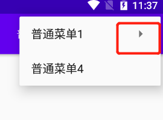
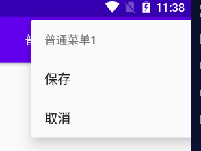

#  第 2 章　探究新语言，快速入门Kotlin编程

[请查看Kotlin笔记](H:\note\AndroidInterview\docs\Kotlin\Kotlin.md)

# 第 3 章　先从看得到的入手，探究Activity

[请查看Andoid第一行代码第2版](./docs\AndroidBook\Android第一行代码（第2版）.md)

## 3.1  在Activity中使用Toast

以前在java编写代码的时候是使用的findViewById()方法获取布局文件中控件的实例，但是比较麻烦，如果有很多个实例，则要声明很多次，但是很笨拙，于是就滋生出了诸如ButterKnife之类的第三方开源库，来简化findViewById()方法的调用。不过，这个问题在Kotlin中就不复存在了，因为使用Kotlin编写的Android项目在app/build.gradle文件的头部默认引入了一个kotlin-android-extensions插件，这个插件会根据布局文件中定义的控件id自动生成一个具有相同名称的变量

## 3.2　在Activity中使用Menu

### **优点**

既可以展示数据菜单，又不占屏幕

### 菜单的分类

要可以分为三类：**选项菜单、上下文菜单/上下文操作模式，弹出菜单**

### **使用步骤**

1. 首先在res目录下新建一个menu文件夹，右击res目录→New→Directory，输入文件夹名“menu”，点击“OK”
2. 右键menu文件夹 - New - Menu resource file，文件名main，点击OK创建完成

```
<?xml version="1.0" encoding="utf-8"?>
<menu xmlns:android="http://schemas.android.com/apk/res/android">

    <item android:id="@+id/item_add"
        android:title="添加"/>
    <item android:id="@+id/item_delete"
        android:title="删除"/>
</menu>
```

注释：

- 我们建立了两个其中<item>标签用来创建具体的某一个菜单项，然后通过android:id给这个菜单项指定一个唯一的标识符，通过android:title给这个菜单项指定一个名称。

  - 可以使用<menu>`、`<item>`、`<group>来进行menu的定义

    - `<menu>`是菜单项的容器。`<menu>`元素必须是该文件的根节点，并且能够包含一个或多个`<item>`和`<group>`元素。
    - `<item>`是菜单项，用于定义`MenuItem`，可以嵌套`<menu>`元素，以便创建子菜单。
    - `<group>`是`<item>`元素的不可见容器（可选）。可以使用它对菜单项进行分组，使一组菜单项共享可用性和可见性等属性。

    其中，`<item>`是我们主要需要关注的元素，它的常见属性如下：

    - `android:id`：菜单项`(MenuItem)`的唯一标识
    - `android:icon`：菜单项的图标（可选）
    - `android:title`：菜单项的标题（必选）
    - `android:showAsAction`：指定菜单项的显示方式。常用的有`ifRoom、never、always、withText`，多个属性值之间可以使用`|`隔开。
      - `always`：菜单项永远不会被收纳到溢出菜单中，因此在菜单项过多的情况下可能超出菜单栏的显示范围。
      - `ifRoom`：在空间足够时，菜单项会显示在菜单栏中，否则收纳入溢出菜单中。
      - `withText`：无论菜单项是否定义了`icon`属性，都只会显示它的标题，而不会显示图标。使用这种方式的菜单项默认会被收纳入溢出菜单中。
      - `never`：菜单项永远只会出现在溢出菜单中。

3. 重写onCreateOptionsMenu方法

   ```
   /*** kontlin ***/
   override fun onCreateOptionsMenu(menu: Menu?): Boolean {
       menuInflater.inflate(R.menu.menu,menu)
       return true
   }
   ```

```
/** java **/
public boolean onCreateOptionsMen(Menu menu) {
	getMenuInflater().inflate(R.menu.menu, menu);
	return true;
}
```

注释：

java：通过getMenuInflater()方法能够得到MenuInflater对象，再调用它的inflate()方法就可以给当前活动创建菜单了。inflate()方法接受两个参数，第一个参数用于指定我们通过哪个资源文件来创建菜单，这里传入R.menu.main。第二个参数用于指定我们的菜单项将添加到哪一个Menu对象中，这里直接使用onCreateOptionsMenu()方法传入的menu参数。将这个方法返回true，表示允许显示菜单，如果返回false，则无法显示菜单。


4，定义菜单的相应事件onOptionsItemSelected

```
/*** Konlin设置点击事件*/
override fun onOptionsItemSelected(item: MenuItem): Boolean {
    when(item.itemId){
        item_add->Toast.makeText(this,"添加成功", Toast.LENGTH_SHORT).show()
        item_delete->Toast.makeText(this,"添加成功", Toast.LENGTH_SHORT).show()
    }

    return true
}
```

```
/**java**/
public boolean onOptionsItemSelected(MenuItem item) {
	switch (item.getItemId()) {
	case R.id.add_item:
		Toast.makeText(this, "You clicked Add", Toast.LENGTH_SHORT).show();
		break;
	case R.id.remove_item:
		Toast.makeText(this, "You clicked Remove", Toast.LENGTH_SHORT).show();
		break;
	default:
	}
	return true;
}

```

z注意:kontin中when的使用请参考[条件控制语句-when的条件判断](]/docs\Kotlin\KotlinBase.md)


### 多级子菜单

```
<item
    android:id="@+id/option_normal_1"
    android:title="普通菜单1"
    app:showAsAction="ifRoom">

    <menu>
        <item android:id="@+id/item_save"
            android:title="保存"/>
        <item android:id="@+id/item_delete"
            android:title="取消"/>
    </menu>
</item>
```





## 3.3　销毁一个Activity

正常情况下，销毁一个Activity,可以通过back键或者finish来进行销毁

## 3.4 Intent

[可以参考一位博主写的这篇文章，这篇文章比较详细](https://blog.csdn.net/salary/article/details/82865454)

Intent 是一个消息传递对象，使用它可以向其他Android组件请求操作。Intent的基本用途主要包括：启动 Activity、启动服务、传递广播。Intent分为显式Intent和隐式Intent

显式Intent

```
btn_intent.setOnClickListener(){
    val intent = Intent(this,MainActivity::class.java)
}
```

注意：MainActivity::class.java的写法就相当于MainActivity.class

这里分析一下Android中传递数据的几种方式**（java）**

**第一种**：**使用Inten的putExtra传递**

FirstActivity中**

一个一个的传递

```
//创建意图对象
 ``Intent intent = new Intent(this,SecordActivity.class);
 ``//设置传递键值对
 ``intent.putExtra("data",str);
 ``//激活意图
 ``startActivity(intent);
```

SecordActivity中**

```
// 获取意图对象
 ``Intent intent = getIntent();
 ``//获取传递的值
 ``String str = intent.getStringExtra("data");
 ``//设置值
 ``tv.setText(str);
```

注意：在传递的时候，、可以传递Double,Int String,等数据，但是在接收的时候呀根据value的类型来判断intent.getStringExtra的类型

- 类型为基本数据类型

  ```
  发送数据
  intent.putExtra("notice1", 1);
  intent.putExtra("notice2", 1.2);
  intent.putExtra("notice3", "1");
  //接收数据
   String notice3 = getIntent().getStringExtra("notice3");
   int notice1 = getIntent().getIntExtra("notice1",0);
   Double notice2 = getIntent().getDoubleExtra("notice2",1.0);
  ```

- 传递对象

  ```
  //发送数据
  intent.putExtra("notice", notice);
  // 接收数据
   notice = (Notice) getIntent().getSerializableExtra("notice");
  ```

  

- 传递list

  [请参考这位博主写的](https://blog.csdn.net/wirelessqa/article/details/8589200?utm_medium=distribute.pc_relevant.none-task-blog-2%7Edefault%7EBlogCommendFromMachineLearnPai2%7Edefault-13.base&depth_1-utm_source=distribute.pc_relevant.none-task-blog-2%7Edefault%7EBlogCommendFromMachineLearnPai2%7Edefault-13.base)

  ```
   //发送
   bundle.putSerializable("img_list", watermarkImageList);
   //接收
  private ArrayList<Picture> list ;
  list = (ArrayList<Picture>) getIntent().getSerializableExtra("img_list");
  ```

  第二种bundle传递

  ```
  //发送数据
  Intent intent  = new Intent(this,ImagePagerActivity.class);
  Bundle bundle = new Bundle();
  bundle.putSerializable("img_list", watermarkImageList);
  bundle.putInt("img_position", picture.getLocation());
  bundle.putInt("type", 1);
  intent.putExtras(intent)；
  startActivity(intent);
  //接收数据
   Bundle bundle = getIntent().getExtras();
     assert bundle != null;
     list = (ArrayList<Picture>) getIntent().getSerializableExtra("img_list");
  ```

## 3.5 Activity的生命周期

[请参考第二版第二章的活动是什么](./docs\AndroidBook\Android第一行代码（第2版）.md)

## 3.5　Activity的启动模式

## 3.6　Kotlin课堂：标准函数和静态方法