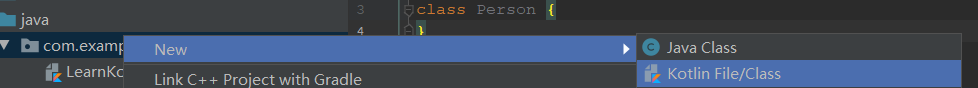
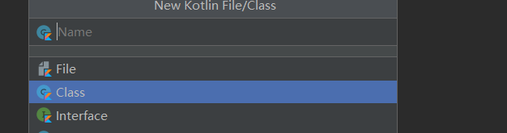

[TOC]


参考1：[kotlin官方中文文档](http://www.kotlincn.net/docs/reference/coroutines/coroutines-guide.html)

参考2：第一行代码第三版

参考3：[菜鸟教程](https://www.runoob.com/kotlin/kotlin-tutorial.html)

# Kotlin Android 环境搭建

# 基础语法

Kotlin 文件以 .kt 为后缀

##  包声明

代码文件的开头一般为包的声明：

```
package com.example.kotlindemoone
fun main() {
    val  a = 10
    println("a = "+a)
}
```

**注意：**

-  打印日志尽量不要使用println()，而是应该使用Log，为什么这里却还是使用了println()呢？这是因为Log是Android中提供的日志工具类，而我们现在是独立运行的Kotlin代码，和Android无关，所以自然是无法使用Log的
- **Kotlin每一行代码的结尾是不用加分号的**

##  变量和函数

###  变量

**Kotlin的变量没有默认值，java有默认值

**参考上面的代码**

参数格式为：参数 : 类型                                比如：val  a:Int = 10

在Java中如果想要定义一个变量，需要在变量前面声明这个变量的类型，比如说int a表示a是一个整型变量，String b表示b是一个字符串变量。而Kotlin中定义一个变量，**只允许在变量前声明两种关键字：val和var。**关键字 <标识符> : <类型> = <初始化值>**

- val（value的简写）用来声明一个**不可变的变量**，这种变量在初始赋值之后就再也不能重新赋值，对应Java中的final变量。

- var（variable的简写）用来声明一个**可变的变量**，这种变量在初始赋值之后仍然可以再被重新赋值，对应Java中的非final变量。

但是Kotlin的类型推导机制并不总是可以正常工作的，比如说如果我们对一个变量延迟赋值的话，Kotlin就无法自动推导它的类型了。这时候就需要显式地声明变量类型才行，Kotlin提供了对这一功能的支持，语法如下所示

var a:Int= 10

- 在Kotlin中变量的首字母都是大写，注意java都是小写，因此，Kotlin都是对象数据类型，而java是基本数据类型

  | java基本数据类型 | Kotlin对象数据类型 | 数据类型说明 |
  | ---------------- | ------------------ | ------------ |
  | int              | Int                | 整型         |
  | long             | Long               | 长整型       |
  | short            | Short              | 短整型       |
  | float            | Float              | 单经度浮点   |
  | double           | Double             | 双经度浮点   |
  | boolean          | Boolean            | 布尔型       |
  | char             | Char               | 字符型       |
  | byte             | Byte               | 字节型       |

  - 常量与变量都可以没有初始化值,但是在引用前必须初始化，编译器支持自动类型判断,即声明时可以不指定类型,由编译器判断

    ```
    val a: Int = 1
    val b = 1       // 系统自动推断变量类型为Int
    val c: Int      // 如果不在声明时初始化则必须提供变量类型
    c = 1           // 明确赋值
    
    
    var x = 5        // 系统自动推断变量类型为Int
    x += 1           // 变量可修改
    ```

    

###  函数

**main函数是程序的入口函数，程序一旦运行，就是从main()函数开始执行的**

fun（function的简写）是定义函数的关键字，无论你定义什么函数，都一定要使用fun来声明。

```
fun main() {
    val  a = 10
    println("a = "+a)
}
```

注意：fun用来修饰函数，方法名可以自己定义，方法里带的参数格式为

#### 普通函数

#### 标准函数

任何Kotlin代码都可以自由地调用所有的标准函数。

**let,with,runmapply,repeat**

- let:主要作用就是配合?.操作符来进行辅助判空处理
- with

#### 静态函数

companion  object ，@JvmStatic

## 数据类型

查看1.2.1变量

## 比较值的大小

在 Kotlin 中，三个等号 === 表示比较对象地址，两个 == 表示比较两个值大小。（==相当于java中的equal）

```kotlin
// TODO 比较两个值
fun main() {

    val name1: String = "张三"
    val name2: String = "张三"
    // --- 比较值本身
    // == 等价 Java的equals
    println(name1.equals(name2))
    println(name1 == name2) //kotlin推荐这种写法


    // ---  比较对象地址
    val test1:Int? =  10000
    val test2:Int? =  10000
    println(test1 === test2) // false
}
```

## **类型转换**

```
toByte(): Byte
toShort(): Short
toInt(): Int
toLong(): Long
toFloat(): Float
toDouble(): Double
toChar(): Char
```

## 数组

数组用类 Array 实现，并且还有一个 size 属性及 get 和 set 方法，由于使用 [] 重载了 get 和 set 方法，所以我们可以通过下标很方便的获取或者设置数组对应位置的值

```kotlin
fun main() {
    // 第一种形式
    val numbers = arrayOf(1, 2, 3, 4, 5, 6, 7, 8)
     println(numbers[0]) //输出1
     println(numbers[7]) //输出8
    for (number in numbers) {
         println(number) // 输出1 2 3 4 5 6 7 8
    }

    // 第二种形式  value=0     长度为10，然后根据value+200循环赋值
    val numbers2 = Array(10,  {value: Int -> (value + 200) })
    for (value in numbers2) {
        println(value) //输出200 201 202 203 204 205 206 207 208 209

    }
}
```

注意：

- [] 运算符代表调用成员函数 get() 和 set()。数组是不可变的

- 除了类Array，还有ByteArray, ShortArray, IntArray，用来表示各个类型的数组，省去了装箱操作，因此效率更高，其用法同Array一样：

  ```
   val x: IntArray = intArrayOf(1, 2, 3)
   x[0] = x[1] + x[2]
   println(x[0])  //输出5
  ```

## 字符串	

和 Java 一样，String 是不可变的。方括号 **[] 语法可以很方便的获取字符串中的某个字符**，也可以通过 for 循环来遍历：

```
val  str:String = "Hello Word"
 println(str[0]) //输出H(一个字符)
    for (c in str) {  // 可以用 for 循环迭代字符串
        println(c)  //输出 H e l l o W o r d（所有字符）
    }
```

- 字符串可以用+进行拼接

- [更多字符串的操作请参考下面博主的连接](https://juejin.cn/post/6844903613869883405)

- Kotlin 支持三个引号 """ 扩起来的字符串，支持多行字符串

  ```
  fun main(args: Array<String>) {
      val text = """
      多行字符串
      多行字符串
      """.trimMargin()
      println(text)   // 输出有一些前置空格
  }
  ```

- String 可以通过 trimMargin() 方法来删除多余的空白。

  ### 字符串模板

  字符串可以包含模板表达式 ，即一些小段代码，会求值并把结果合并到字符串中。 模板表达式以美元符（$）开头，由一个简单的名字构成:

  ```
  fun main(args: Array<String>) {
      val a = 3
      val s = "a = $a" // 求值结果为 "a = 3"
      println(s)
  }
  ```

或者用花括号扩起来的任意表达式:

```
fun main(args: Array<String>) {
    val s = "runoob"
    val str = "$s.length is ${s.length}" // 求值结果为 "runoob.length is 6"
    println(str)
}
```

# 条件控制结构

Kotlin中的条件语句主要有两种实现方式：if和when。

## if条件语句

- Kotlin中的if用法和Java中是几乎完全一样的，但是还是有不同点的

- Kotlin中的if语句相比于Java有一个额外的功能**，它是可以有返回值的**，返回值就是if语句每一个条件中最后一行代码的返回值

```
//方式1
fun Maxlength(num1: Int, num2: Int): Int {
    return if (num1 > num2) {
        num1
    } else {
        num2
    }
//方式2
    fun Maxlength(num1: Int, num2: Int): Int = if (num1 > num2)num1 else num2
}
```

- 使用区间  使用 in 运算符来检测某个数字是否在指定区间内，区间格式为 **x..y**

- ```
  fun main(args: Array<String>) {
      val x = 5
      val y = 9
      if (x in 1..8) {
          println("x 在区间内")  //输出x 在区间内
      }
  }
  ```

## when条件语句

Kotlin中的when语句有点类似于Java中的switch语句，但它又远比switch语句强大得多。

```
fun getScore(name: String) = when (name) {
    "A" -> 68
    "B" -> 34
    else -> 0
}
```

注意：在 when 中，else 同 switch 的 default。如果其他分支都不满足条件将会求值 else 分支。

​     when语句允许传入一个任意类型的参数，然后可以在when的结构体中定义一系列的条件，格式是：

匹配值->{执行逻辑}  当你的执行逻辑只有一行代码时，{ }可以省略

我们也可以检测一个值在（in）或者不在（!in）一个区间或者集合中：

```
when (x) {
    in 1..10 -> print("x is in the range")
    in validNumbers -> print("x is valid")
    !in 10..20 -> print("x is outside the range")
    else -> print("none of the above")
}
```

另一种可能性是检测一个值是（is）或者不是（!is）一个特定类型的值。注意： 由于智能转换，你可以访问该类型的方法和属性而无需 任何额外的检测。

```
fun hasPrefix(x: Any) = when(x) {
    is String -> x.startsWith("prefix")
    else -> false
}
```

when 也可以用来取代 if-else if链。 如果不提供参数，所有的分支条件都是简单的布尔表达式，而当一个分支的条件为真时则执行该分支：

```
when {
    x.isOdd() -> print("x is odd")
    x.isEven() -> print("x is even")
    else -> print("x is funny")
}
```

# 循环语句

Java中主要有两种循环语句：while循环和for循环。而Kotlin也提供了while循环和for循环	

Kotlin在for循环方面做了很大幅度的修改，Java中最常用的for-i循环在Kotlin中直接被舍弃了，而Java中另一种for-each循环则被Kotlin进行了大幅度的加强，变成了for-in循环，所以我们只需要学习for-in循环的用法就可以了

## 区间

```
 for (i in 0..5){
        println(i)
    }
    输出值：0 1 2 3 4 5 
```

解析：

- ..是创建两端闭区间的关键字，在..的两边指定区间的左右端点就可以创建一个区间了，相当于[0  ,5]

- for-in循环最简单的用法了，我们遍历了区间中的每一个元素

- Kotlin中可以使用until关键字来创建一个左闭右开的区间（默认情况下，for-in循环每次执行循环时会在区间范围内递增1）

  ```
  for (i in 0 until 5){
      println(i) 
  }
  输出：0 1 2 3 4
  ```

- 跳过一个元素step（）

  ```
  for (i in 0 until 10 step 2){
      println(i)
  }
  输出 0 2 4 6 8
  ```

- downTo 

  ```
  for (i in 0  downTo 1){
      println(i)
  }
  输出：10 9 8 7 6 5 4 3 2 1 0
  ```

# 面向对象编程

## 类和对象

### 类

File通常是用于编写Kotlin顶层函数和扩展函数

如何在Android studio 中建立Kolin的类






#### 类定义

Kotlin中也是使用class关键字来声明一个类的 ，Kotlin 类可以包含：构造函数和初始化代码块、函数、属性、内部类、对象声明

```
class Person {.....}
```

#### 类的属性

类的属性可以用关键字 **var** 声明为可变的，否则使用只读关键字 **val** 声明为不可变。

```
class Person {
   var name = ""
   var age = 0
}
```

我们可以像使用普通函数那样使用构造函数创建类实例：

```
var p = Person();//Kotlin 中没有 new 关键字
```

要使用一个属性，只要用名称引用它即可

```
p.age = 19
p.name = "WDD"
```

Koltin 中的类可以有一个 主构造器，以及一个或多个次构造器，主构造器是类头部的一部分，位于类名称之后:

```
class Person constructor(firstName: String) {}
```

如果主构造器没有任何注解，也没有任何可见度修饰符，那么constructor关键字可以省略。

```
class Person(firstName: String) {
}
```

## 继承/构造函数

### 继承

- Kotlin 中所有类都继承该 Any 类，它是所有类的超类，对于没有超类型声明的类是默认超类

  Any 默认提供了三个函数：

  ```
  equals()
  
  hashCode()
  
  toString()
  ```

- 在Kotlin中任何一个非抽象类默认都是不可以被继承的，相当于Java中给类声明了final关键字

- 默认所有非抽象类都是不可以被继承的
- 要让一个类可以被继承，在类的前面加上**open** 

```
open class Person {
....
}
```

- 子类，在java中用extents,kotlin 中用冒号：

  ```
  class Student : Person() {
  ..
  }
  ```

**注意：父类需要加上（）**

### 构造函数

#### 主构造函数

**解释父类需要加上（）的含义**

Kotlin将构造函数分成了两种：主构造函数和次构造函数。

- 主构造函数的特点是没有函数体，直接定义在类名的后面即可。比如下面这种写法：

```
class Student(val sno:String ,val grade:Int ) : Person() {}
```

**注意：**

- Person类后面的空括号表示要去调用Person类中无参的构造函数

- 当有参数的时候，当实例化对象的时候，必须传入要求类型的值，，所以我们可以在定义为val不可变的变量
- **主构造函数没有方法体，如何需要编写逻辑，这是可以用init结构体**（因为在绝大多数的场景下，我们是不需要编写init结构体的。）

```
class Student(sno:String ,grade:Int ) : Person() {
    
    init {
        println("sno is"+sno)
        println("grade is"+grade)
        
    }
}
```

#### 次构造函数

次构造函数是通过constructor关键字来定义的

当一个类中既有主函数，又有次构造函数的时候，，在次构造函数必须调用主构造函数

```
class Student(sno:String ,grade:Int,name:String,age:Int ) : Person(name,age) {
    init {
        println("sno is"+sno)
        println("grade is"+grade)
    }
    constructor(name: String,age: Int):this("",20,name,age){}
    constructor():this("",20){}
}
```

### 实例

```
/**用户基类**/
open class Person(name:String){
    /**次级构造函数**/
    constructor(name:String,age:Int):this(name){
        //初始化
        println("-------基类次级构造函数---------")
    }
}

/**子类继承 Person 类**/
class Student:Person{

    /**次级构造函数**/
    constructor(name:String,age:Int,no:String,score:Int):super(name,age){
        println("-------继承类次级构造函数---------")
        println("学生名： ${name}")
        println("年龄： ${age}")
        println("学生号： ${no}")
        println("成绩： ${score}")
    }
}

fun main(args: Array<String>) {
    var s =  Student("李四", 21, "12325", 129)
}
```

输出结果：

```
-------基类次级构造函数---------
-------继承类次级构造函数---------
学生名： 李四
年龄： 21
学生号： 12325
成绩： 129
```

## 接口

Java中继承使用的关键字是extends，实现接口使用的关键字是implements，而Kotlin中统一使用冒号，中间用逗号进行分隔

Java中有public、private、protected和default（什么都不写）这4种函数可见性修饰符。Kotlin中也有4种，分别是public、private、protected和internal，需要使用哪种修饰	

- **private：*在java中一样*，在类的内部使用
- public：public修饰符的作用虽然也是一致的，表示对所有类都可见，但是在Kotlin中public修饰符是默认项，而在Java中default才是默认项
- protacted:protected关键字在Java中表示对当前类、子类和同一包路径下的类可见，在Kotlin中则表示只对当前类和子类可见
- 只对同一模块中的类可见，使用的是internal修饰符

## 数据类与单例类

### 数据类

Kotlin 可以创建一个只包含数据的类，关键字为 **data**：

```
 data class Cellphone (val brand:String,val price:Double){ //当一个类中没有任何代码时，还可以将尾部的大括号省略
}
```

编译器会自动的从主构造函数中根据所有声明的属性提取以下函数：

- `equals()` / `hashCode()`
- `toString()` 格式如 `"User(name=John, age=42)"`
- `componentN() functions` 对应于属性，按声明顺序排列
- `copy()` 函数

如果这些函数在类中已经被明确定义了，或者从超类中继承而来，就不再会生成。

为了保证生成代码的一致性以及有意义，数据类需要满足以下条件：

- 主构造函数至少包含一个参数。
- 所有的主构造函数的参数必须标识为`val` 或者 `var` ;
- 数据类不可以声明为 `abstract`, `open`, `sealed` 或者 `inner`;
- 数据类不能继承其他类 (但是可以实现接口)。

```
data class Cellphone(val brand: String, val price: Double) {
}
fun main() {
    val cellphone1 = Cellphone("A", 1234.3)
    val cellphone2 = Cellphone("B", 12345.3)
    println(cellphone1)
    println("cellphone1 equals cellphone2"+(cellphone1 == cellphone2))

}
输出：
Cellphone(brand=A, price=1234.3)
cellphone1 equals cellphone2false
如果没有data,会输出cellphone1 equals cellphone2false
```

### 单例类

在Kotlin中创建一个单例类的方式极其简单，只需要将**class关键字改成object关键字**即可。

```
object  Singleton {
    fun singleTonTest(){
        println("singleTonTest is called.")
    }
}
 Singleton.singleTonTest(); //调用单实例模式
```

## Lambda编程

### 集合的创建与遍历

list,set,map

```
/**
 * 集合list
 */
class List  {

}
fun main(){
   println("------list--------")
    // 方式一
    val  list = ArrayList<String>()
    list.add("A")
    list.add("B")
    list.add("C")

    // 方式二，并且用for进行遍历
    val  list2 = listOf("A","B","C")
    for (fruit in list2){
        println(fruit)
    }
    
       println("------map--------")
    //方法1
    val map  = HashMap<String ,Int>()
    map["A"]=1
    map["B"]= 2
    map["C"]= 3
    //方法二
    val  map2 = mapOf("A" to 1,"B" to 2 ,"C" to 3)
    for ((fruit,num)in  map2){
        println("fruit is "+fruit+",num is "+num)
    }
}
```

注意：listOf创建的是一个不可变得集合（只能进行读取，不能进行修改）

​           mutableListOf：创建一个可变的集合。可以进行修改

​            set和list的用法差不多一样，setOf,mutableSetof

### lambda

Lambda就是一小段可以作为参数传递的代码

语法：

{参数1：参数类型，参数2：参数类型 -> 函数体	}

```
val list2 = listOf("apple", "Banana", "Pear")
var maxLengthFruit = ""
for (fruit in list2) {
    if (fruit.length > maxLengthFruit.length) {
        maxLengthFruit = fruit
    }
    // 方式1
  var lamba = { fruit: String -> fruit.length }
  var  maxLengthFruit = list2.maxBy(lamba)
    //方式2
    var  maxLengthFruit = list2.maxBy({fruit:String->fruit.length})
    //方式3
    var maxLengthFruit = list2.maxBy(){ fruit: String -> fruit.length }//当Lambda参数是函数的最后一个参数时，可以将Lambda表达式移到函数括号的外面
    //方式3
    var  maxLengthFruit = list2.maxBy{fruit:String->fruit.length}
    //方式4
    var maxLengthFruit = list2.maxBy { it.length }//当Lambda表达式的参数列表中只有一个参数时，也不必声明参数名，而是可以使用it关键字来代替
    println("max length is " + maxLengthFruit)
}
```

# 空指针检查

Kotlin却非常科学地解决了这个问题，它利用编译时判空检查的机制几乎杜绝了空指针异常。

- 在kotlin中所有的参数和变量都不可为空，但是根据需要我们需要为空的情况，类名的后面加上一个问号。比如，Int表示不可为空的整型，而Int?就表示可为空的整型；String表示不可为空的字符串，而String?就表示可为空的字符串。

### 判空辅助工具

#### ?.操作符

```
if(a != null){
    a.eat()
}
//使用操作符
a?.eat()
```

#### ?:操作符

```
val c = if (a != null){
    a
}else{
    b
}
//使用操作符
 var c = a?:b
```

#### let

let既不是操作符，也不是什么关键字，而是一个函数

let函数是可以处理全局变量的判空问题的

```
fun study(Study study?){
    study?.eat()
    study?.study()
}
fun study(Study study?){
    study？.let{stu->
        study.eat()
        study.study()
    }
    fun study(Study study?){
        study？.let{
        it.eat()
        it.study()
    }
```

## 字符串内嵌表达式

烈度评定类型:1、A1类未设防土木、砖木、石木 2、穿斗木构架3、B类未设防砖混结构4、C类设防砖混结构5、D类设防钢筋混泥土

| 烈度 | A1类未设防土木、砖木、石木 | A2穿斗木构架 | B类未设防砖混结构 | C类设防砖混结构 | D类设防钢筋混泥土 |
| ---- | -------------------------- | ------------ | ----------------- | --------------- | ----------------- |
| Ⅵ    | 0.02-0.06                  | 0.01-0.12    | 0-0.1             | 0-0.6           | 0-0.04            |
| Ⅶ    | 0.15-0.4                   | 0.11-0.2     | 0.09-0.2          | 0.05-0.18       | 0.04-0.16         |
| Ⅷ    | 0.42-0.6                   | 0.29-0.4     | 0.25-0.5          | 0.2-0.34        | 0.18-0.2          |
| Ⅸ    | 0.6-0.9                    | 0.4-0.6      | 0.48-0.65         | 0.33-0.55       | 0.25-0.48         |
| Ⅹ    | 0.8-0.99                   | 0.6-0.88     | 0.6-0.9           | 0.52-0.71       | 0.4-0.8           |
| Ⅺ    | 0.91-0.99                  | 08-0.99      | 0.9-0.99          | 07-0.99         | 07-0.99           |
| Ⅻ    | 1                          | 1            | 1                 | 1               | 1                 |

 

