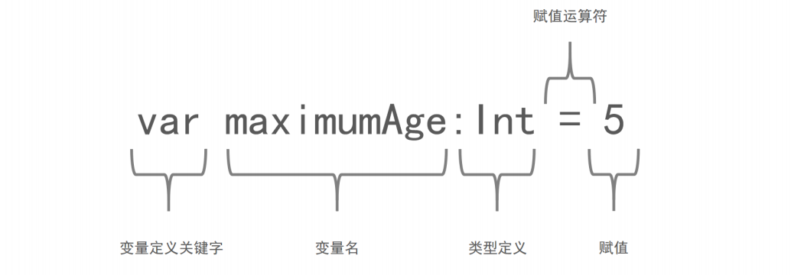
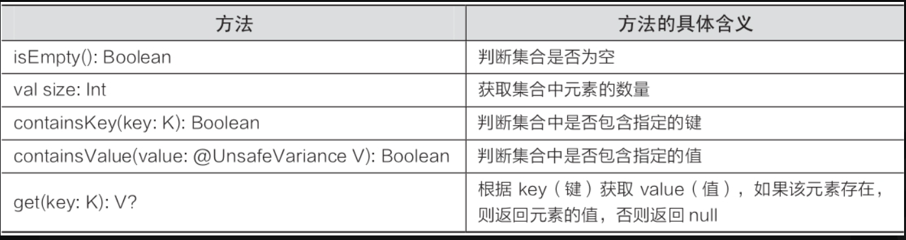
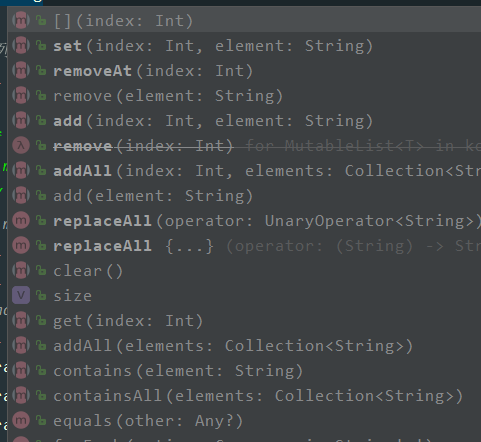
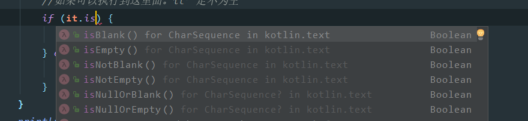
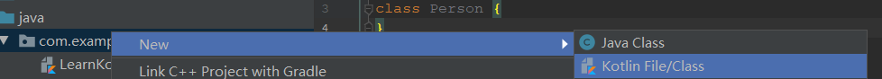
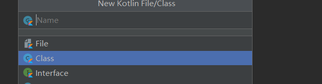
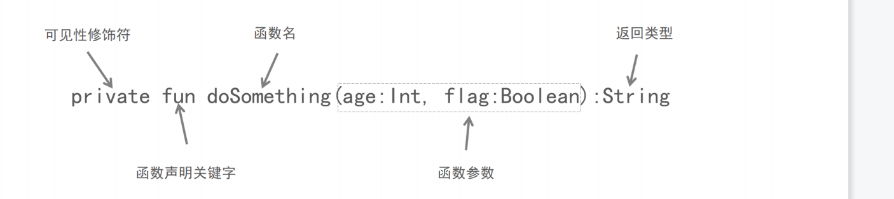
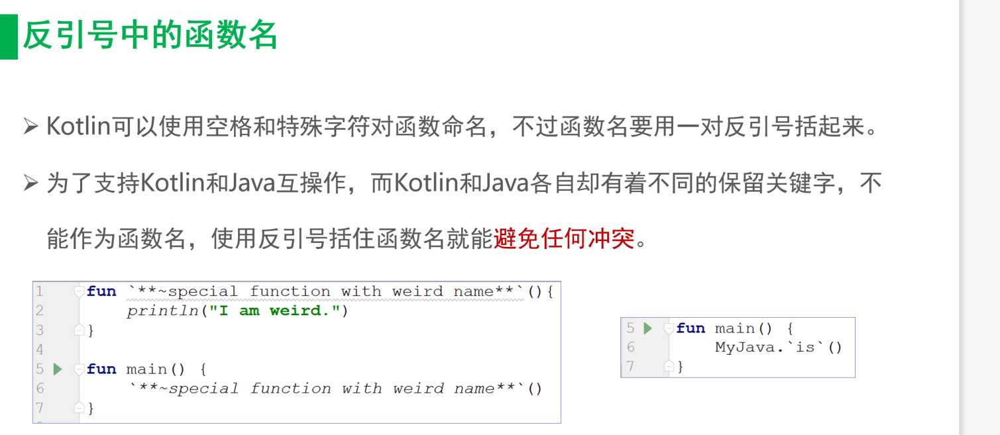

[TOC]


参考1：[kotlin官方中文文档](http://www.kotlincn.net/docs/reference/coroutines/coroutines-guide.html)

参考2：第一行代码第三版

参考3：[菜鸟教程](https://www.runoob.com/kotlin/kotlin-tutorial.html)

- [Kotlin官网文档](https://kotlinlang.org/docs/reference/)
- [kotlin中文官网文档](http://www.kotlincn.net/docs/reference/)
- [Kotlin在线IDE](https://try.kotlinlang.org/)
- [Kotlin On Github](https://github.com/JetBrains/kotlin)

# Kotlin

# 基础语法

Kotlin 文件以 .kt 为后缀

##  包声明

代码文件的开头一般为包的声明：

```
package com.example.kotlindemoone
fun main() {
    val  a = 10
    println("a = "+a)
}
```

**注意：**

-  **打印日志尽量不要使用println()，而是应该使用Log，为什么这里却还是使用了println()呢？这是因为Log是Android中提供的日志工具类**，而我们现在是独立运行的Kotlin代码，和Android无关，所以自然是无法使用Log的
- **Kotlin每一行代码的结尾是不用加分号的**

##  变量和常量

###  变量

**Kotlin的变量没有默认值，java有默认值**，kotlin是静态语言

**参考上面的代码**

参数格式为：参数 : 类型                                比如：val  a:Int = 10



在Java中如果想要定义一个变量，需要在变量前面声明这个变量的类型，比如说int a表示a是一个整型变量，String b表示b是一个字符串变量。而Kotlin中定义一个变量，**只允许在变量前声明两种关键字：val和var。**关键字 <标识符> : <类型> = <初始化值>**

- val（value的简写）用来声明一个**不可变的变量**，这种变量在初始赋值之后就再也不能重新赋值，对应Java中的final变量。

- var（variable的简写）用来声明一个**可变的变量**，这种变量在初始赋值之后仍然可以再被重新赋值，对应Java中的非final变量。

但是Kotlin的类型推导机制并不总是可以正常工作的，比如说如果我们对一个变量延迟赋值的话，Kotlin就无法自动推导它的类型了。这时候就需要显式地声明变量类型才行，Kotlin提供了对这一功能的支持，语法如下所示

var a:Int= 10

### 常量和静态方法

[学习](https://www.jianshu.com/p/e8752c880088)

编译时常量

>- 只读变量并非绝对只读。
>- **编译时常量只能在函数之外（包含main方法）定义**，因为编译时常量必须在编译时赋值，而函数都
>  是在运行时才调用，函数内的变量也是在运行时赋值，编译时常量要在这些变量赋值前就已存在。
>- 编译时常量只能是常见的基本数据类型:String.Int、Double、Float、Long、
>  Short、Byte、Char、Boolean。

`val`关键字前面加上`const`关键字

```
const val NUM_A = 6
```

其特点：**`const`只能修饰`val`，不能修饰`var`**

1. 在顶层声明

2. 在`object`修饰的类中声明，在`kotlin`中称为**对象声明**，它相当于`Java`中一种形式的单例类

3. 在伴生对象中声明

   ```
   // 在顶层声明
    const val TEXT_NUM1 ="在顶层声明的常量" 
   fun main(args: Array<String>) {
       println("顶层声明：${TEXT_NUM1}")
       println("在object修饰的类中：${TestConst.TEXT_NUM2}")
       println("伴生对象中声明：${TestClass.TEXT_NUM3}")
   
   }
   object TestConst{
       const val TEXT_NUM2 ="在object修饰的类中"
   }
   class TestClass{
       /*在这里也涉及到了一个子知识点companion object，需要进行学习下，与object的区别又啥呢
         companion object 修饰为伴生对象,伴生对象在类中只能存在一个，类似于java中的静态方法 Java 中使用类访问静态成员，静态方法。
        */
       companion object {
           const val TEXT_NUM3 ="伴生对象中声明"
       }
   }
   
   输出结果：顶层声明：在顶层声明的常量
           在object修饰的类中：在object修饰的类中
           伴生对象中声明：伴生对象中声明
   ```

## 关键字

### open

在学习open的时候，可以在学习下java中的final在进行学习下

- 在 Java 开发中默认可以被继承的类不需要添加 final 关键字，如需不想被继承例如 String 类添加 final 修饰类。

- **在**Kotlin开发中类和方法默认不允许被继承和重写，等同于Java中用 final 修饰类和方法。
  如果在Kotlin 中类和方法想被继承和重写，需添加open 关键字修饰。

- ```
  open class Person
  open class Student : Person() 
  ```

## 数据类型


>Java有两种数据类型:引用类型与基本数据类型。
>      Kotlin只提供引用类型这一种数据类型，出于更高性能的需要，Kotlin编译器会在Java字节码中改用基本数据类型。
>
>

### 基本数据类型

#### 基本数据类型的分类

在java中数据类型分为基本基本数据类型基和引用数据类型

- 在Kotlin中变量的首字母都是大写，注意java都是小写，因此，Kotlin都是对象数据类型，而java是基本数据类型

  | java基本数据类型 | Kotlin对象数据类型 | 数据类型说明 |
  | ---------------- | ------------------ | ------------ |
  | int              | Int                | 整型         |
  | long             | Long               | 长整型       |
  | short            | Short              | 短整型       |
  | float            | Float              | 单经度浮点   |
  | double           | Double             | 双经度浮点   |
  | boolean          | Boolean            | 布尔型       |
  | char             | Char               | 字符型       |
  | byte             | Byte               | 字节型       |

  - 常量与变量都可以没有初始化值,但是在引用前必须初始化，编译器支持自动类型判断,即声明时可以不指定类型,由编译器判断

    ```
    val a: Int = 1
    val b = 1       // 系统自动推断变量类型为Int
    val c: Int      // 如果不在声明时初始化则必须提供变量类型
    c = 1           // 明确赋值
    
    
    var x = 5        // 系统自动推断变量类型为Int
    x += 1           // 变量可修改
    ```

#### 比较两个数字大小==与===

- 在 Kotlin 中，三个等号 === 表示比较对象地址，两个 == 表示比较两个值大小

- 在java中**== 比**较的是变量(栈)内存中存放的对象的(堆)内存地址，用来判断两个对象的地址是否相同，即是否是指相同一个对象。比较的是真正意义上的指针操作。**equals**用来比较的是两个对象的内容是否相等，由于所有的类都是继承自java.lang.Object类的，所以适用于所有对象，如果没有对该方法进行覆盖的话，调用的仍然是Object类中的方法，而Object中的equals方法返回的却是==的判断。

- ```
  fun main(args: Array<String>) {
      val a: String = "Aa"
      val b: String = "BB"
      val c: String = "BB"
      val e:String="aa".capitalize()// 将首字母转换为大写
      println(a.equals(c))// java中的equals
      println(a == c) //输出结果：false
      println(a === c) // 输出结果：false
      println(b == c) //输出结果：true ,内容比较
      println(b === c)//输出结果：true ,引用比较
      println(a == e)//输出结果：true ,内容比较
      println(a === e)//输出结果：false ,引用比较，当转换对的时候重新开辟了一个内存单元
  
  }
  ```

#### 类型转换

由于不同的表示方式，较小类型并不是较大类型的子类型，较小的类型不能隐式转换为较大的类型。 这意味着在不进行显式转换的情况下我们不能把 Byte 型值赋给一个 Int 变量。

每种数据类型都有下面的这些方法，可以转化为其它的类型：

```
toByte(): Byte
toShort(): Short
toInt(): Int
toLong(): Long
toFloat(): Float
toDouble(): Double
toChar(): Char
```

以后字符串··有关整形的转换，尽量使用此toIntOrNull函数

```
fun main(args: Array<String>) {
    val number: Int = "123".toInt()
    println(number)
    //解决什么奔溃的问题
    val number2: Int? = "123".toIntOrNull()
    val number3: Int? = "123.9".toIntOrNull()
    println(number2)
    //Elvis操作符（?:）,当值为空的时候，我们不想输出null,这是我们可以利用？：来自定义我们需要输出的内容，当为null的时候输出？：后面的内容，当不为空的时候不输出
    println(number3?:"num3为空")

}
```

##### Double转Int

**用roundToInt函数，DOuble->Int有四舍五入的效果**

```
fun main(args: Array<String>) {
    println(65.65.toInt()) //输出65，四舍五入
    println(65.65.roundToInt())//66,四舍五入
    // 用roundToIn函数，DOuble->Int有四舍五入的效果
}
```

#### 保留小数后几位的问题

利用**%.nf.format**来保留，保留的小数

```
// 保留小数点
val data  ="%.3f".format(43.31456)
println(data) //43.315
```

###  类型推断

```
 //var str:String ="Hello word"
  var str ="Hello word" //类型推断：对于已经声明并且赋值的变量，他允许你省略定义的类型
```


### 比较值的大小

在 Kotlin 中，三个等号 === 表示比较对象地址，两个 == 表示比较两个值大小。（==相当于java中的equal）

```kotlin
// TODO 比较两个值
fun main() {

    val name1: String = "张三"
    val name2: String = "张三"
    // --- 比较值本身
    // == 等价 Java的equals
    println(name1.equals(name2))
    println(name1 == name2) //kotlin推荐这种写法


    // ---  比较对象地址
    val test1:Int? =  10000
    val test2:Int? =  10000
    println(test1 === test2) // false
}
```

### **类型转换**

#### 显示转换

```
toByte(): Byte
toShort(): Short
toInt(): Int
toLong(): Long
toFloat(): Float
toDouble(): Double
toChar(): Char
```

### **位运算符**

- ```
  Kotlin中对于按位操作，和Java是有很大的差别的。
  ```

  ```
  Kotlin中没有特殊的字符，但是只能命名为可以以中缀形式调用的函数，下列是按位操作的完整列表(仅适用于整形（Int）和长整形（Long）)：
  ```

  1. `shl(bits)` => 有符号向左移 (类似`Java`的`<<`)
  2. `shr(bits)` => 有符号向右移 (类似`Java`的`>>`)
  3. `ushr(bits)` => 无符号向右移 (类似`Java`的`>>>`)
  4. `and(bits)` => 位运算符 `and` (同`Java`中的按位与)
  5. `or(bits)` => 位运算符 `or` (同`Java`中的按位或)
  6. `xor(bits)` => 位运算符 `xor` (同`Java`中的按位异或)
  7. `inv()` => 位运算符 按位取反 (同`Java`中的按位取反)

### 字符转义

- `\t` => 表示制表符
- `\n` => 表示换行符
- `\b` => 表示退格键（键盘上的Back建）
- `\r` => 表示键盘上的`Enter`键
- `\\` => 表示反斜杠
- `\'` => 表示单引号
- `\"` => 表示双引号
- `\$` => 表示美元符号，如果不转义在`kotlin`中就表示变量的引用了
- 其他的任何字符请使用Unicode转义序列语法。例：'\uFF00'

## 类型检测

### 运算符

#### is，!is，as，as?运算符

1. **is，!is**

-   在kotlin中通过is来进行类型的检测，**相当于java中instanceof**

- **is运算符可以检查对象A是否是特定的类型，还可以检查一个对象是否属于某种数据类型（Int、String等）**。

- Kotlin中我们可以在运行时通过 is 或者 !is 来检查对象是否符合所需的类型

- ```
  fun main(args: Array<String>) {
      println("你好" is String)// 输出：true
      println("你好" !is String)// 输出：false
  
  }
  ```

1. **as运算符和as?运算符**

   **as运算符用于执行引用类型的显式类型转换**。如果要转换的类型与指定的类型兼容，转换就会成功进行；如果类型不兼容，使用as?运算符就会返回值null。在Kotlin中，父类是禁止转换为子类型的。

   ```
   fun main(args: Array<String>) {
       val student =Student()
       val person = Person()
       println(student as Person ) // 输出Student@266474c2
       println(person as Student )// 报错 :Exception in thread "main" java.lang.ClassCastException: Person cannot be
       cast to Student
       println((person as? Student))// 输出：null
   }
   open class Person
   open class Student : Person() 
   
   ```

```csharp
JAVA

if(view instanceof TextView) {
    ((TextView) view).setText("text");
}

Kotlin

if(view is TextView) {
    (view as TextView).setText("text")
}
```

#### 可空？

```
fun main(args: Array<String>) {
    // 第一种情况：默认不可空的情况。不能随意给null
    val name: String = "Derry"
    //报错：Null can not be a value of a non-null type String：不能为非空类型String的值
    // name = null 
    println("name:$name")
    // 第二种情况：声明时指定为可空的类型
    val name2: String ?
    name2 = null
   // name2 = "学习可空"
    println("name2:$name2")
}
```


#### 安 全调用符（?.）

专门用于调用可空类型变量中的成员方法或属性，其语法格式为“变量?.成员”。其作用是判断变量是否为null，如果不为null才调用变量的成员方法或者属性。

```
fun main(args: Array<String>) {
    var name: String? = "kotlin"
    name = null
    // 将首字母转换为大写
    //name.capitalize() name是可空类型的，要想使用必须给出补救措施
    name?.capitalize() // name为可空类型，当name为null的时候，？后面的不执行
    println(name?.capitalize())
}
```

#### Elvis操作符（?:）

在使用安全调用符调用可空变量中的成员方法或属性时，如果当前变量为空，则会返回一个null值，但有时即使当前变量为null，也不想返回一个null值而是指定一个默认值，此时该如何处理呢？为了解决这样的问题，Kotlin中提供了一个Elvis操作符（?:），通过Elvis操作符（?:）可以指定可空变量为null时，调用该变量中的成员方法或属性的返回值，其语法格式为“表达式?:表达式”。

####  非空断言（!!.）

除了通过使用安全调用符（?.）来使用可空类型的变量之外，还可以通过非空断言（!!.）来调用可空类型变量的成员方法或属性。使用非空断言时，调用变量成员方法或属性的语法结构为“变量!!.成员”。非空断言（!!.）会将任何变量（可空类型变量或者非空类型变量）转换为非空类型的变量，若该变量为空则抛出异常

## 容器

容器：存放数据的载体，容器分为数组和集合

### 数组

#### 数组定义

在学习的时候可以对比着java进行学习

数组：初始化时候指定容器的大小，不可以动态的调整大小。元素安顺序存储在一连串的内存段上

#### kotlin 数组的创建

**声明对象数组的三种形式：**

*(1)使用arrayOf函数和指定的数组元素创建数组，必须指定数组的元素，可以为任意类型*

```
//Java写法:
String[] params1 = {"str1", "str2", "str3"};
//kotlin写法:`
val params1 = arrayOf("str1", "str2", "str3")
```

*(2).使用arrayOfNulls函数创建一个指定大小的并初始化每个元素为null的数组，但是必须指定元素的类型*

```
//Java写法:
String[] params2 = new String[12];

//kotlin写法:
val params2 = arrayOfNulls<String>(12)
```

*(3)Array构造方法指定数组大小和一个生成元素的lambda表达式*

这种方法创建的数组，其中的每个元素都是非空的

```
//kotlin写法:
val params3 = Array<String>(3){i -> "str" + i }
// 也可以这么写
val params=Array(3){"str$it"}
```

#### 基本数据类型数组

- [] 运算符代表调用成员函数 get() 和 set()。数组是不可变的

- 除了类Array，还有ByteArray, ShortArray, IntArray，用来表示各个类型的数组，省去了装箱操作，因此效率更高，其用法同Array一样：

  ```
   val x: IntArray = intArrayOf(1, 2, 3)
   x[0] = x[1] + x[2]
   println(x[0])  //输出5
   
    val inArray = IntArray(5)
    inArray[0]= 2
    // 创建一个长度为5，值全部为100的整型数组intArray[100,100,100,100,100]
    val intArray2 = IntArray(5){100}
    //这里it是它的索引值，所以创建一个长度为5的intArray[0,2.4,8,16],it是lamble是专有表达式，这里代表数组的下标
    val intArray3 = IntArray(5){it*2 } //{i -> i*2}
  ```

|          | kotlin        | java        |
| -------- | ------------- | ----------- |
| 整型     | IntArray      | int[]       |
| 整型装箱 | Array<Int>    | Integer[]   |
| 字符     | CharArray     | char[]      |
| 字符装箱 | Array<Char>   | Character[] |
| 字符串   | Array<String> | String[]    |
|          |               |             |

```
@description ：Kotlin中的数组类型
Kotlin语言中的各种数组类型，虽然是引用类型，背后可以编译成Java基本数据类型
IntArray        intArrayOf
DoubleArray     doubleArrayOf
LongArray       longArrayOf
ShortArray      shortArrayOf
ByteArray       byteArrayOf
FloatArray      floatArrayOf
BooleanArray    booleanArrayOf
Array<对象类型>           arrayOf         对象数组
 */
// 1.intArrayOf 常规操作的越界奔溃
// 2.elementAtOrElse elementAtOrNull
// 3.List集合转 数组
// 4.arrayOf Array<File>
fun main() {
    // 1.intArrayOf 常规操作的越界奔溃
    val intArray /*: IntArray*/ = intArrayOf(1, 2, 3, 4, 5)
    println(intArray[0])
    println(intArray[1])
    println(intArray[2])
    println(intArray[3])
    println(intArray[4])
    // println(intArray[5]) // 奔溃：会越界异常

    println()

    // 2.elementAtOrElse elementAtOrNull
    println(intArray.elementAtOrElse(0) { -1 })
    println(intArray.elementAtOrElse(100) { -1 })

    println(intArray.elementAtOrNull(0))
    println(intArray.elementAtOrNull(200))

    // OrNull + 空合并操作符 一起来用
    println(intArray.elementAtOrNull(666) ?: "你越界啦啊啊啊")

    println()

    // 3.List集合转 数组
    val charArray /*: CharArray*/ = listOf('A', 'B', 'C').toCharArray()
    println(charArray)

    // 4.arrayOf Array<File>
    val objArray /*: Array<File>*/ = arrayOf(File("AAA"), File("BBB"), File("CCC"))
}
```

#### 数组的遍历

**java遍历数组**

```
/*
java遍历数组的方法：fori,forEach,
 forEach：遍历数组中的每个元素，且不需要下标
 */
for (int forEach : a) {
   System.out.println("forEach=" + forEach);
}
for (int i = 0 ; i< a.length;i++){
   System.out.println("for遍历:"+a[i]);
}
```

**kotlin遍历数组**

方法一：for-in

```
val numbers2 = Array(10, { value: Int -> (value + 200) })
// 数组for循环遍历 for-in
for (value in numbers2) {
    println(value) //输出200 201 202 203 204 205 206 207 208 209
}
// for-in的加强版： 根据下标在取出数组中的元素
    for (i:Int in numbers2.indices){
    println(i.toString()+"->"+numbers2[i])//输出结果0->200 1->201 2->202 3->203 4->204 5->205 6->206 7->207 8->208 9->209
    }
```

方法2：forEach

```
numbers2.forEach { 
   println("forEach:$it") 
}
   // forEach加强版，同时遍历下标和元素 
    numbers2.forEachIndexed{index, i ->
        println("$index:$i")
    }
```


#### 数组的替换值

数组用类 Array 实现，并且还有一个 size 属性及 get 和 set 方法，由于使用 [] 重载了 get 和 set 方法，所以我们可以通过下标很方便的获取或者设置数组对应位置的值

#### 字符数组转换成字符串

    fun main() {
        // 第一种形式建立数组arrayOf
        val numbers = arrayOf(1, 2, 3, 4, 5, 6, 7, 8)
         println(numbers[0]) //输出1
         println(numbers[7]) //输出8
         // 数组遍历
        for (number in numbers) { 
             println(number) // 输出1 2 3 4 5 6 7 8
        }
    // 第二种形式 Array value=0     长度为10，然后根据value+200循环赋值
    val numbers2 = Array(10,  {value: Int -> (value + 200) })
    for (value in numbers2) {
        println(value) //输出200 201 202 203 204 205 206 207 208 209
    
    }
}

### 集合

#### 集合的分类


[参考学习1](https://www.jianshu.com/p/fa5abe312269)

[参考学习2](https://www.songyubao.com/book/primary/kotlin/kotlin-data-collection.html)

与数组不同的是集合的大小可以任意改变	，按照类型分类

- list:是一个有序列表，可以通过索引(下标)访问列表。元素可以在列表中出现多次，可以重复
- set:是唯一的元素集合，一组无重复数据的对象，一般来说set中元素的顺序并不重要
- map：（字典）键值对，键是唯一的，每个键刚好映射到一个值，值可以重复

按照可变性分类

- 可变集合
- 不可变集合

具体来说
 对于List

- List ——声明不可变List集合
- MutableList——声明可变List集合

对于Map

- Map——声明不可变Map集合
- MutableMap——声明可变Map集合

对于Set

- Set——声明不可变Set集合
- MutableSet——声明可变Set集合

除此之外还有四个基本接口

- Iterable ——所有集合的父类
- MutableIterable —— 继承于Iterabl接口，支持遍历的同时可以执行删除操作
- Collection —— 继承于Iterable接口，仅封装了对集合的只读方法
- MutableCollection ——继承于Iterable,Collection，封装了添加或移除集合中元素的方法

| 类型 | 数组创建方式                                           | 示例                                                         | 说明                                        | 是否可变 |
| ---- | ------------------------------------------------------ | ------------------------------------------------------------ | ------------------------------------------- | -------- |
| list | arrayListOf<T>() mutableListOf<T> 相同元素类型的队列   | val array = arrayListOf<Int>(1, 2, 3) val array = mutableListOf<String>() | - 必须指定元素类型                          | 可变     |
|      | listOf<T>() 相同元素类型的集合                         | val array = listOf<Int>(1, 2, 3)                             | - 必须指定元素类型 - 必须指定初始化数据元素 | 不可变   |
| map  | arrayMapOf<K,V>() mutableMapOf<K,V> 相同元素类型的字典 | val array= arrayMapOf(Pair("key","value")) val array= mutableMapOf() | - 初始元素使用Pair包装                      | 可变     |
|      | mapOf<T>() 相同元素类型的字典                          | val array= mapOf(Pair("key","value"))                        | - 元素使用Pair包装 - 必须指定初始元素       | 不可变   |
| set  | arraySetOf<T>() mutableSetOf<T> 相同元素类型的集合     | val array= arraySetOf<TInt>(1,2,3) val array= mutableSetOf<Int>() | - 会对元素自动去重                          | 可变     |
|      | setOf<T>() 相同元素类型的集合                          | val array= arraySetOf<Int>(1,2,3)                            | - 对元素自动去重 - 必须指定元素类型。       | 不可变   |

##### list

###### list的分类

**可变**:mutableListOf

**不可变**:listOf

不可进行增删改操作

```
//列表的创建---不可变列表，必须指定元素类型，必须指定初始化数据元素
val arrayInt = listOf<Int>(1, 2, 3, 4)
```

###### list的取值

取值： 防止奔溃取值方法：getOrElse getOrNUll

```
@description ：kotlin中list的创建和元素获取
// 普通取值的方式：索引
// 防止奔溃取值方法：getOrElse getOrNUll
 */
fun main(args: Array<String>) {
    val list = listOf("AA", "BB", "CC")
    // 普通方法
    println(list[0])
    println(list[1])
    println(list[2])
    //println(list[3]) 报错：Exception in thread "main" java.lang.ArrayIndexOutOfBoundsException: 3

    // kotlin中一定不会出现空指针异常，下标越界异常
    // 防止奔溃的取值方式：getOrElse，getOrNull
    println(list.getOrElse(3) { "越界" })
    //getOrNull+空合并操作符
    println(list.getOrNull(3))

}
```

###### 可变和不可变的转换

不可变转换为可变：toMutableList（）

可变转换为不可变：toList()

```
fun main(args: Array<String>) {
    val list = mutableListOf("AA", "DD", "CC")
    list.add("你好")
    list.add("哈哈")
    println(list)

    // 不可变集合to可变集合
    // 不可变集合：不能进行增删改查。 可变集合：可以进行操作
    val list2 = listOf("1", "2", "3")
    // list2.add() //不可变集合无法完成可变的操作
    val list3 = list2.toMutableList()
    list3.add("不可变集合to")
    println(list3)
    // 可变转换为不可变
    val list4 = list3.toList()
    //list4.add
}
```

###### list的方法

- mutato：-=，+=
- removeIf:删除元素
- removeAt(3)：删除指定位置的元素
-  forEach循环遍历list中元素
- reverse()：集合翻转
- .add(2, "33")：指定位置插入元素
- add("34"）：不指定位置插入元素
- clear():清除整个集合
- sort:排序。从小到大进行排序

```
列表的创建---可变列表，必须指定元素类型
val arrayString = mutableListOf<String>()
arrayString.add("1")
arrayString.add("2")
arrayString.add("3")
arrayString.add(3, "4")
val arrayString2 = mutableListOf<String>("1", "2", "3", "4")
val iterator = arrayString2.iterator()
iterator.forEach { println("it:${it}") }// forEach循环遍历list中元素
println("add-index:${arrayString2.add(2, "33")}") // 指定位置插入元素
println("add:${arrayString2.add("34")}") //不指定位置插入元素，输出结果true
println("removeAt:${arrayString2.removeAt(3)}") //移除指定位置的元素
println("clear:${arrayString2.clear()}")// 集合中的元素会被清除
arrayString2.forEach {
    println("reverse:${arrayString2.reverse()}")//集合元素翻转  
}
arrayString2.sort()//排序。从小到大进行排序
    val list = mutableListOf("AA", "AABB", "AACC", "Dd")
    //mutator
    list += "李四" //mutator的的特性，-=,+=其实背后就是运算符存在
    list += "婷婷"
    list -= "Dd"
    println(list)
    // removeif:过滤元素
    list.removeIf { true }// //如果是true，自动遍历整个集合，进行一个元素一个元素的删除，及删除集合中所有的元素
    list.removeIf { it.contains("AA") } // ，过滤所有的元素，只要元素元素中包含有AA，就删除这个元素
    println(list)
```

###### 遍历list的方法

```
fun main(args: Array<String>) {
    val list = listOf(1, 2, 3, 4, 5)

    // 第一种方式
    for (i in list) {
        println("for-in元素：$i")
    }
    println("--------------------")
    // 第二种方式
    list.forEach {
        println("forEach遍历元素：$it")
    }
    println("+++++++++")
    // 第三种方式
    list.forEachIndexed { index, i ->
        println("下标：$index,元素：$i")
    }
}
```

###### 解构语法过滤元素学习

```
@description :kotlin的解构语法过滤元素学习
// 1.集合配合解构语法
// 2.反编译看Java给三个变量赋值的代码
// 3.解构屏蔽接收值
 */
fun main(args: Array<String>) {
    val list = listOf("1", "2", "3")
    val(v1,v2,v3) = list
    println("v1:$v1,v2:$v2,v3:$v3")
    // 只读
    var(a,b,c) =list
    println("a:$a,b:$b,c:$c")
    //_不是基本数据类型，因此可以不用给他赋值，这是可以进行过滤，这样也节约了性能
    val(_,e,f) =list
    println("e:$e,f:$f")
}
```

##### map

想存储具有映射关系的数据，使用map

###### map的分类

Map集合中的元素是无序可重复的，Map集合与List、Set集合类似，同样分为不可变集合Map和可变集合MutableMap两种，其中可变集合MutableMap可以对集合中的元素进行增加和删除的操作，不可变集合Map对集合中的元素仅提供只读操作。

**可变**

```
//map--可变，使用Pair指定集合中初始化的元素
val arrayMap3 = mutableMapOf<String, String>()
arrayMap3["1"] = "1"
arrayMap3["2"] = "2"
arrayMap3["3"] = "3"
```

**不可变**

不可变Map集合的查询操作主要有判断集合是否为空、获取集合中元素的数量、判断集合中是否包含指定的键、判断集合中是否包含指定的值以及根据key（键）获取value（值）

```
// map---不可变字典，不可动态添加，删除元素
val arrayMap = mapOf(Pair("key", "value"))
val arrayMap2 = mapOf<String, String>()
```



###### map的取值

```
val map = mapOf(1 to "你", 2 to "好", 3 to "Kotlin语言的读取Map的值")
```

- 方式1：[] ：找不到会返回null，不会奔溃

```
源码：
/**
*Returns the value corresponding to the given [key], or `null` if such a key is not present in the map.
​ 返回对应于给定[key]的值，如果映射中不存在这样的键，则返回' null '。 
*/
public operator fun get(key: K): V?**
```

​         2，operator：运算符的重载 

```
举例：
println(map[2]) //输出：好
println(map[3]) //输出：Kotlin语言的读取Map的值
println(map[5]) //好不到会返回null
```

- 方式2：getOrDefault() ：如果找不到键，则返回指定的默认值。

```
源码：
@SinceKotlin("1.1")
@PlatformDependent
public fun getOrDefault(key: K, defaultValue: @UnsafeVariance V): V {
// See default implementation in JDK sources
return null as V
```

```
举例：
println(map.getOrDefault(1, "你"))//输出值 你
println(map.getOrDefault(2, "是否错误"))//输出值 好
println(map.getOrDefault(5, "getOrDefault()"))//输出值 getOrDefault()
```

- 方式3：getOrElse：返回给定键的值，如果没有给定键的条目，则返回[defaultValue]函数的结果。

```
源码
* @kotlin.internal.InlineOnly
  public inline fun <K, V> Map<K, V>.getOrElse(key: K, defaultValue: () -> V): V = get(key) ?: defaultValue()
```

```
举例子
println(map.getOrElse(1, { "你" })) //输出值 你
println(map.getOrElse(2, { "getOrElse取值" }))//输出值 好
println(map.getOrElse(5) { "getOrElse取值" })//输出值 getOrElse取值
```

- 方法四：get（key）和java一样会奔溃

  ```
  println(map.get(1))
  ```

###### map的操作方法

##### set

set里元素打印出是不能重复的

###### 分类

**可变**

```
// set:可变集合
val set = mutableSetOf<String>()
set.add("1")
set.add("2")
set.add("3")
set.add("4")
for (item in set) {
    println(item)
}
val set2 = mutableSetOf<String>("1", "2", "4")
print("isEmpty:${set2.isEmpty()}")//isEmpty
print("contain:${set2.contains("6")}")//contains
```

**不可变**

```
//set:不可变集合,元素唯一
val set3 = setOf<String>()
```

###### set的取值

**普通方法**：elementAt

**防止奔溃的方法**：elementAtOrElse

```
fun main(args: Array<String>) {
    var set = setOf("测试1", "测试2", "测试2", "kotlin中元素的创建以及获取") //set中不会有重复元素
    println(set) //[测试1, 测试2, kotlin中元素的创建以及获取]
    // 获取set集合元素,在set中没有[]
    set.elementAt(0)
    set.elementAt(1)
    set.elementAt(2)
    // set.elementAt(4)  奔溃 会越界:Exception in thread "main" java.lang.IndexOutOfBoundsException
    println("------------")
    // 使用 list 或 set 集合，尽量使用  此方式，防止越界奔溃异常
    // 在给定的[index]处返回一个元素，或者如果[index]超出了集合的范围，则返回调用[defaultValue]函数的结果。 
    println(set.elementAtOrElse(0) {"越界了"})
    println(set.elementAtOrElse(100) {"越界了"})
    //这种类型一般加OrNull+空合并操作符？：一起使用
    println(set.elementAtOrNull(100)?:"越界了")
}
```

#### 集合的操作

add:添加元素确实改变了集合就返回true，如果集合没有发生变化就返回false。



#### 集合转换与快捷函数

```
// TODO 64.Kotlin语言的集合转换与快捷函数学习
// 1.定义可变list集合
// 2.List 转 Set 去重
// 3.List 转 Set 转 List 也能去重
// 4.快捷函数去重 distinct
 */
fun main(args: Array<String>) {
    val list : MutableList<String> = mutableListOf("Derry", "Derry", "Derry", "Leo", "Lance") // list 可以重复元素
    println(list)

    // List 转 Set 去重
    val set /*: Set<String>*/ = list.toSet()
    println(set)

    // List 转 Set 转 List 也能去重
    val list2 /*: List<String>*/ = list.toSet().toList()
    println(list2)

    // 快捷函数去重 distinct
    println(list.distinct()) // 内部做了：先转变成 可变的Set结合  在转换成 List集合
    println(list.toMutableSet().toList()) // 和上面代码等价
}
```

## 字符串

和 Java 一样，String 是不可变的。方括号 **[] 语法可以很方便的获取字符串中的某个字符**，也可以通过 for 循环来遍历：

```
val  str:String = "Hello Word"
 println(str[0]) //输出H(一个字符)
    for (c in str) {  // 可以用 for 循环迭代字符串
        println(c)  //输出 H e l l o W o r d（所有字符）
    }
```

- [更多字符串的操作请参考下面博主的连接](https://juejin.cn/post/6844903613869883405)

- Kotlin 支持三个引号 """ 扩起来的字符串，支持多行字符串

  ```
  fun main(args: Array<String>) {
      val text = """
      多行字符串
      多行字符串
      """.trimMargin()
      println(text)   // 输出有一些前置空格
  }
  ```

- String 可以通过 trimMargin() 方法来删除多余的空白。

###  字符串模板 $

- $ 表示一个变量名或者变量值
- $varName 表示变量值
- ${varName.fun()} 表示变量的方法返回值

字符串可以包含模板表达式 ，即一些小段代码，会求值并把结果合并到字符串中。 **模板表达式以美元符（$）开头，由一个简单的名字构成:**

```
fun main(args: Array<String>) {
    val a = 3
    val s = "a = $a" // 求值结果为 "a = 3"
    println(s)
}
```

或者用花括号扩起来的任意表达式:

```
fun main(args: Array<String>) {
    val s = "runoob"
    val str = "$s.length is ${s.length}" // 求值结果为 "runoob.length is 6"
    println(str)
}

```

### 字符串拼接

java 中我们通常使用`StringBuilder`、`concat`或者`+`等方式来拼接字符串。**Kotlin中还可以使用字符串模板和`plus`**

```
// 字符串的拼接
val a = "Hello"
val b = "World"
val c = "$a $b"
val d = "$a $b！"
val e = a.plus(" ").plus(b)
val f = a.plus(" ").plus(b).plus("！")
println("c:$c")
println("d :$d")
println("e:$e")
println("f:$f")
输出结果：c:Hello World
d :Hello World！ 
e:Hello World
f:Hello World！
反编译成java
    a = "Hello";
    String b = "World";
    (new StringBuilder ()).append(a).append(' ').append(b).toString();
    String d = a +' ' + b + '！';
    (new StringBuilder ()).append(a + " ").append(b).toString();
    String f = a +" " + b + "！";
```

### 字符串的转义

**字符串字面量**

> 在`Kotlin`中， 字符串字面量有两种类型：
>
> - 包含转义字符的字符串 转义包括（`\t`、`\n`等）,不包含转义字符串的也同属此类型
> - 包含任意字符的字符串 由三重引号（`""" .... """`）表示

### 字符串的截取subString

subString和java中的用法几乎相同，可以查看java中的用法

### split

split返回的是list集合数据

```
val jsonTest = "AA,SS,DD,FF"
val test = "Hello World"
val test2 = "你好|World"
val test3 = "你猜猜看.World"

//list类型自动推断成List<String>
val list = jsonTest.split(",")
println(test.split(" "))//输出：[Hello, World]
// 不接构输出
println(list) //输出：[AA, SS, DD, FF]
println(test2.split("|"))// 输出：[你好, World]
println(test3.split(".")) //输出：[你猜猜看, World]
// c++。解构，kotlin也有解构
val (v1, v2, v3, v4) = list
println("v1:$v1,v2:$v2,v3:$v3,v4:$v4") //输出：v1:AA,v2:SS,v3:DD,v4:FF
}
```

### replace

在kotlin中 replace的作用和在java中的基本一样，可以参考java中的学习

### 字符串判空

在kotlin中提供了很多的实现不同功能的判空的方法




- isBlank

  等价于：str == null || str.length == 0 || str.trim().length == 0

- isEmpty

  等价于：str == null || str.length == 0

- isNotBlank

  等价于：str != null && str.length > 0 && str.trim().length > 0

- isNullOrBlank

  等价于：str == null || str==""

- isNullOrEmpty

  判断该字符串是否为`null`或者其`length`是否等于`0`

```kotlin
fun main(args: Array<String>) {
    val str : String? = "kotlin"
    println(str?.isEmpty()) //输出false 等价于str == null || str.length == 0
    println(str?.isNotEmpty()) // 输出：true isEmpty的反结果
    println(str.isNullOrEmpty()) // 输出：false 等价于str == null || str.length == 0
    println(str?.isBlank()) //输出：false 等价于 str == null || str.length == 0 || str.trim().length == 0
    println(str?.isNotBlank())  // 输出：true，isBlank的反结果 等价于str ！= null || str.length ！= 0
    println(str.isNullOrBlank())  // 输出false
}
```

### 字符串的遍历forEach

```
fun main(args: Array<String>) {
    val str = "ABCDEFGHLGKLMNOPKR"
    str.forEach {
        println("字符串遍历结果为：$it")
    }
}
```

## 注释

kotlin中的注释几乎和java中的没啥区别，唯一区别就是在kotlin的多行注释可以嵌套多行注释，这在java中是不可以的

```
/**
 * 第一个多行注释
 *
 * /**
 * 第二个多行注释
 * */
 */
```


## kotlin的运算符

#### 运算符的重载（operator）

[学习参考连接](https://blog.csdn.net/qq_34589749/article/details/103643764)

在学习map的取值的时候遇到了[] 的源码，public operator fun get(key: K): V?，

##### 定义

**运算符重载就是对已有的运算符（比如+，-，* 等等运算符）赋予他们新的含义。即是将这些运算符的操作映射到指定的方法中，为实现这样的操作符，需要为类提供一个固定名字的成员函数或扩展函数，相应的重载操作符的函数需要用 operator 修饰符标记**

##### 操作符的分类以及对应的方法

- 一元操作符

| 操作符 | 方法名         |
| ------ | -------------- |
| +a     | a.unaryPlus()  |
| -a     | a.unaryMinus() |
| !a     | a.not()        |
| a++    | a.inc()        |

- 二元操作符

| 操作符  |                  |
| ------- | ---------------- |
| a + b   | a.plus(b)        |
| a – b   | a.minus(b)       |
| a * b   | a.times(b)       |
| a / b   | a.div(b)         |
| a % b   | a.mod(b)         |
| a..b    | a.rangeTo(b)     |
| a in b  | b.contains(a)    |
| a !in b | !b.contains(a)   |
| a += b  | a.plusAssign(b)  |
| a -= b  | a.minusAssign(b) |
| a *= b  | a.timesAssign(b) |
| a /= b  | a.divAssign(b)   |
| a %= b  | a.modAssign(b)   |

-  数值类型操作符（Array type operators）

| 操作符             | 方法名                |
| ------------------ | --------------------- |
| a[i]               | a.get(i)              |
| a[i, j]            | a.get(i, j)           |
| a[i_1, …, i_n]     | a.get(i_1, …, i_n)    |
| a[i] = b           | a.set(i, b)           |
| a[i, j] = b        | a.set(i, j, b)        |
| a[i_1, …, i_n] = b | a.set(i_1, …, i_n, b) |

-  等于和不等于操作符（Equals Operation）

| 操作符 | 方法名                          |
| ------ | ------------------------------- |
| a == b | a?.equals(b) ?: (b === null)    |
| a != b | !(a?.equals(b) ?: (b === null)) |

-  比较操作符（Comparison operators）

| 操作符 | 方法名              |
| ------ | ------------------- |
| a > b  | a.compareTo(b) > 0  |
| a < b  | a.compareTo(b) < 0  |
| a >= b | a.compareTo(b) >= 0 |
| a <= b | a.compareTo(b) <= 0 |

- 调用操作符（Invoke operator）

| 操作符         | 方法名                |
| -------------- | --------------------- |
| a()            | a.invoke()            |
| a(i)           | a.invoke(i)           |
| a(i, j)        | a.invoke(i, j)        |
| a(i_1, …, i_n) | a.invoke(i_1, …, i_n) |

# 条件控制结构

Kotlin中的条件语句主要有两种实现方式：if和when。

## if条件语句

- Kotlin中的if用法和Java中是几乎完全一样的，但是还是有不同点的

- Kotlin中的if语句相比于Java有一个额外的功能**，它是可以有返回值的**，返回值就是if语句每一个条件中最后一行代码的返回值

```
//方式1
fun Maxlength(num1: Int, num2: Int): Int {
    return if (num1 > num2) {
        num1
    } else {
        num2
    }
//方式2
    fun Maxlength(num1: Int, num2: Int): Int = if (num1 > num2)num1 else num2
}
```

- 使用区间 in  : 使用 in 运算符来检测某个数字是否在指定区间内，区间格式为 **x..y**

- ```
  fun main(args: Array<String>) {
      val x = 5
      val y = 9
      if (x in 1..8) {
          println("x 在区间内")  //输出x 在区间内
      }
  }
  ```

## when条件语句

Kotlin中的when语句有点类似于Java中的switch语句，但它又远比switch语句强大得多。

```
fun getScore(name: String) = when (name) {
    "A" -> 68
    "B" -> 34
    else -> 0
}
```

注意：在 when 中，else 同 switch 的 default。如果其他分支都不满足条件将会求值 else 分支。

​     when语句允许传入一个任意类型的参数，然后可以在when的结构体中定义一系列的条件，格式是：

匹配值->{执行逻辑}  当你的执行逻辑只有一行代码时，{ }可以省略

我们也可以检测一个值在（in）或者不在（!in）一个区间或者集合中：

```
when (x) {
    in 1..10 -> print("x is in the range")
    in validNumbers -> print("x is valid")
    !in 10..20 -> print("x is outside the range")
    else -> print("none of the above")
}
```

**另一种可能性是检测一个值是（is）或者不是（!is）一个特定类型的值。注意： 由于智能转换，你可以访问该类型的方法和属性而无需 任何额外的检测。**

```
fun hasPrefix(x: Any) = when(x) {
    is String -> x.startsWith("prefix")
    else -> false
}
```

when 也可以用来取代 if-else if链。 如果不提供参数，所有的分支条件都是简单的布尔表达式，而当一个分支的条件为真时则执行该分支：

```
when {
    x.isOdd() -> print("x is odd")
    x.isEven() -> print("x is even")
    else -> print("x is funny")
}
```

# 循环语句

Java中主要有两种循环语句：while循环和for循环。而Kotlin也提供了while循环和for循环	

Kotlin在for循环方面做了很大幅度的修改，Java中最常用的for-i循环在Kotlin中直接被舍弃了，而Java中另一种for-each循环则被Kotlin进行了大幅度的加强，变成了for-in循环，所以我们只需要学习for-in循环的用法就可以了

## 区间--range表达式

**in是闭区间**，until可以取消闭区间

```
 for (i in 0..5){ //相当于for(int i; i<=5;i++)
        println(i)
    }
    输出值：0 1 2 3 4 5 
```

解析：

- ..是创建两端闭区间的关键字，在..的两边指定区间的左右端点就可以创建一个区间了，相当于[0  ,5]

- for-in循环最简单的用法了，我们遍历了区间中的每一个元素

- **Kotlin中可以使用until关键字来创建一个左闭右开的区间（**默认情况下，for-in循环每次执行循环时会在区间范围内递增1）

  ```
  for (i in 0 until 5){
      println(i) 
  }
  输出：0 1 2 3 4
  ```

- 跳过一个元素step（）

  ```
  for (i in 0 until 10 step 2){
      println(i)
  }
  输出 0 2 4 6 8
  ```

- downTo 

  ```
  for (i in 0  downTo 1){
      println(i)
  }
  输出：10 9 8 7 6 5 4 3 2 1 0
  ```

# 面向对象编程

## 类和对象

### 类

File通常是用于编写Kotlin顶层函数和扩展函数

如何在Android studio 中建立Kolin的类






#### 类定义

**Kotlin中也是使用class关键字来声明一个类的** ，

```
class Person {.....}
```

#### 类的组成

Kotlin 类可以包含：构造函数和初始化代码块、函数、属性、内部类、对象声明

- 在后面的文章说明汇总对于构造函数已经进行了说明，请查看1.1.4
- 属性

#### 类的属性

类的属性可以用关键字 **var** 声明为可变的，否则使用只读关键字 **val** 声明为不可变。

```
class Person {
   var name = ""
   var age = 0
}
```

我们可以像使用普通函数那样使用构造函数创建类实例：

```
var p = Person();//Kotlin 中没有 new 关键字
```

要使用一个属性，只要用名称引用它即可

```
p.age = 19
p.name = "WDD"
```

####  构造函数

**Koltin 中的类可以有一个 主构造器，以及一个或多个次构造器，主构造器是类头部的一部分**，位于类名称之后:

- 主构造函数

```
class Person constructor(age: Int) {}
--------等价于-------
/*
     因为是默认的可见性修饰符且不存在任何的注释符
     故而主构造函数constructor关键字可以省略
*/
class Person(age: Int){
      ...
}
```

如果主构造器没有任何注解，也没有任何可见度修饰符，那么constructor关键字可以省略。

```
class Person(age: String) {
}
```

> - 构造函数中不能出现其他的代码，只能包含初始化代码。包含在初始化代码块中。
> - 关键字：`init{...}`
> - 值得注意的是，`init{...}`中能使用构造函数中的参数

例：

```
fun main(args: Array<String>) {
    // 类的实例化，会在下面讲解到，这里只是作为例子讲解打印结果
    var test = Test(1)
}

class Person  constructor(var age : Int){
    init {
        age = 5
        println("age = $age")
    }
}
```

**注意：**

https://www.cnblogs.com/Jetictors/p/7758828.html

constructor省略条件

必须是在默认修饰符public修饰的条件下才可以省略，不然不可以省略，并且在修饰符的后面

- 构造函数

- `Kotlin`中支持二级构造函数。它们以`constructor`关键字作为前缀。

- ```
  class Person {
      constructor(){
          
      }
  }
  ```

#### 类的实例化

在kotlin中，调用构造方法进行实例化，与Java不同的是，kotlin实例化不需要进行new

```
var test = Test()
```

### 修饰符

- 可见修饰符合（注意和java的区别private，none(default)，protected，public）

  - `public`修饰符表示 *公有* 。此修饰符的范围最大。当不声明任何修饰符时，系统会默认使用此修饰符。
  - `internal`修饰符表示 *模块* 。对于`模块`的范围在下面会说明。
  - `protected`修饰符表示 *私有`+`子类*。值得注意的是，此修饰符不能用于`顶层`声明。
  - `private`修饰符表示 *私有* 。此修饰符的范围最小，即可见性范围最低。

- 在类中使用情况

  在类中都可以使用public，internal，protected，private进行修饰，也可以访问任意修饰符修饰的变量和，public，internal可以不同类中使用，private不可以，只能在本类中使用，protected不能那在顶层中修饰

- 在接口中

  只能由`public`修饰符修饰属性。方法可由`public`、`private`两个修饰符去修饰，但是，用`private`修饰符修饰符修饰的方法不能被实现该接口的类重写。

```
fun main() {
    val  a = 10
    println("a = "+a)
}
```

注意：fun用来修饰函数，方法名可以自己定义，方法里带的参数格式为

### 关键字

#### it

```
un main(args: Array<String>) {
    val method: (Int, Int, Int) -> String = { num1, num2, num3 ->
        val num = 123456
        "$num Derry 数字1：$num1,$num2.$num3 "
    }
    println(method(1, 2, 3))
    /**
     * 在kotlin中定义只有一个参数的匿名函数时候，可以使用it来代表参数名，当传入两个以上的值参数时候，it就不能使用了
     */
    val method2: (String) -> String = { "$it 你好" }
    println(method2("星期四"))
}
```

##  函数



关于函数，[看一参考一下这位博主写的](https://juejin.cn/post/6975384870675546126)

**main函数是程序的入口函数，程序一旦运行，就是从main()函数开始执行的**

**fun（function的简写）是定义函数的关键字，无论你定义什么函数，都一定要使用fun来声明。**

- 定义格式为：`可见性修饰符 fun 函数名(参数名 ：类型,...) : 返回值{}`

函数可以分为：

- 从参数的2角度分为：有参函数，无参函数
- 返回值的角度：有返回值，没返回值

### 普通函数

### 标准函数

任何Kotlin代码都可以自由地调用所有的标准函数。

**let,with,runmapply,repeat**

- let:主要作用就是配合?.操作符来进行辅助判空处理
- with

### 静态函数

companion  object ，@JvmStatic

**Kotlin中的object 与companion object的区别**

[学习链接](https://www.jianshu.com/p/14db81e1576a)

`companion object` 修饰为伴生对象,伴生对象在类中只能存在一个，类似于java中的静态方法 Java 中使用类访问静态成员，静态方法。

### kotlin高阶函数

### 匿名函数

1，定义的时候不取名字的函数，称为匿名函数，匿名函数通常整体传递给其他函数，或者从其他函数返回，**变量有类型，变量可以等于函数，函数也会有类型，函数的类型，由传入的参数和返回值类型决定**

2，	和具名函数不一样，除了极少数情况，匿名函数不需要return关键字来返回数据，匿名函数会隐式或者自定返回函数体最后一行语句的结果

函数参数

和具名函数一样，匿名函数可以不带参数，也可以带一个或多个任何类型的参数，**需要带参数时，参数的类型放在匿名函数的类型定义中，参数名则放在函数定义中。**

#### 匿名函数的类型推断

```
fun main(args: Array<String>) {
    //匿名函数：类型推断为String
    //方法名：必须指定 参数类型和返回类型
    // 方法名 = 类型推断返回类型
    val method: (String) -> String = { "$it 你好" }
    println(method("星期四"))
    val method1 = { num1: Int, num2: Int, num3: Int ->
        "num1:$num1,num2:$num2,num3:$num3"
    }
    // method1等价于下面的method2
    val method2: (Int, Int, Int) -> String = { num1, num2, num3 ->
        "num1:$num1,num2:$num2,num3:$num3"
    }
    println("method1" + method1(1, 2, 3))
    println("method2" + method2(1, 2, 3))

    val method3 = { 123 }
    println(method3())
}
```

### 具名函数

指在调用函数的时候指定形参的名称

```
fun main(args: Array<String>) {
    //匿名函数
    showPersonInfo("lisi", 20, '男', "学习kotlin语言") {
        println("输出结果：$it")
    }
    //具名函数
    // :: 将普通函数转换为lambel表达式属于函数的对象级别的
    showPersonInfo("庄三", 24, '男', "学习kotlin语言", ::showPersonApl)

}

/**
 * 如何将一个函数对象转换为一个参数
 */
fun showPersonApl(result: String) {
    println("输出结果：$result")
}

// 函数的内联
inline fun showPersonInfo(name: String, age: Int, sex: Char, study: String, showResult: (String) -> Unit) {
    val str = "name:$name,age:$age,sex：$sex,study:$study"
    showResult(str)
}
```

##### ::的使用

Kotlin 中 双冒号操作符 表示把一个方法当做一个参数，传递到另一个方法中进行使用，通俗的来讲就是引用一个方法

### Unit函数

在kotlin中函数没有返回值的的函数叫unit函数，返回类型为unit，在java中void的没有返回值

在kotlin中也可以不写，默认unit(Unit代表无参数返回的)

### Nothing类型

TODO函数的任务就是抛出异常，返回Nothing类型

给TODO加上注释就起到标记的作用，可以很快定位到这个位置

```
public inline fun TODO(): Nothing = throw NotImplementedError()
```



```
fun main(args: Array<String>) {
    //第一种情况
        `2021-11-1 测试登录，要求编码人Derry`("李四","123456")
    // 第二种情况 in和is 是关键字,,当使用的时候，可以在kotlin中使用反引号
    JavaDemo.`in`()
    JavaDemo.`is`()
}
private fun  `2021-11-1 测试登录，要求编码人Derry`(name:String,pws:String){
    println("模拟：用户名是$name,密码是：$pws")
}
```

### 函数的参数

函数的参数分为：具名函数，默认函数，可变函数

具名函数：指在调用函数的时候指定形参的名称

可变参数：可变参数，是指参数类型确定但个数不确定的参数，可变参数通过vararg关键字标识，我们可以将其理解为数组。可变参数通常声明在形参列表中的最后位置，如果不声明在最后位置，那么可变参数后面的其他参数都需要通过命名参数的形式进行传递。

Kotlin中的可变参数与Java中的可变参数的对比Kotlin中可变参数规则：• 可变参数可以出现在参数列表的任意位置；• 可变参数是通过关键字vararg来修饰；• 可以以数组的形式使用可变参数的形参变量，实参中传递数组时，需要使用“*”前缀操作符。Java中可变参数规则：• 可变参数只能出现在参数列表的最后；• 用“…”代表可变参数，“…”位于变量类型与变量名称之间；• 调用含有可变参数的函数时，编译器为该可变参数隐式创建一个数组，在函数体中以数组的形式访问可变参数。

```
fun main(args: Array<String>) {
    // 第一步，函数的声明，第二步：对声明函数的实现
    val method: (Int, Int, Int) -> String = {
        num1,num2, num3 ->
        val num = 123456
        "$num Derry 数字1：$num1,$num2.$num3 "
    }
    // 第三步：调用这个函数
    println(method(1, 2, 3)
    )
}
```

## filed


## 继承/构造函数

### 继承

- **Kotlin 中所有类都继承该 Any 类，它是所有类的超类，对于没有超类型声明的类是默认超类**

  Any 默认提供了三个函数：

  ```
  equals()
  
  hashCode()
  
  toString()
  ```

- 在Kotlin中任何一个非抽象类默认都是不可以被继承的，相当于Java中给类声明了final关键字

- 默认所有非抽象类都是不可以被继承的
- 要让一个类可以被继承，在类的前面加上**open** 

```
open class Person {
....
}
```

- 子类，在java中用extents,kotlin 中用冒号：

  ```
  class Student : Person() {
  ..
  }
  ```

**注意：父类需要加上（）**

### 构造函数

#### 主构造函数

**解释父类需要加上（）的含义**

Kotlin将构造函数分成了两种：主构造函数和次构造函数。

- 主构造函数的特点是没有函数体，直接定义在类名的后面即可。比如下面这种写法：

```
class Student(val sno:String ,val grade:Int ) : Person() {}
```

**注意：**

- Person类后面的空括号表示要去调用Person类中无参的构造函数

- 当有参数的时候，当实例化对象的时候，必须传入要求类型的值，，所以我们可以在定义为val不可变的变量
- **主构造函数没有方法体，如何需要编写逻辑，这是可以用init结构体**（因为在绝大多数的场景下，我们是不需要编写init结构体的。）

```
class Student(sno:String ,grade:Int ) : Person() {
    
    init {
        println("sno is"+sno)
        println("grade is"+grade)
        
    }
}
```

#### 次构造函数

次构造函数是通过constructor关键字来定义的

**当一个类中既有主函数，又有次构造函数的时候，，在次构造函数必须调用主构造函数**，通过this来进行调用

为什么次构造函数要调用主构造函数呢，主要是为了统一管理

需要注意的是，当新定义的次构造函数调用主构造函数或次构造函数时，被调用的构造函数中参数的顺序必须与新定义的次构造函数中参数的顺序一致，并且参数个数必须小于新定义的次构造函数中参数的个数。

```
class Student(sno:String ,grade:Int,name:String,age:Int ) : Person(name,age) {
    init {
        println("sno is"+sno)
        println("grade is"+grade)
    }
    constructor(name: String,age: Int):this("",20,name,age){}
    constructor():this("",20){} //
}
```

### kotlin中的类属性

### 实例

```
/**用户基类**/
open class Person(name:String){
    /**次级构造函数**/
    constructor(name:String,age:Int):this(name){
        //初始化
        println("-------基类次级构造函数---------")
    }
}

/**子类继承 Person 类**/
class Student:Person{

    /**次级构造函数**/
    constructor(name:String,age:Int,no:String,score:Int):super(name,age){
        println("-------继承类次级构造函数---------")
        println("学生名： ${name}")
        println("年龄： ${age}")
        println("学生号： ${no}")
        println("成绩： ${score}")
    }
}

fun main(args: Array<String>) {
    var s =  Student("李四", 21, "12325", 129)
}
```

输出结果：

```
-------基类次级构造函数---------
-------继承类次级构造函数---------
学生名： 李四
年龄： 21
学生号： 12325
成绩： 129
```

注意：在执行的时候，先是执行init{}代码块中的代码，然后执行次构造函数中的。，init{}每次创建都会执行一遍，当有伴生对象中的代码先执行

**Kotlin中的伴生对象相当于Java中的Static关键字。****伴生对象里的init代码块就相当于Java中的静态代码块。在类加载的时候会优先执行且只会执行一次。**

```
kotlin中构造函数中默认函数的学习
 */
class SecondConstrutorDemo2(name:String="你好") {
    constructor(name1: String="哈哈", sex: Char='女') : this(name1 ) {
        println("2个参数的构造函数：name:$name1,sex:$sex" )
    }

    //3个次构造次构造函数必须调用主构造函数
    constructor(name: String="你猜", age: Int=23, sex: Char='的') : this(name) {
        println("3个参数的构造函数：name:$name,age:$age,sex:$sex" )

    }

    //4个次构造次构造函数必须调用主构造函数
    constructor(name1: String="那你", age: Int, sex: Char, info: String) : this(name1) {
        println("4个参数的构造函数：name:$name1,age:$age,sex:$sex,info:$info" )

    }
}

fun main(args: Array<String>) {
    SecondConstrutorDemo2()// 到底是调用哪一个构造函数，是次构造函数还是主构造函数，优先调用主构造函数
}
```

### 初始化代码

```
Kotlin语言的初始化块学习
1.name,age,sex的主构造函数
2.init代码块学习 require
3.临时类型只有在 init代码块才能调用
 */

//伪代码
/*class A {
{

}

A() {

}

}*/
//userName，userAge，userSex:是临时耳朵，必须要二次转换,但是在代码块中可以用
class InitDemo1(userName: String, userAge: Int, userSex: Char) {
    // 初始化代码块 init代码块
    //不是java的static{},相当于java中的代码块{}
    init {
        println("主构造函数被调用了：$userAge，$userName,$userSex")
        //如果第一个参数是false，就会调用第二个参数的lambel
        //require(boolean) 用来检测方法的参数，当参数boolean为false时，抛出 IllegalArgumentException
        // 如果第一个参数是false，就会调用第二个参数的lambda
        // 判断name是不是空值 isNotBlank ""
        require(userName.isNotBlank()) { "你的username空空如也，异常抛出" }

        require(userAge > 0) { "你的userage年龄不符合，异常抛出" }

        require(userSex == '男' || userSex == '女') { "你的性别很奇怪了，异常抛出" }
    }
    
    constructor(userName: String) : this(userName, 12, '男') {
        println("次构造函数调用了")
    }
    
}

fun main(args: Array<String>) {
    InitDemo1("你好", 12, '男') //调用主构造函数
    InitDemo1("次构造函数") // 调用次构造函数
```

### Kotlin 构造函数和init代码块的执行顺序

- \1. 伴生对象中成员变量初始化
- \2. 伴生对象中init代码块按先后顺序执行
- \3. 类的init代码块按先后顺序执行
- \4. 类的主构造函数
- \5. 类的次构造函数

 先执行主构造函数中的，1：val修饰的参数，2伴生对象中init代码块按先后顺序执行，3：init代码块, 4，类的主构造函数，4类的次构造函数

```
.Kotlin语言的构造初始化顺序学习
1.main 调用次构造 name sex age
2.主构造的 val 变量
3.var mName = _name
4.init { nameValue 打印 }
 */
// 第一步：生成val sex: Char
class InitDemo2(_name: String, val sex: Char) // 主构造
{

    // 第二步： 生成val mName // 由于你是写在 init代码块前面，所以先生成你， 其实类成员 和 init代码块 是同时生成
    val mName = _name
    
    init {
        val nameValue = _name // 第三步：生成nameValue细节
        println("init代码块打印:nameValue:$nameValue")
    }

    // 次构造 三个参数的 必须调用主构造
    constructor(name: String, sex: Char, age: Int) :this(name, sex) {
    // 第五步：生成次构造的细节
        println("次构造三个参数的, name:$name, sex:$sex, age:$age")
    }
    companion object {
        init {
            println("伴生对象中的初始化代码")
        }
        /* 伴生对象中不允许有构造函数
        constructor() {
            println("companion constructor\n")
        } */
    }

    // 第四步
    val derry = "AAA"

// 纠正网上优秀博客的错误： 类成员先初始生成 再init代码块初始生成 错误了
// Derry正确说法：init代码块 和 类成员 是同时的，只不过你写在 init代码块前面 就是先生成你
}

// TODO 77.Kotlin语言的构造初始化顺序学习
// 1.main 调用次构造 name sex age
// 2.主构造的 val 变量
// 3.var mName = _name
// 4.init { nameValue 打印 }
fun main(args: Array<String>) {
    // 调用次构造
    InitDemo2("李元霸", '男', 88) // 调用次构造
}
```

\1. kotlin的伴生对象(companion object)相当于java中的静态初始化块(static {}), 只被同个类的所有实例的第一个实例执行一次, 用于静态成员变量初始化和初始化代码

\2. kotlin的init代码块(init {})相当于java的非静态初始化块({}), 每个类实例都会执行, 且按先后顺序执行, 用于对多个构造函数的代码复用

\3. kotlin的主构造函数, 在java中没有, 比次构造函数(constructor)先执行 (从次构造函数需要继承 : this()主构造函数已经可以推测是主构造函数先执行), 每个类实例都会执行, 用于类成员变量的声明/赋值, 由于没有代码块, 所以不能做其他初始化逻辑

\4. kotlin的次构造函数(constructor)相当于java的构造函数, 函数签名要跟主构造函数不一样, 否则报错, 可以重载出多个次构造函数, 用于类初始化, 由于有代码块, 所以可以做其他初始化逻辑

### kotlin中的延迟加载

在说延迟加载之前，我们可以先了解一下 **委托模式**

#### by关键字

[by关键字学习](https://blog.csdn.net/wzgiceman/article/details/82689135?spm=1001.2101.3001.6650.9&utm_medium=distribute.pc_relevant.none-task-blog-2%7Edefault%7Eessearch%7Evector-9.fixedcolumn&depth_1-utm_source=distribute.pc_relevant.none-task-blog-2%7Edefault%7Eessearch%7Evector-9.fixedcolumn)

 **by 关键字用来简化实现代理 (委托) 模式**，不仅可以类代理，还可以属性代理

- 类的代理 class
- 属性延迟加载 lazy
- 可观察属性 Delegates.observable ( 扩展 Delegates.vetoable )
- 自定义监听属性变化 ReadWriteProperty
- 属性非空强校验 Delegates.notNull()
- Map值 映射到类属性 map
  

####  委托模式


[参考模式](https://blog.csdn.net/qq_40990280/article/details/107601024)

委托模式（delegation pattern）**是软件设计模式中的一项基本技巧。在委托模式中，**有两个对象参与处理同一个请求，接受请求的对象将请求委托给另一个对象来处理。**委托模式是一项基本技巧，许多其他的模式，如状态模式、策略模式、访问者模式本质上是在更特殊的场合采用了委托模式。委托模式使得我们可以用聚合来替代继承，它还使我们可以模拟mixin。

```
class People {
    fun sayHello() { println("Hello World")}
}
class Student {
    fun sayHello() {People().sayHello()}
}
fun main() {
   Student().sayHello()
}

输出结果：Hello World 
```

这就是应该最简单的委托模式了 `Main`调用`Student`的`sayHello`方法时 `Student` 拥有`People`的实例 将`SayHello`委托给People的`SayHello`的方法去执行。

Kotlin中的委托 他分为两种 一种是`属性委托` 一种是`类委托`

###### 类委托

```
interface Base {
    var name: String
    fun print()
    fun printMessageLine()
}

class BaseImpl(val x: Int) : Base {
    override var name="AA-BaseImpl"

    override fun print() {
        println(x)
    }

    override fun printMessageLine() {
        println(x)
    }
}

/**
 * 注意：Dericed并没有实现print()方法
 */
class Dericed(b: Base) : Base by b {

    //并不是想 BaseImpl 来委托所有方法的实现 那怎么办捏 其实也很简单 你把不想 BaseImpl委托的几个方法 重写下来 就可以了
    override fun printMessageLine() {
        println("abc")
    }

    override var name= "Message of Derived"
}

fun main(args: Array<String>) {
    val b = BaseImpl(10)
    Dericed(b).print() //因为BaseImpl实现了Base,Dericed委托BaseImpl去执行
    Dericed(b).printMessageLine() //输出：abc不想委托所有的方法，我们可以让Dericed自己去重写这个方法
    val derived = Dericed(b)
    println(derived.name) //输出：Message of Derived
}
```

###### 属性委托

**属性委托可以实现属性的延迟加载**

lazy 文档 创建的新实例懒惰使用指定的初始化函数初始化和默认的线程安全模式LazyThreadSafetyMode.SYNCHRONIZED 。
如果值的初始化抛出一个异常，它会尝试重新初始化在下次访问该值。
注意，返回的实例使用自身同步的。 从外部代码在返回的实例不同步，因为它可能会导致意外的死锁。 另外这个行为可以在未来被改变。

看看他的源码 并不是很长  **就是按需加载，使用时生成一个`类单例`对象,不使用无须生成对象**

```
public actual fun <T> lazy(initializer: () -> T): Lazy<T> = SynchronizedLazyImpl(initializer)
```

**lzay 后跟表达式，表达式返回值必须和属性类型一致**

注意 lateinit**修饰的对象在赋值前调用会抛出异常**


默认情况下，对于 lazy 属性的求值是同步锁的（synchronized）：该值只在一个线程中计算，并且所有线程会看到相同的值。如果初始化委托的同步锁不是必需的，这样多个线程可以同时执行，那么将 LazyThreadSafetyMode.PUBLICATION 作为参数传递给 lazy() 函数。 而如果你确定初始化将总是发生在与属性使用位于相同的线程， 那么可以使用 LazyThreadSafetyMode.NONE 模式：它不会有任何线程安全的保证以及相关的开销。

```
val str by lazy(LazyThreadSafetyMode.NONE) {
        println("Init lazy")
        "Hello World"
    }
```


```
@description ：by是关键字，lazy是表达式
 */
class LazyDemo3 {
    val name by lazy {
        println("init lazy")
        " by lazy"
    }
}

fun main(args: Array<String>) {
    val la = LazyDemo3() //只有第一次使用的时候 初始化对象才会用到
    println("初始化 la")
    println(la.name)
    /**
     * 初始化 la
    init lazy
    by lazy
     */
}
```

#### 延迟初始化lateinit

使用延迟初始化的原因：

**在kotlin中，在声明变量的时候要对变量进行初始化，除非为抽象的，在kotlin中变量是没有默认值的，而在java中有默认值null等，当在kotlin中要想声明为null,必须要指定这个变量是可空的，**

当在声明的时候不想初始化，我们可以利用lateinit以及后面学到的by lazy来进行延迟初始化

注意事项：

- lateinit 不能用来修饰基本数据类型，因为基本类型的属性在类加载后的准备阶段都会被初始化为默认值
- lateinit不能修饰val变量，只能修饰可变的属性
- lateinit不能修改可空的变量
- lateinit可以在任何位置进行初始化，而且可以初始化多次

判断某一个变量是否初始化了**，一定要：：**

```
// kotlin
if (::name.isInitialized){
    println("name:$name")
}else{
    println("你都没有进行初始化")
}
//java
if(name !=null){
 println("name:+name")
}else{
 println("你都没有进行初始化")
}
```

```
Kotlin语言的延迟初始化lateinit学习
// 1.lateinit responseResultInfo 定义
// 2.request 懒加载
// 3.showResponseResult
// 4.main 先请求 在显示
 */
class LateibelDemo() {
    //注意不能为val，val是可读的，不能在修改了
    lateinit var name: String // 等会先初始化，先定义，所以没有赋值
  //  lateinit var age:Float   lateinit不能修改8中基本类型（Byte,Short,Int Long,Float,Double）
   

    //模拟服务器请求
    fun request() { //延时初始化，属于懒加载，用到你在给你加载
        name = "服务器加载成功"
    }

    fun showData() {
        //由于没有初始化，只要用它，他就会报错
       // 判断是否初始化了
        if (::name.isInitialized){
            println("name:$name")
        }else{
            println("你都没有进行初始化")
        }
    }
}

fun main(args: Array<String>) {
    //报错： lateinit property name has not been initialized
    val p = LateibelDemo()
    //使用他之前，加载一下（用到它才加载，就属于，懒加载）
    p.request()
    p.showData()
}
```

#### 惰性初始化by lazy

惰性初始化是一种常见模式，，直到第一次访问该属性的时候，才根据需要创建属性的一部分，，当初始化过程消耗大量资源并且在使用对象时并不总是需要数据时，这个非常有用。

- by lazy只能作用于val关键字标注的属性。
- 当属性用到的时候才会初始化”lazy{}”里面的内容
- 而且再次调用属性的时候，只会得到结果，而不会再次执行lazy{}的运行过程

#### by lazy与lateinit的区别

- .lazy{} 只能用在val类型, lateinit 只能用在var类型 
- .lateinit不能用在可空的属性上和java的基本类型上
- lateinit可以在任何位置初始化并且可以初始化多次。而lazy在第一次被调用时就被初始化，想要被改变只能重新定义
- .lateinit 有支持（反向）域（Backing Fields）


## 接口的实现

Java中继承使用的关键字是extends，实现接口使用的关键字是implements，而Kotlin中统一使**用冒号**，中间用逗号进行分隔

Java中有public、private、protected和default（什么都不写）这4种函数可见性修饰符。Kotlin中也有4种，分别是public、private、protected和internal，需要使用哪种修饰	

- **private：*在java中一样*，在类的内部使用
- public：public修饰符的作用虽然也是一致的，表示对所有类都可见，但是在Kotlin中public修饰符是默认项，而在Java中default才是默认项
- protacted:protected关键字在Java中表示对当前类、子类和同一包路径下的类可见，在Kotlin中则表示只对当前类和子类可见
- 只对同一模块中的类可见，使用的是internal修饰符

1，接口里面的所有成员和接口本身都是public open的

2，接口不能有主构造

3，实现类不仅仅要重写接口的函数，也要重写接口的成员

4，接口，var要是给接口的成员赋值的（但是与其他方法）

5，任何类，接口 等等，val代表只读，是不可以在后面动态改变

## 数据类与单例类

shuffled,val不能set

### 数据类

Kotlin 可以创建一个只包含数据的类，关键字为 **data**：

```
 data class Cellphone (val brand:String,val price:Double){ //当一个类中没有任何代码时，还可以将尾部的大括号省略
}
```

编译器会自动的从主构造函数中根据所有声明的属性提取以下函数：

- `equals()` / `hashCode()`
- `toString()` 格式如 `"User(name=John, age=42)"`
- `componentN() functions` 对应于属性，按声明顺序排列
- `copy()` 函数

如果这些函数在类中已经被明确定义了，或者从超类中继承而来，就不再会生成。

为了保证生成代码的一致性以及有意义，数据类需要满足以下条件：

- 主构造函数至少包含一个参数。
- 所有的主构造函数的参数必须标识为`val` 或者 `var` ;
- 数据类不可以声明为 `abstract`, `open`, `sealed` 或者 `inner`;
- 数据类不能继承其他类 (但是可以实现接口)。

```
data class Cellphone(val brand: String, val price: Double) {
}
fun main() {
    val cellphone1 = Cellphone("A", 1234.3)
    val cellphone2 = Cellphone("B", 12345.3)
    println(cellphone1)
    println("cellphone1 equals cellphone2"+(cellphone1 == cellphone2))

}
输出：
Cellphone(brand=A, price=1234.3)
cellphone1 equals cellphone2false
如果没有data,会输出cellphone1 equals cellphone2false
```

### open


### 单例类

在Kotlin中创建一个单例类的方式极其简单，只需要将**class关键字改成object关键字**即可。

```
object  Singleton {
    fun singleTonTest(){
        println("singleTonTest is called.")
    }
}
 Singleton.singleTonTest(); //调用单实例模式
```

## Lambda编程

### 集合的创建与遍历

list,set,map

```
/**
 * 集合list
 */
class List  {

}
fun main(){
   println("------list--------")
    // 方式一
    val  list = ArrayList<String>()
    list.add("A")
    list.add("B")
    list.add("C")

    // 方式二，并且用for进行遍历
    val  list2 = listOf("A","B","C")
    for (fruit in list2){
        println(fruit)
    }
    
       println("------map--------")
    //方法1
    val map  = HashMap<String ,Int>()
    map["A"]=1
    map["B"]= 2
    map["C"]= 3
    //方法二
    val  map2 = mapOf("A" to 1,"B" to 2 ,"C" to 3)
    for ((fruit,num)in  map2){
        println("fruit is "+fruit+",num is "+num)
    }
}
```

注意：listOf创建的是一个不可变得集合（只能进行读取，不能进行修改）

​           mutableListOf：创建一个可变的集合。可以进行修改

​            set和list的用法差不多一样，setOf,mutableSetof

### lambda

Lambda就是一小段可以作为参数传递的代码

语法：

{参数1：参数类型，参数2：参数类型 -> 函数体	}

```
val list2 = listOf("apple", "Banana", "Pear")
var maxLengthFruit = ""
for (fruit in list2) {
    if (fruit.length > maxLengthFruit.length) {
        maxLengthFruit = fruit
    }
    // 方式1
  var lamba = { fruit: String -> fruit.length }
  var  maxLengthFruit = list2.maxBy(lamba)
    //方式2
    var  maxLengthFruit = list2.maxBy({fruit:String->fruit.length})
    //方式3
    var maxLengthFruit = list2.maxBy(){ fruit: String -> fruit.length }//当Lambda参数是函数的最后一个参数时，可以将Lambda表达式移到函数括号的外面
    //方式3
    var  maxLengthFruit = list2.maxBy{fruit:String->fruit.length}
    //方式4
    var maxLengthFruit = list2.maxBy { it.length }//当Lambda表达式的参数列表中只有一个参数时，也不必声明参数名，而是可以使用it关键字来代替
    println("max length is " + maxLengthFruit)
}
```

## 内联函数inline

学习：https://www.jianshu.com/p/ab877fe72b40

### 定义

**定义**：使用linline定义的函数叫内联函数

**意义：**一些方法被频繁的调用，就会一直进栈出栈，这样会造成栈空间或栈内存的大量消耗。因此就使用了linline,表示内联函数

inline 是方法的一个修饰符，用来让方法以内联的方式进行编译。什么是内联，简单说就像是复制了一份方法实现代码进来。即是在编译时期，把调用这个函数的地方用函数的方法体调换，在这个过程中进行代码的移动，即是复制，并不需要进栈出栈，这样大大解放了内存，提高了效率

优点：提交代码的性能，也代码更加的简介

**在编译时期，把调用这个函数的地方用这个函数的方法体替换**

### 使用范围

1. 不带参数，或是带有普通参数的函数，不建议使用 `inline`
2. 带有 `lambda` 函数参数的函数，建议使用 `inline`

当我们对函数进行内联的时候，对应的参数也会进行内联，当不想参数也进行内联的时候，可以使用noinline修饰符来修饰参数

## 内置函数

### 内置函数的作用

let,apply,run,also可以方便我们简单，快捷的调用对象的方法，减少了代码，，还有takeOf以及takeUnless,这两个函数允许在链式调用的同时加入对象的代码检查

### 内置函数的总结：

- **info.let
  1. let函数的返回类型，是根据匿名函数的最后一行的变化而变化的 ------**和run一模一样**
  2. let函数的 匿名函数里面持有的it== 集合本身 **--- 和also一模一样**
- info.apply
  1. apply函数返回类型永远一直为info **---- 和also一模一样**
  2. apply函数的 匿名函数里面持有的this== info本身，并没有it ------ **和run一摸一样**
- info.run
  1. run函数的返回类型。是根据匿名函数的最后一行的变化而变化的。**----此条和let一模一样**
  2. run函数的 匿名函数里面持有的this== info本身，**-----和apply一模一样**
- with(info) 
  1. with和run基本相同，只不过是使用的时候不同
  2. with函数的返回类型。是根据匿名函数的最后一行的变化而变化的。**----此条和let一模一样**
  3. with函数的 匿名函数里面持有的this== info本身，-----和apply一模一样
- info.also
  1. also函数返回类型永远一直为info **---和apply一模一样**
  2. also函数的 匿名函数里面持有的it== 集合本身 **----- 和let一模一样**

### apply

就是简化初始化对象的功能，在apply函数中，代表对象本身的是this，而不是匿名函数的it

apply 扩展函数和 run 扩展函数很像，唯一的不同点就是它们各自返回的值不一样，run 扩展函数是以闭包形式返回最后一行代码的值，而 apply 扩展函数的返回的是传入对象的自身。所以 apply 扩展函数一般用于对象实例属性初始化场景（类似 builder 模式），此外还可以用多层级判空场景。


```
fun main(args: Array<String>) {
    val info = "Kotlin中的apply内置函数"
    // 普通方式
    println(" info的字符串的长度：${info.length}")
    println(" info的最后一个字符是：${info[info.length - 1]}")

    /*
     *  apply的内置函数的方式
     *  info.apply的特点:apply始终返回"info本身String类型"
     */
    val newInfo = info.apply {
        //一般情况下，匿名函数都会有it,it等价于Object本身，但是apply没有it，但是会只有this== info本身
        println("apply匿名函数里面打印的：$this")
        println("apply的字符串的长度：${length}")
        println("apply的最后一个字符是：${this[length - 1]}")
    }
    println(newInfo)
    /*
      真正使用apply
       info.apply的特点:info.apply的特点:apply始终返回"info本身String类型"
       始终返回函数的本身，不会根据匿名函数的变化而变化
      */
    info.apply {
        println("apply真正用法匿名函数里面打印的：$this")
    }.apply {
        println("apply真正用法的字符串的长度：${length}")
    }.apply {
        println("apply真正用法的最后一个字符是：${this[length - 1]}")
    }
    //普通写法
    val file = File("H:\\a.doc")
    file.setExecutable(true)
    file.setReadable(true)
    println(file.readLines())
    // apply的写法，this代表file本身
    file.apply {
        setExecutable(true)
    }.apply {
        setReadable(true)
    }.apply {
        println(readLines())
    }
}
```

### let

空指针检测--判空工具-**查看1.3let**

let 扩展函数实际是一个作用域函数，当我们需要定义变量在一个特定的作用域范围内时，let 函数就是一个不错的选择。此外 let 函数配合`?.`运算符的另一个作用是可以避免写一些判 null 操作。

### run

- run函数的特点：字符串延时
  2.具名函数判断长度 isLong
  3,具名函数检测合格 showText
  4,具名函数增加一个括号 mapText
  5,具名函数输出内容

kotlin 对 run 提供了一个扩展函数实现和一个普通函数实现；普通函数的实现可以说也是为了解决定义变量在一个特定的作用域范围内场景；而扩展函数实现实际上可以说是 let 和 with 两个函数的结合体，run 扩展函数弥补了 let 函数在函数体内必须使用 it 参数替代对象问题，可以像 with 函数一样省略 it，直接访问实例的公有属性和方法；另一个角度来说，run 扩展函数弥补了 with 函数传入对象判空问题。


```
@description ：kotlin语言的内置函数run

 */
fun main(args: Array<String>) {
    val str = "kotlin语言的内置函数run"
    val data: Float = str.run {
        // this== str的本身
        // run函数的返回类型。是根据匿名函数的最后一行的变化而变化的
        23.4f
    }
    println(data)
    // 下m面试具名函数配合run函数
    // 具名函数判断长度isLong
    // 这个是匿名函数配合run使用
    str.run {
        // this ==str本身
    }
    // str的类型由最后一行的值决定，这个是属于具名函数
    // :: 符号的作用：将一个方法当做一个参数，传递给另一个方法使用，就是引用一个方法
    // ----------------------------------上面全是具名调用run来执行，下面全是匿名调用给run执行
    /* val str2: String = str
             .run(::isLong)
             .run(::showText)
             .run(::mapText)
     println(str2)*/
    str
            .run(::isLong) // this == str本身
            .run(::showText) // this == isLong返回的Boolean
            .run(::mapText) //this == showText返回的字符串
            .run(::println)// 打印 this == mapText返回的字符串

    //let是持有it，run函数有this，都可以很灵活的把上一个结果结果值给下一个函数
    str.let(::isLong) // it == str本身
            .let(::showText) // it == == isLong返回的Boolean
            .let(::mapText) //it == == showText返回的字符串
            .let(::println)// 打印 it == == mapText返回的字符串
    // ----------------------------------上面全是具名调用run来执行，下面全是匿名调用给run执行
    str.run {
        if (length > 5) true else false
    }.run {
        if (this) "你的字符串是合格的" else "你的字符串是不合格的"
    }.run {
        "{$this}"
    }.run {
        println(this)
    }
}

fun isLong(data: String) = if (data.length > 5) true else false
fun showText(isLong: Boolean) = if (isLong) "你的字符串是合格的" else "你的字符串是不合格的"
fun mapText(getShow: String) = "{$getShow}"
```

### with

with 普通函数实际是一个简写封装,适用于调用同一个类的多个方法或者属性场景，这时可以省去类名重复，直接调用类的方法即可

```
fun main(args: Array<String>) {
    val str = "kotlin的with内置函数"
    // 注意：这两个的区别
    /*byteArrayOf(str.toByte())
    str.toByteArray()*/
    // 具名函数
    val r1 = with(str, ::getLength)
    val r2 = with(r1, ::getLneInfo)
    val r3 = with(r2, ::getInfoMap)
    with(r3, ::show)
    // 匿名函数
   with(with(with(with(str) {
       length
   }) {
       "你的字符串的长度是：$this"
   }) {
       "{$this}"
   }) {
       println(this)
   }
}

fun getLength(str: String) = str.length
fun getLneInfo(len: Int) = "你的字符串的长度是：$len"
fun getInfoMap(info: String) = "{$info}"
fun show(info: String) = println(info)
```

### also

also 扩展函数和 let 很像，唯一的区别就是返回值不一样，let 是以闭包的形式返回函数体内最后一行的值，而 also 扩展函数返回的是传入对象的自身。also 扩展函数适用于 let 函数的任何场景，此外还能用作链式编程中的介入操作（不破坏链式解构）。


```
fun main(args: Array<String>) {
    val str = "kotlin中的内置函数also"
    str.also {
        true
        123.4
        "你好"
    }
    println(str)  //str.also 一直返回的是str本身
    str.also { 
        // it == str本身
    }
     //真正使用also的写法是
    // also函数的特点，also函数返回的一直是str的本身，因此可以链式调用
    str.also {
        println("str的原始数据是：$str")
    }.also {
        println("str转换大写为：${it.capitalize()}")
    }.also {
        println("结束了")
    }
}
```

### takeOf

在调用对象的方法的同时加入了状态的判断

大部分情况下都是takeif+空合并操作符？:一起使用

**name.takeif{true/false} 当为true的时候，返回name本身，当为false的时候，返回null**

takeIf 和 takeUnless 扩展函数算是一对过滤器操作，这两扩展函数允许我们在链式调用中加入对象的状态检查，根据代码块里面的返回值决定返回空还是调用对象自身，配合`?.`作用域函数来做简单的 if 逻辑判断效果。

```
fun main(args: Array<String>) {
    // 普通判断
    val result = checkPermission("admin", "1234")
    if (result != null) {
        println("欢迎${result}参观")
    } else {
        println("权限不够")
    }
    // 真正的用途
    println(checkPermission2("admin", "1234"))
}

// 可以为空 --前端
fun checkPermission(name: String, pws: String): String? {
    return name.takeIf { getPermission(name, pws) }
}

// takeif+空格并操作符

fun checkPermission2(name: String, pws: String): String {
    return name.takeIf { getPermission(name, pws) } ?: "权限不够oo"
}

// 权限设置
fun getPermission(name: String, pws: String): Boolean {
    return if (name == "admin" && pws == "123") true else false

}
```

### takeUnless

```
fun main(args: Array<String>) {
    //name.takeIf{true/false} 当为true的时候，返回name本身，当为false的时候，返回null
    //name.takeUnless{true/false} 当为false的时候，返回name本身，当为true的时候，返回null
    // 为啥又takeUnless
    val manager = Manager()

    /*
    "kotlin中的内置函数takeUnless".takeIf { *//*it == "kotlin中的内置函数takeUnless"*//* }
    "kotlin中的内置函数takeUnless".takeUnless { *//*it == "kotlin中的内置函数takeUnless"*//* }
    */

    // manager.setInfoValue("AAA")

    // 小结：takeUnless+it.isNullOrBlank() 一起使用，可以验证字符串有没有初始化等功能
   // isNullOrBlank等价于：str == null || str==""
    val r  = manager.getInfoValue().takeUnless { it.isNullOrBlank() } ?: "未经过任何初始化值"
    println(r)
}
class Manager {

    private var infoValue: String? = null

    fun getInfoValue() = infoValue

    fun setInfoValue(infoValue: String) {
        this.infoValue = infoValue
    }
}
```

### repeat

repeat 内联函数其实就是一个工具函数，何其名字一样，重复执行，本质就是一个 for 循环，没啥多说的，使用也很简单

*//重复打印三次，it为次数索引* repeat(3) {    println("exec $it") }

## 函数的引用

## 继承

在kotlin中所有的类都final进行修饰了，因此不能被继承，当我们需要一个类可以被继承的时候，可以使用open关键字来进行修饰父类，

KT所有的函数，默认是final修饰的，不能被重写，和Java相反,要想可以被重写，可以用open


注意：在 Java 开发中默认可以被继承的类不需要添加 final 关键字，如需不想被继承例如 String 类添加 final 修饰类。

如果方法不想被子类重写，需在方法前用 final 修饰方法。


# 空指针检查

Kotlin却非常科学地解决了这个问题，它利用编译时判空检查的机制几乎杜绝了空指针异常。

- **在kotlin中所有的参数和变量都不可为空**，**但是根据需要我们需要为空的情况，类名的后面加上一个问号**。比如，Int表示不可为空的整型，而Int?就表示可为空的整型；String表示不可为空的字符串，而String?就表示可为空的字符串。

## 判空辅助工具

###  安全调用符 ?.

当对象不为空时正常调用相应的方法，当对象为空时则什么都不做

可空变量在使用时需要通过if…else语句进行判断，然后再进行相应的操作。这样的使用方式还是比较复杂，为此Kotlin提供了一个安全调用符“?.”，专门用于调用可空类型变量中的成员方法或属性，其语法格式为“变量?.成员”

```
if(a != null){
    a.eat()
}
//使用操作符
a?.eat() //在使用“?.”调用可空变量的属性时，如果当前变量为空，则程序编译也不会报错，而是返回一个null值。

```

### Elvis操作符  ?:

当值为null的时候，不想让其返回null,需要让其返回一个默认的值

这个操作符的左右两边都接收一个表达式，如果左边表达式的结果不为空就返回左边表达式的结果，否则就返回右边表达式的结果。

```
val c = if (a != null){
    a
}else{
    b
}
//使用操作符
 var c = a?:b
```

### let

let既不是操作符，也不是什么关键字，而是一个函数

let函数是可以处理全局变量的判空问题的

**let扩展函数的实际上是一个作用域函数，当你需要去定义一个变量在一个特定的作用域范围内，let函数的是一个不错的选择；let函数另一个作用就是可以避免写一些判断null的操作。**

#### 定义

一个作用域函数

```
fun study(Study study?){
    study?.eat()
    study?.study()
}
fun study(Study study?){
    study？.let{stu->
        study.eat()
        study.study()
    }
    fun study(Study study?){
        study？.let{
        it.eat()
        it.study()
    }
```

#### 作用

定义一个变量在特定的作用域范围内，避免写一些判空的操作


```
fun main(args: Array<String>) {
    var name: String? = null
    name = "在kotlin中使用Let的安全调用"
    // name为可空类型，当name为null的时候，？后面的不执行

    //方法1：使用it代替object来访问公有属性的方法
    name.let {
        it.toString()
    }
    //方法2：判断Object为空的操作，
    var r = name?.let {
        /**
         * it ==name 本身
        如果可以执行到这里面。it一定不为空
        str.isBlank()表示：str == null || str.length == 0 || str.trim().length == 0
         */

        if (it.isNullOrBlank()) {
            "Default"
        } else {
            it
        }
    }
    println(r)
```

```javascript
// 使用Java
if( mVar != null ){
    mVar.function1();
    mVar.function2();
    mVar.function3();
}

// 使用kotlin（无使用let函数）
mVar?.function1()
mVar?.function2()
mVar?.function3()

// 使用kotlin（使用let函数）
// 方便了统一判空的处理 & 确定了mVar变量的作用域
mVar?.let {
       it.function1()
       it.function2()
       it.function3()
}
```

#### 返回值

- let函数：返回值 = 最后一行 / return的表达式

#### 使用场景

let函数适用的场景

场景一: 最常用的场景就是使用let函数处理需要针对一个可null的对象统一做判空处理。

场景二: 然后就是需要去明确一个变量所处特定的作用域范围内可以使用

```
@description ：kotlin的内置函数let
普通方式：对集合的第一个元素相加
let方式：对集合第一个元素相加
普方式：对值判断null,并返回
let方式：对值判断null，并且返回

内置函数的总结：
let:
1,let函数的返回类型，是根据匿名函数的最后一行的变化而变化的
2，let函数的 匿名函数里面持有的it== 集合本身
apply
1,apply函数返回类型永远一直为info,
2，apply函数的 匿名函数里面持有的this== info本身，并没有it
 */
fun main(args: Array<String>) {

    // 对集合的第一个元素相加
    /*
    普通方式：对集合的第一个元素相加
     */
    val list = listOf(1, 2, 3, 4, 5, 6)
    val firstData = list.first()
    val result = firstData + firstData
    println(result)
    /*
      let方式：对集合第一个元素相加
      let匿名函数，是根据匿名函数的最后一行的变化而变化的
      let函数对的匿名函数里面持有的是it,apply是this，
     */
    val result2 = listOf(1, 2, 3, 4, 5, 6).let {
        // it == list集合（即是，谁调用就是谁
        it.first() + it.first()// 匿名函数的最后一行作为返回值。let的特点，但是apply永远返回info本身
    }
    println(result2)
    getNullMethod1(null)
}

// 对值判断null,并返回
/*
 * 普通方式：对值判断null,并返回
 * 注意：在kotlin中if是条件表达式，也是可以有返回值的，每一个条件中的最后一行代码的返回值
 * 在java中是语句
 */
// 不简化
fun getNullMethod1(data: String?): String {
    return if (data == null) "dat的值为空" else "${data}的值不为空"
}

// 简化版1
fun getNullMethod2(data: String?): String = if (data == null) "dat的值为空" else "${data}的值不为空"

// 简化版3,类型会自动推断
fun getNullMethod3(data: String?) = if (data == null) "data的值为空" else "${data}的值不为空"

/*
let 对值判断null,并返回
?:不想让其返回值null,需要让其返回一个自定义的语句
 */
fun getNullMethod4(data: String?): String {
    return data?.let {
        "${data}的值不为空"
    } ?: "data的值为空"
}

// let的简化版本
fun getNullMethod5(data: String?) = data?.let {
    "${data}的值不为空"
} ?: "data的值为空"
```

### 非断言!！

必须是在确保Object在不为空的情况下，不然还是会报空指针异常

```
fun main(args: Array<String>) {
    var name: String? = null
    // name?.capitalize() // name为可空类型，当name为null的时候，？后面的不执行
    //补救措施，我们已经学习了？
    var str = name!!.capitalize() //!!断言，不管name是否为空都执行
    println(str)
    // 结论：只有百分比的确认name不为空，才可以使用！！断言。否则会有Java空指针异常
}
```

### if判空

```
fun main(args: Array<String>) {
    var name: String? = null
    if (name!=null){
        var str = name.capitalize()
        println(str)
    }else{
        println("name is null")
    }
}
```

### kotlin中的空合并操作符

```
fun main(args: Array<String>) {
    var name :String? = "kotlin中的空合并操作符"
    //空合并操作符：xx?:"name为空",如果xx为空，则会执行？：后面的语句
    println(name?:"name为空")
    //let函数+空合并操作符
    println(name?.let { "[$it]" }?:"name为空2")
}
```


# 泛型

Any是Kotlin中所有类的共同基类，相当于Java中的Object，而Any？则表示允许传入空值。

# 异常

当我们需要检测代码的时候，可以利用kotlin语言的先决条件，内部抛出异常来检测

```
fun main(args: Array<String>) {
    var name: String? = null
    var name2: Boolean = true

    //checkNotNull(name)  Exception in thread "main" java.lang.IllegalStateException: Required value was null.
    //requireNotNull(name) //Exception in thread "main" java.lang.IllegalArgumentException: Required value was null.
    require(name2)
}
```

# Kotlin开发中的一些Tips

学习地址：https://juejin.cn/post/7012979587248291877

### Kotlin中 ?、!!、?:、:: 、->、== 符号的简单说明


