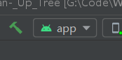

[参考](https://blog.csdn.net/qq_15975081/article/details/53391640)

1，接收数据，实体类不确定的时候要用map来接收

java动态解析

Map<String, Object> map = new HashMap<>();
JSONObject jsonObject = new JSONObject();
Iterator<String> it = jsonObject.keys();
while (it.hasNext()) {
    String key = it.next();
    Object value = jsonObject.get(key);
    map.put(key, value);
}

# com.yl.clean

1,

分析：1，没有找到启动类，在Mainfest

An exception occurred applying plugin request [id: 'com.android.application']
> Failed to apply plugin 'com.android.internal.application'.
> Android Gradle plugin requires Java 11 to run. You are currently using Java 1.8.
> You can try some of the following options:
>      - changing the IDE settings.
>           - changing the JAVA_HOME environment variable.
>           - changing `org.gradle.java.home` in `gradle.properties`.

原因，jdk版本太低
