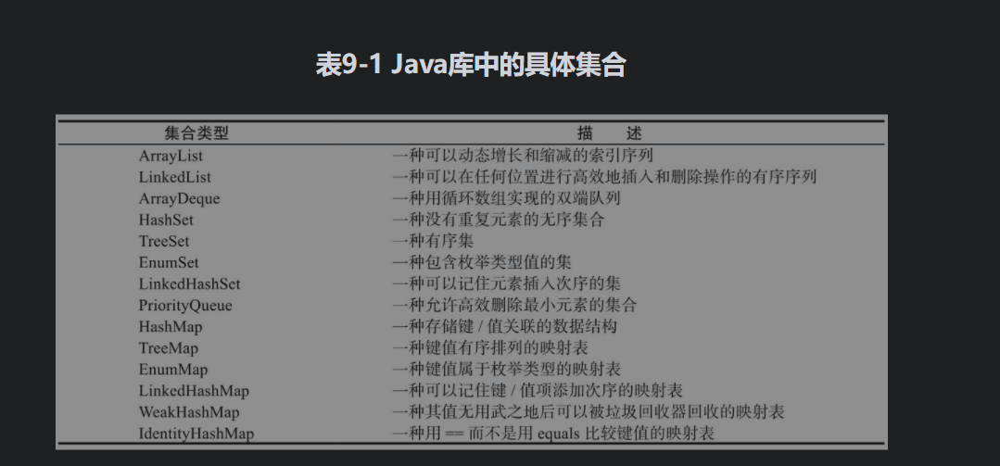

# **java基础**

**学习书籍：java核心1技术 卷I ,卷II**

**视频：****黑马毕向东****

## 第1课java基础语法

javac：用来编译java文件，将.java文件编译成虚拟机可以识别的字节码文件.class文件,

java：执行字节码文件.class文件

### 面试题1：jdk,jre,jvm的区别

- jdk,jre,jvm的区别，开发者使用

Jdk:java的开发工具，用户使用

jre:java运行时环境，

jvm:解析机器码

jdk(jre(jvm))

javec:编译成.class文件，class文件会解析成机器码会放到jvm（有window和linux）上（java到处运行）


### 数据类型，类型转换

**数据类型**

- 由于Java程序必须保证在所有机器上都能够得到相同的运行结果，所以各种数据类型的取值范围必须固定

- 在Java中，所有的数值类型所占据的字节数量与平台无关。

- java·是强类型语言（先定义在使用），分为基本数据类型，引用数据类型	


**字节**

- 位：计算机存储的最小单位
- 字节：计算机中数据处理的基本单位
- 字符：计算机中使用的字母，数字，字和符号

- 1B(byte,字节) = 8bit(位)
- 1bit 表示一位
- 1Byte表示一个自己1b= 8b;
- 1024B = 1Kb
- 1024Kb  = 1M;
- 1024M= 1G

### 运算符

### 包机制


## 第2课 Java流程控制

## 第3课 方法

## 第3课 数组

### 数组

### 数组的定义

同一种数据类型的集合	，数组就是一个容器

#### 数组的初始化

方式1：匿名数组，不需要进行new	
数据类型[] 数组名称 = {值，值，....} 
方式2
数据类型[] 数组名称 = new 数据类型[] {值，值，....}

#### 数组拷贝

在Java中，允许将一个数组变量拷贝给另一个数组变量。这时，两个变量将引用同一个数组，就要使用Arrays类的copyOf方法

####  打印数组中的所有元素

**forEach**

依次处理数组中的元素，而不必指定下标值

**Arrays.toString**

作用：返回一个包含数组元素的字符串，这些元素被放在括号内，并用逗号分开

```
int[] a = {2, 5, 4, 6, 7};
for (int forEach:a){
   System.out.println("forEach=" + forEach);//打印数组a中的每一个元素，一个元素占一行，注意int可以为任何类型，也可以为对象
   System.out.println("b=" + Arrays.toString(b));//输出结果：a=[2, 4, 5, 6, 7]
}
输出结果
forEach=2
forEach=4
forEach=5
forEach=6
forEach=7
```

**注意：**数组的长度可以为0

```
public static void main(String[] args) {
   // 初始化数组
   int[] a = {2, 5, 4, 6, 7};
   int[] b = StaticToolDemo.bubbleSort(a);//冒泡排序
   int[][] c = {{2, 3}, {1, 0}, {4, 45}};
   Arrays.sort(a); //排序
   // 输出数组
   System.out.println("b=" + Arrays.toString(b));// Arrays.toString：打印数组中的元素
   System.out.println("sort=" + Arrays.toString(a));// Arrays.sort：对数组中的元素进行排序,按升序
   /*
   注： *c:[[I@15db9742, [I@6d06d69c, [I@7852e922]* 这种输出结果是因为：c是一个二维数组。相当于一个长度为3的数组，但是这个数组的元素还是是数组。
        当执行Arrays.toString的时候相当于遍历数组，并且输出数组的元素，但是这个数组的元素是数组，所以这里输出的是数组元素的地址。
        
        Arrays.deepToString()与Arrays.toString()的区别
        Arrays.deepToString()主要用于数组中还有数组的情况，而Arrays.toString()则相反，对于Arrays.toString()而言，当数组中有数组时，不会打印出数组中的内容，只会以地址的形式打印出来。

    */
   System.out.println("c二维数组=" + Arrays.toString(c));//输出结果：c=[[I@1540e19d, [I@677327b6, [I@14ae5a5]
   System.out.println("deepToString=" + Arrays.deepToString(c));
   
   /*
   java遍历数组的方法：fori,forEach,
    forEach：遍历数组中的每个元素，且不需要下标
    */
   for (int forEach : a) {
      System.out.println("forEach=" + forEach);
   }
   for (int i = 0; i < a.length; i++) {
      System.out.println("for遍历:" + a[i]);
   }
   /*
   数组类型转换
    */
   String arrStrings=Arrays.toString(a);
   System.out.println("arrStrings:"+arrStrings);
   /*
   数组中是否包含一个值
    */
   if (Arrays.asList(a).contains(1)){
      System.out.println("包含该元素1");
   }else {
      System.out.println("不包含该元素1");
   }
   /*
   将数组转换为list
    */
   List<Integer>list = new ArrayList();
   for (int i = 0; i <a.length ; i++) {
      list.add(a[i]);
   }
   System.out.println("数组转换为list"+list);//输出：数组转换为list[2, 4, 5, 6, 7]
}
```

#### 数组排序

Arrays类中的sort方法

## 集合

### 集合框架

数组存储对象长度固定的，集合的长度是可变的，数组中可以存储基本数据类型，集合只能存储对象

在Java类库中，集合类的基本接口是Collection接口

**集合有两个基本接口：Collection和Map**



#### collection

collection
	list
		ArrayList
		LinkedList
		Vector
	set
		HashSet
		ThreeSet

Queue

为什么有这么多的容器？因为每个容器对应的数据的存储方式不同，这个存储方式称为数据结构

##### collection中常见的方法


| Modifier and Type        | Method and Description                                       |
| ------------------------ | ------------------------------------------------------------ |
| `boolean`                | `add(E e)`  确保此集合包含指定的元素（可选操作）。 **插入成功返回true，插入失败返回false** |
| `boolean`                | `addAll(Collection<? extends E> c)`  将指定集合中的所有元素添加到此集合（可选操作）。 |
| `void`                   | `clear()`  从此集合中删除所有元素（可选操作）。              |
| `boolean`                | `contains(Object o)`  如果此集合包含指定的元素，则返回 `true` 。 |
| `boolean`                | `containsAll(Collection<?> c)`  如果此集合包含指定 `集合`中的所有元素，则返回true。 |
| `boolean`                | `equals(Object o)`  将指定的对象与此集合进行比较以获得相等性。 |
| `int`                    | `hashCode()`  返回此集合的哈希码值。                         |
| `boolean`                | `isEmpty()`  如果此集合不包含元素，则返回 `true` 。          |
| `Iterator<E>`            | `iterator()`  返回此集合中的元素的迭代器。                   |
| `default Stream<E>`      | `parallelStream()`  返回可能并行的 `Stream`与此集合作为其来源。 |
| `boolean`                | `remove(Object o)`  从该集合中删除指定元素的单个实例（如果存在）（可选操作）。 |
| `boolean`                | `removeAll(Collection<?> c)`  删除指定集合中包含的所有此集合的元素（可选操作）。 **去交集**，保留调用对象中不停的数据 |
| `default boolean`        | `removeIf(Predicate<? super E> filter)`  删除满足给定谓词的此集合的所有元素。 |
| `boolean`                | `retainAll(Collection<?> c)`  仅保留此集合中包含在指定集合中的元素（可选操作）。 |
| `int`                    | `size()`  返回此集合中的元素数。                             |
| `default Spliterator<E>` | `spliterator()`  创建一个[`Spliterator`](../../java/util/Spliterator.html)在这个集合中的元素。 |
| `default Stream<E>`      | `stream()`  返回以此集合作为源的顺序 `Stream` 。             |
| `Object[]`               | `toArray()`  返回一个包含此集合中所有元素的数组。 **//将集合转换为数组** |
| `<T> T[]`                | `toArray(T[] a)`  返回包含此集合中所有元素的数组;  返回的数组的运行时类型是指定数组的运行时类型。 |

```
public static void main(String[] args) {
   //创建一个集合容器，使用collection接口的子类，ArrayList
   ArrayList<String> list = new ArrayList<>();
   list.add("测试1");//all(Object b)
   list.add("测试2");
   list.add("测试3");
   list.add("测试4");
   System.out.println("size:" + list.size());//size:长度 输出结果：4
   System.out.println("打印集合：" + list);//打印集合，输出结果：打印集合：[测试1, 测试2, 测试3, 测试4]
   System.out.println("判断是否包含元素contains：" + list.contains("测试"));//判断是否包含某个元素，输出结果：判断元素：false
   System.out.println("判断是否为空isEmpty：" + list.isEmpty());//判断是否isEmpty，输出结果：判断是否为空：false

   ArrayList<String> list2 = new ArrayList<>();
   list2.add("测试1");
   list2.add("列表2");
   //removeAll:删除指定集合中包含的所有此集合的元素（可选操作）。 此调用返回后，此集合将不包含与指定集合相同的元素。
   // 包含要从此集合中删除的元素的集合 ,返回结果，删除相同的为true,否则为false
   list.removeAll(list2);//取交集，lst只会保留和list2中不同的数据。
   System.out.println("retainAll删除指定集合中包含的所有此集合的元素（:" + list);//结果retainAll:[测试2, 测试3, 测试4]
   list2.toArray();// 将集合转换为数组
   System.out.println("数组打印:"+ Arrays.toString(list2.toArray()));// 输出结果：数组打印:[测试1, 列表2]
   list.addAll(list2);//将指定集合中的所有元素添加到此集合
   System.out.println("addAll:"+list);
   System.out.println("删除：" + list.remove("测试2"));//remove:删除元素，删除成功返回true,删除失败返回false
   list.clear();//clear；清除所有元素

}
```

##### 迭代器

是一种访问集合的方法，即取出集合元素的值， iterator() 的主要使用方法next,hasnext,remove

通过反复调用next，可以逐个访问集合中的每个元素。但是，如果到达了集合的末尾，next方法将抛出一个NoSuchElementException。因此，需要在调用next之前调用hasNext方法。如果迭代器对象还有多个供访问的元素，这个方法就返回true。如果想要查看集合中的所有元素，就请求一个迭代器，并在hasNext返回true时反复地调用next方法

```
public static void main(String[] args) {
   List<String> list = new ArrayList<>();
   list.add("1");
   list.add("2");
   list.add("3");
   list.add("4");
   // 方式1：Iterator
   Iterator<String> it = list.iterator();// 获取迭代器
   while (it.hasNext()) {// 循环取出集合中的元素
      //it.remove(); 报错：java.lang.IllegalStateException
      System.out.println("iterator:" + it.next()); //输出1，2,3,4
      it.remove();// 对next方法和remove方法的调用具有互相依赖性。如果调用remove之前没有调用next将是不合法的
   }
   // 方式2：forEach
   for (String num : list) {
      System.out.println("forEach:" + num);//输出1，2,3,4
   }
}
```

###### forEachRemaining

forEachRemaining()是java1.8新增的Iterator接口中的默认方法，可以不用循环，用forEachRemaining

```
Iterator iterator = arrayList.iterator();
iterator.forEachRemaining(ele -> System.out.println("forEachRemaining"+ele));
```

##### collection的分类

list:元素是有序的。元素可以重复。因为该集合体系有索引
* ArrayList:底层的数据结构使用的是数组结构，查询速度很快，但是增删稍慢 	 ，线程不同步	
  * LinkedList：底层使用的是链表数据结构，特点：增删很快，查询稍慢
  * Vector：底层输数组数据结构。线程同步，被ArrayList替代了

set：元素是无序的，元素不可以重复
* HashSet：  线程不安全，存取速度快。底层是以哈希表实现的。
* ThreeSet： 红-黑树的数据结构，默认对元素进行自然排序（String）

list特有的方法

**增**

* add(int index, E element)：在此列表中的指定位置插入指定的元素
* addAll(int index, Collection<? extends E> c) ：将指定集合中的所有元素插入到此列表中，从指定的位置开始。

**删**

* remove(int index)：删除该列表中指定位置的元素。

**改**

* set(int index, E element) ：用指定的元素替换此列表中指定位置的元素。该元素以前在指定的位置 

**查**

* get(int index) ：返回此列表中指定位置的元素。public E get(int index)返回此列表中指定位置的元素。
* subList(int fromIndex, int toIndex) ：返回此列表之间的部分视图 fromIndex ，包容和 toIndex ，排斥。

List集合特有的迭代器。ListIterator是Iterator的子接口。

在迭代时,不可以通过集合对象的方法操作集合中的元素[因为会发生concurrentModificationException异常。

所以，在迭代器时，只能用迭代器的放过操作元素，可是Iterator方法是有限的，只能对元素进行判断,取出,删除的操作,

如果想要其他的操作如添加，修改等，就需要使用其子接口，ListIterator.

该接口只能通过List集合的1istIterator方法获取。

###### list

 LinkedList:特有方法:
* addFirst () ;
* addLast ();
* getFirst ( );
* getLast ();获取元素但是不删除值
* removeFirst() ;
* removeLast();获取元素但是值删除

```
public static void main(String[] args) {
   LinkedList<String> linkedList = new LinkedList<>();
   linkedList.addLast("测试1");
   linkedList.addLast("测试2");
   linkedList.addLast("测试3");
   linkedList.addLast("测试4");
   System.out.println("getFirst:"+linkedList.getFirst());//输出结果：getFirst:测试1
   System.out.println("getLast:"+linkedList.getLast());//输出结果：getLast:测试4
   System.out.println("list:"+linkedList);//输出结果：list:[测试1, 测试2, 测试3, 测试4]
   System.out.println("removeFirst:"+linkedList.removeFirst()); // 输出结果：removeFirst:测试1
   System.out.println("removeLast:"+linkedList.removeLast()); // 输出结果：removeLast:测试4
   System.out.println("list2:"+linkedList); //输出结果 list2:[测试2, 测试3]
   
}
```

###### set

元素无序，但是元素不可以重复，set的功能和collection的一致

**HashSet**：线程不安全，存取速度快。底层是以哈希表实现的

哈希表边存放的是哈希值。HashSet存储元素的顺序并不是按照存入时的顺序（和List显然不同） 是按照哈希值来存的所以取数据也是按照哈希值取得。

HashSet不存入重复元素的规则.使用hashcode和equals

由于Set集合是不能存入重复元素的集合。那么HashSet也是具备这一特性的。HashSet如何检查重复？HashSet会通过元素的hashcode（）和equals方法进行判断元素师否重复。

当你试图把对象加入HashSet时，HashSet会使用对象的hashCode来判断对象加入的位置。同时也会与其他已经加入的对象的hashCode进行比较，如果没有相等的hashCode，HashSet就会假设对象没有重复出现。

简单一句话，如果对象的hashCode值是不同的，那么HashSet会认为对象是不可能相等的。

因此我们自定义类的时候需要重写hashCode，来确保对象具有相同的hashCode值。

如果元素(对象)的hashCode值相同,是不是就无法存入HashSet中了? 当然不是,会继续使用equals 进行比较.如果 equals为true 那么HashSet认为新加入的对象重复了,所以加入失败。如果equals 为false那么HashSet 认为新加入的对象没有重复.新元素可以存入.


```
HashSet是如何保证元素的唯一性，是通过HashCode和equals，如果HashCode的元素的值相同，才会判断equals的值为true，如果HashCode的元素的值不相同，不会调用equals
 对于判断元素是否存在，以及删除操作，依赖的方法是元素的hashcode和equals


/*
		HashSet是值是唯一的，但是没有顺序
		 */
		HashSet<Person> set = new HashSet();
		set.add(new Person("李四", 23));
		set.add(new Person("哈哈哈", 23));
		set.add(new Person("拟好", 21));
		set.add(new Person("庄三", 33));

		for (Person p : set) {
			System.out.println(p.getName() + p.getAge()); // 结果：哈哈哈23 庄三33 李四23 拟好21
		}

		System.out.println("-------------------------------");
		/**
		 * 要想实现顺序，可以用LinkedHashSet，数据存储采用链表+哈希表组合的形式
		 */
		HashSet<Person> linkedSet = new LinkedHashSet<>();
		linkedSet.add(new Person("李四", 23));
		linkedSet.add(new Person("哈哈哈", 23));
		linkedSet.add(new Person("拟好", 21));
		linkedSet.add(new Person("庄三", 33));
		for (Person p : linkedSet) {
			System.out.println(p.getName() + p.getAge());//结果：李四23 哈哈哈23  拟好2 庄三33
		}
	}
```

## 第4课，对象和类

### 面向对象

#### **面试题3**

1，面向对象和面向过程的区别：

面向过程：面向过程就是分析解决问题的步骤，并且通过函数来表达出来，即处理对象的一种手段，比如，打开冰箱这个动作，人吃饭这个动作通过吃，打开

面象对象：面向对象是把构成问题事务分解成各个对象，建立对象的目的不是为了完成一个步骤，而是为了描叙某个事物在整个解决问题的步骤中的行为。

在回答面向对象的时候要说出面向对象的几大特征

- **封装**

封装的意义在于，在于明确标出外部使用的成员变量和数据项，内部细节对外部调用透明，外部无需关心和修改内部的实现

1，javaBean:属性私有，提个getset对外访问	，因为属性的赋值只能有javaBean本身来决定，不能由外部来胡乱修改

- **继承**

继承基类的属性和方法，做出自己的改变，子类共性的属性和方法可以直接调用夫类的，而不需要自己在定义，只是执行的逻辑不同

- **多态**

  基与对象所属的类不同，外部对同一方法的调用，但是执行逻辑的不同

缺点：无法调用子类的特有的属性

#### 构造函数

- ​	作用

  可用于对对象进行初始化，要记住所有的Java对象都是在堆中构造的，构造器总是伴随着new操作符一起使用

  java类中系统会默认一个构造函数（无参数），当自定义以后，默认的构造函数就没有了，默认构造函数和类的权限一致。当类没有被public修饰，则默认函数也不会被修饰。即默认构造函数的权限随着类的权限变化而变化

- 与一般方法的区别：

  1，写法上不同

  2，	运行上不同	：构造函数对象已建立就运行，给对象进行初始化。一般方法是只有调用了才执行

  3，一个对象建立，构造函数只运行一次，一般方法可以被多次调用

注意：

- 构造代码块：作用:给对象进行初始化。

- 对象一建立就运行,而且优先于构造函数执行。

- 和构造函数的区别:构造代码块是给所有对象进行统一初始化，而构造函数是给对应的对象初始化。

构造代码快中定义的是不同对象共性的初始化内容。

​	**this**

* this:看上去是区分成员变量和局部变量1的同名清空
* this为什么可以解决：
* this特点：代表所在函数的引用，即是那个对象在调用this所在的函数，this就代表那个函数

```
class Person {
   private String age;
   private String name;

   public Person(String age, String name) {
      this.age = age;
      this.name = name;
   }

   public void speak() {
      System.out.println("age=:" + this.age+"-----"+"this.name=:" + name);
      show();
   }
   public  void show(){
      System.out.println("name=:" + this.name);
   } 
}
```

this的应用：当定义类中的功能时，该函数内部要用到该函数的对象时，这时候用this来表示对象,但凡本来功能,那个对象调用，**this就代表那个对象**

```
Person person1 = new Person("23");
Person person2 = new Person("2");
boolean p = person1.compare(person2);
。。。。。。。。。。。。。。。。
System.out.println("p=:" +p);
	public boolean compare(Person person) {
		return 	this.age == person.age;
	}

输出结果：false,this代表person1
```

#### static

https://baijiahao.baidu.com/s?id=1636927461989417537&wfr=spider&for=pc

##### 定义：

用于修饰成员（成员变量，成员函数），静态修饰内容被共享（有共同属性的时候可以用static）

注意： 成员被静态修饰以后就多了一种调用方式，除了被对象调用，还可以被类名调用 ,类名.静态成员(注意静态成员变量必须为public修饰)

```
public class PersonBean {

	private  String age;
	private String name;
	public  static  String country;
	------------
System.out.println("country=:" + PersonBean.country);
```

##### 用途：

* 用于修饰成员（成员变量，成员函数），静态修饰内容被共享（有共同属性的时候可以用static）
* 当成员被静态修饰以后就多了一种调用方式，除了被对象调用，还可以被类名调用   ,类名.静态成员(注意静态成员变量必须为public修饰)

##### 特点 

1. 随着 类的加载而加载。也就是说，静态随着类的消失而消失，因此生命周期最长。比如当person一加载到内存中，static 修饰的成员变量就已经开辟了空间
2. 优先于对象存在：静态是先存在的，类后存在的
3. 被所有对象共享
4. 可以直接被类名调用

##### 实例变量和类变量的区别

* 存放位置：类变量：随着类的加载而存在于方法区中，随着类的消失而消失。

  ​                 实例变量：随着类的建立存在于堆内存中

* 生命周期：类变量：生命周期最长，随着类的小时而消失

  ​                  实例变量：随着对象的消失而消失

##### 静态的使用注意事项：

1. 静态方法只能访问静态成员（因为：静态的内容是随着类的加载而加载，所以当类加载时，静态方法和静态成员是先进入内存的，

2. 而此时的非静态成员变量是不在内存里的，因此静态方法找不到其他非静态成员。），非静态成员既可以访问静态成员，也可以访问非静态方法

3. 由于静态是优先于对象存在的。所以静态方法中不能出现this

4. 主函数 是静态的

   - 主函数；可以被jvm调用，作为程序的入口

   -  主函数的定义：public:代表着改函数的访问权限最大

   ​                            static:随着类的加载已经存在了

   ​                             void:没有返回值

   ​                             main:不是关键字

   ​                             String[] args：函数的参数，参数类型是一个数组，该数组中的元素是字符串，字符串类型的数组

   - 主函数是固定格式的（只有 args可以修改（这是变量名） ）：jvm识别 ，注意jvm在调用主函数的时候，传入的是new String[0];   

##### 静态有利有弊

- 利：

  1，对共享数据进行单独空间的存储，节省空间，没有必要每一个对象存储一次

  2，可以直接被类名调用，

- 弊：生命周期过长，访问出现局限性，只能访问静态  

##### 什么是静态

静态修饰的有成员变量和函数

1. 什么时候定义静态变量(类变量)？

   当对象中出现共享数据时候，该数据被静态修饰，对象中特有数据要定义成非静态存在于堆内存中

2. 什么时候定义静态函数呢？

   当功能内部没有访问到非静态数据（对象的特有数据），那么定义为静态的。

##### 如何生成javacAPI文档

命令：使用命令输入javadoc -d javaapi -header 测试的API -doctitle 这是我的第一个文档注释 -version -author javadoc/Hello.java 进行文档生成。-d:文件存储位置; -head:文件头部名称; -version:显示版本; -author:显示作者; javadoc/Hello.java 处理的文件包以及java源文件.

**比如javac -d myHelp -author  -version  ArrarTool.java**

##### 静态代码块

**格式：**

```
public class StaticDemo3 {
   static {
      System.out.println("a");
   }
   public static void main(String[] args) {
      System.out.println("b");
   }
}
```

**特点：**

随着类的加载而只是执行一次,用于给类进行初始化,并优于主函数

#### 对象的初始化过程

[参考](https://blog.csdn.net/justloveyou_/article/details/72466416)

Study s = new Study("学习对象初始化"，23);

**注释**

这句代码干了什么？

1，因为new用到了Study.class这个对象，所以会先找到Study.class这个对象并加载到内存中

2，执行该代码中的static代码块，如果有的话，给Study.class进行初始化

3，在堆内存中开辟内存空间分配内存地址

4, 在堆内存中建立对象的特有属性，并默认初始化	

5，对属性显示初始化

6，对对象进行构造代码块初始化

7，对对象进行对应构造函数初始化

8，将内存地址赋值给栈内存中的s变量

#### 实例模式

##### 单实例模式

解决一个类在内存中只存在一个对象

### 面向对象的特点

#### 继承

##### 继承的概述

##### 继承的特点

1）提高代码的复用性

2）让类与类之间车产生了关系，有了这个关系，才有了多态的特性。

3）Java语言中只支持单继承，不支持多继承，因为多继承存在安全隐患，当多个父类中定义了相同功能，当功能内容不同时，子类对象不知道运行哪一个。

4）但是java保留了这种机制，并用另一种体现形式来完成表示，多实现。

5）Java支持多层继承，也就是一个继承体系

如何使用一个继承体系的功能呢

想要使用体系，先查阅体系父类的描述，因为父类中的是该体系中共性功能，那么这个体系已经可以基本使用了。

那么在具体调用时，要创建最子类的对象，为什么呢？一是因为有可能父类不能创建对象

二是创建子类对象可以使用更多的功能，包括基本的也包括特有的

简单一句话：查阅父类功能，创建子类对象使用功能

注意：千万不要为了获取其他去了的功能。简化代码而继承

必须是类与类之间有所属关系才可以继承，所属关系is a。

 Java语言中只支持单继承，不支持多继承

##### super关键字

子父类出现后，类成员的特点

类成员

1，变量

2，函数

3，构造函数

1.3变量

如果子类中出现非私有的同名成员变量时，子类要访问本类中的变量用this,子类要访问父类中的同名变啊理工，用super

super和this的使用几乎一致

this代表的是本类对象的引用

super代表的是父类对象的引用

1.4子父类中的函数

当子类出现和父类***\*一模一样\****的函数时，当子类对象调用该函数，会运行子类函数的内容，如同父类的函数会被覆盖掉一样。

这种情况是函数的另一个特性：重写（覆盖）

当子类继承父类，沿袭了父类的功能，到子类中

但是子类虽具备该功能，但是工鞥的内容却和父类不一致，这是，没有必要定义新功能，而是使用覆盖特效，保留父类的功能定义，并重写功能内容。

注意：

1）子类覆盖父类必要保证子类权限大于等于父类权限，才可以覆盖，否则编译失败

2）静态是能覆盖静态

重载：只看同名函数的的参数列表

重写：子父类方法要***\*一模一样\****

子类要访问父类中的同名函数a：super.a()

1.4子父类中的构造函数

在对子类对象进行过初始化时，父类的构造函数也会运行

那是因为子类的构造函数默认第一行有一条隐式super();

super()：会访问父类中***\*空参\****的构造函数，***\*而且子类中所有的构造函数默认第一行都是super();\****

为什么子类中一定要访问父类中的构造函数呢

因为 父类中的数据子类可以直接获取，所以子类对象在建立是需要先查看父类是如何对这些数据进行初始化的，

所以子类在对象初始化时，要先访问下父类的构造函数

如果要访问父类中指定的构造函数，可以手动定义super()方式来访问 

子类中使用父类中的构造函数，***\*super一定要定义在子类构造函数第一行\****

***\*结论（子类的实例化过程）：子类中所有的构造函数默认都会访问父类中空参数的构造函数，因为子类每一个构造函数内的第一行都有一句隐式的super();\****

***\*当父类中没有空参数的构造函数时，子类必须手动指定this语句来访问本类中的构造函数，子类中至少有一个构造函数会访问父类父类中的构造函数\****

##### 函数覆盖

关键字this有两个用途：一是引用隐式参数，二是调用该类其他的构造器。同样，super关键字也有两个用途：一是调用超类的方法，二是调用超类的构造器。在调用构造器的时候，这两个关键字的使用方式很相似。调用构造器的语句只能作为另一个构造器的第一条语句出现。构造参数既可以传递给本类（this）的其他构造器，也可以传递给超类（super）的构造器。

##### 子类的实例化过程

```
abstract class Emploee {
   private String name;
   private String id;
   private double pay;
   public Emploee(String name, String id, double pay) {
      this.name = name;
      this.id = id;
      this.pay = pay;
   }
   public abstract void work();
}
```

```
class Manger extends Emploee {
   private int bonus;
   /*
     1,子类继承父类以后要进行构造函数
     2,在一个构造器中调用另一个重载的构造器使用this调用来完成，在子类构造器中调用父类构造器使用super调用来完成。
     2,由于Maneger类的构造器，你们不能访问Emploee的私有属性，因此必须利用Emploee的构造器来进行初始化，可通过super来实现对父类构造器的调用，反射是指在程序运行期间发现更多的类及其属性的能力
     如果子类的构造器没有显式地调用超类的构造器，则将自动地调用超类默认（没有参数）的构造器。如果超类没有不带参数的构造器，并且在子类的构造器中又没有显式地调用超类的其他构造器，则Java编译器将报告错误
    */
   public Manger(String name, String id, double pay, int bonus) {
      super(name, id, pay);
      this.bonus = bonus;
   }
```

##### final关键字

```
final:最终，作为一个修饰符
* 1）可以修饰类，变量，函数。
* 2）被final 修饰的类不可以被继承，为了避免被继承，被子类复写功能。
* 3）被final修饰的方法不可以被复写
* 4）被final修饰的变量是一个常量只能赋值一次，既可以修饰成员变量，也可以修饰局部变量。
* 在描述事物时，一些数据的出现值是固定的，那么这是为了增强阅读性，都给这些值七个名字，方便与阅读，而这个值不需要改变，所以加上final修饰。作为常量：常量的书写规范所有的字母都是大写，如果有多个单词组成，单词可通过_连接。
* 5）内部类定义在类中的局部位置时，只能访问该局部被final修饰的局部变量。
```

##### abstract

* 1，当多个类中出现相同   功能，但是功能主体不同，这时可以进行向上抽取，之抽取功能定义，而不抽取功能的主体
* 抽象类的特点：
* 1）抽象方法一定定义在抽象类中
* 2）抽象方法和抽象类都必须被abstract关键字修饰
* 3）抽象类不可以被new创建对象，因为调用抽象方法没有意义
* 4）抽象类中的抽象方法要被使用，必须由子类复写其所有的抽象方法后建立子类对象调用
* 5）如果子类只覆盖了部分抽象方法，那么该子类还是一个抽象类。
* 6）抽象类和一般类没有太大不同，该如何描述事物就如何描述事物，只不过该事物中出现了一些看不懂得东西，这些不明确的部分，也是该事物的功能，需要明确出现，但是无法定义主体。通过抽象方法来表示。
* 抽象类比一般类多了个抽象函数，就是在该类中可以定义抽象方法
* 抽象类不可以进行实例化
* 特殊：抽象类中可以不定义抽象方法，这样做仅仅是为了不让该类建立对象（不让该类进行实例化）
* 抽象类和一般类没啥区别，，该如何描述就如何描述，，只不过，该实物事物中出现了一些看不懂的功能，这些不确定的功能，也是该事物的功能，需要明确出现，但是无法定义主体，
* 通过抽象方法表示
* 抽象类比一般类多了抽象函数，抽象类不能实例化
* 特殊：抽象类中可以不定义抽象方法，这样仅仅是不让该类建立对象

```
public class AbstractDemo {
   public static void main(String[] args) {
      // new Student();抽象类不可以被new创建对象，因为调用抽象方法没有意义
      new BaseStudent().Study();//抽象类中的抽象方法要被使用，必须由子类复写其所有的抽象方法后建立子类对象调用
   }
}
/*
c抽象方法必须放在抽象类中
 */
abstract class Student {
   abstract void Study();//因为BaseStudent类和AdvStudent类中方法主体不同，说以不定义方法主体,所以是抽象方法，包含抽象方法的类叫做抽象类，所以把类也用abstract修饰。
}
class BaseStudent extends Student {
   @Override
   void Study() {
      System.out.println("基础学习");
   }
}
class AdvStudent extends Student {
   @Override
   void Study() {
      System.out.println("高级学习");
   }
```

##### 模板方法设计模式

**在定义功能时候，功能的一部分是确定的，但是有一部分是不确定的，而确定的部分在使用不确定的部分，那么就将不确定的这部分暴露出去，有该类的子类去完成**

```
public class TempletDemo {
   public static void main(String[] args) {
      SubTime getTime = new SubTime();
      getTime.getTime();
   }
}

 abstract class GetTime {
   public  final  void getTime() {
      long startTime = System.currentTimeMillis();
      for (int i = 0; i < 1000; i++) {
         System.out.println(i);
      }
      setTime();
      //确定功能
      Long endTime = System.currentTimeMillis();
      System.out.println("毫秒：" + (endTime - startTime));
   }
   public abstract void setTime();
}

class SubTime extends GetTime {
   @Override
   public void setTime() {
      for (int i = 0; i < 4000; i++) {
         System.out.println(i);
      }
   }
}
```

#### 接口

定义：接口：初期理解，可以认为是一个特殊的抽象类，当抽象类中的方法都是抽象的(默认抽象的)，那么该类可以通过接口的形式来表示。

* class用于定义类
* interface用来定义接口
* 接口定义时候：格式特点
* 接口中常见定义：常量，抽象方法。
* 接口中的成员都有固定修饰符
* 常量修饰符：public static final
* 方法：public static
* 记住：接口中的成员都是public的。
* 接口是不可以创建对象的因为有抽象方法需要被子类实现，子类对接口中的抽象方法全都覆盖后，子类才可以实例化，否则子类是一个抽象类。
* 接口与接口之间存在多继承。
* 接口可以被类多实现.java实现都实现
* 类与类直接是继承关系，接口和类是实现关系，接口和接口是继承关系，只有在接口与接口中才存在多继承

  **接口的特点**
* 接口是对外暴露的规则
* 接口是程序的功能扩展
* 接口可以用来多实现
* 接口降低了耦合性
* 接口与接口之间是实现关系，而且类可以继承一个类的同时实现多个接口
* 接口有接口之间可以有继承关系，并且存在多继承关系（类与类之间的关系是单继承）

#### 多态

1, 多态的体现

* 父类的应用指向自己子类对象,父类的引用也可以接收自己子类的对象

2，多态的前提、

* 必须是类与类直接有关系，要木继承，要目实现
* 通常还有一个前提，存在覆盖

3，多态的好处

* 多态的出现大大的提高了程序的扩展性

4，多态的应用

5，多态的弊性：提高了扩展性，但是只能父类的引用访问父类中的成员

6，对态

### Object


### 内部类

内部类的访问规则

 * 1，内部类可以直接访问外部类的成员，包含私有，之所以可以直接访问，因为内部类中持有了一个外部类的引用，格式，外部类.this
 * 2外部类不能直接访问内部类，必须建立内部类
 * 访问格式：
 * 1,当内部类定义在外部类的成员位置上，而且非私有，可以在外部其他类中，可以直接建立内部类对象，
 * 格式：外部类.内部类 变量名 = 外部类对象。内部类对象
 * Outer.Inner in = new Outer.new Inner();
 * 2 当内部类在成员位置上，就可以被成员修饰符所修饰。
 * 比如：private：将内部类在外部类中进行封装
 * static:内部类就具有static的特性
 * 当内部类被static静态修饰后只能直接访问外部类中的静态成员了
 * 在外部其他类中如何直接访问静态内部类啦
 * new Outer.Inner1.function();
 * 在外部其他类中，如何直接访问static内部类的静态成员成员，
 * outer.Inner .show();
 * 注意：当内部类中定义了静态成员，该内部类必须是静态的。
 * 当外部类中静态方法访问内部类时，内部类也必须是静态的
 * 当描述事物时，事物的内部还有事物，该事物用内部类来描述，
 * 因为内部事物在使用外部事物的内容。

### 异常

异常：程序在运行的时候出现的不正常情况
* 异常由来：问题是现实生活中的一个具体的事物，也可以通过java的类的形式进行描述，并封装对象，其实就是对java不正常的情况描述
* 对于严重的，Error进行描述，对于Error不编写针对性的代码进行处理，
* 非严重的java，通过Exception进行描述，对于Exception不编写针对性的代码进行处理

 Throwable

​      ----Erro

​      ----Exception

**异常的处理**

```
try {
   //需要检查得代码块
}catch (异常类 变量){
   //异常处理的方式：（处理方式）
 }finally {
  // 一定会执行的语句：
 }
```

对获取到的异常对象进行处理的方法：
* e.getMessage()：  返回此throwable的详细消息字符串。 
* e.toString():
* e.printStackTrace():异常名称；异常信息，异常出现的位置,其实jvm默认的异常处理机制，就是调用printStackTrace方法，打印异常的堆栈   的跟踪信息

```
public class ExceptionDemo {
   public static void main(String[] args) {
      Demo demo = new Demo();
      try{
         int x = demo.div(4, 0);
         System.out.println("x:" + x);
         }catch (Exception e){ //Exception e = new ArithmeticException();
         
         System.out.println("出零了:"+e);
         System.out.println("异常信息"+e.getMessage());//结果：by zero
         System.out.println("异常信息2"+e.toString());//java.lang.ArithmeticException: / by zero
         e.printStackTrace(); //异常名称；异常信息，异常出现的位置,其实jvm默认的异常处理机制，就是调用printStackTrace方法，打印异常的          堆栈的跟踪信息
       }
       System.out.println("结束");
   }
}

class Demo {
   int div(int a, int b) throws Exception{ //在功能上通过throws关键字来声明该功能可能出现问题
      return a / b;
   }
}
```

### 线程

学习资料：疯狂java，

####  线程的基础知识

####  理解线程和进程的区别与联系

**进程**：正在执行的一个过程或者任务，而负责执行的是cpu（cpu在某一个时间点只能执行一个进程，cpu不断的在进程中切换）

一个正在执行的程序，每一个进程都有一个执行顺序。该顺序叫一个执行路径，或者叫一个	控制单元

**线程**：就是进程中的一个控制单元，一个进程中**至少**有一个线程，线程是独立运行的

总结出就是：操作系统可以同时执行多个任务，每个任务就是进程；进程可以同时执行多个任务，每个任务就是线程。

##### 线程和进程

- 进程：

1， 概念

所有运行中的任务通常对应一个进程（Process）。当一个程序进入内存运行时，即变成一个进程。进程是处于运行过程中的程序，并且具有一定的独立功能，进程是系统进行资源分配和调度的一个独立单位。

 2，特点

- 并行性：指在同一时刻，多条指令在多个处理器上同时执行
- 并发性：在同一时刻，有多条指令在多个处理器上同时执行；并发指在同一时刻只能有一条指令执行，但多个进程指令被快速轮换执行，使得在宏观上具有多个进程同时执行的效果。

####  三种创建线程的方式

Java使用Thread类代表线程，所有的线程对象都必须是Thread类或其子类的实例。每个线程的作用是完成一定的任务，实际上就是执行一段程序流（一段顺序执行的代码）。Java使用线程执行体来代表这段程序流

####  线程的run()方法和start()方法的区别与联系

#### 线程的生命周期

####  线程死亡的几种情况

#### 控制线程的常用方法

#### 线程同步的概念和必要性

####  使用synchronized控制线程同步


