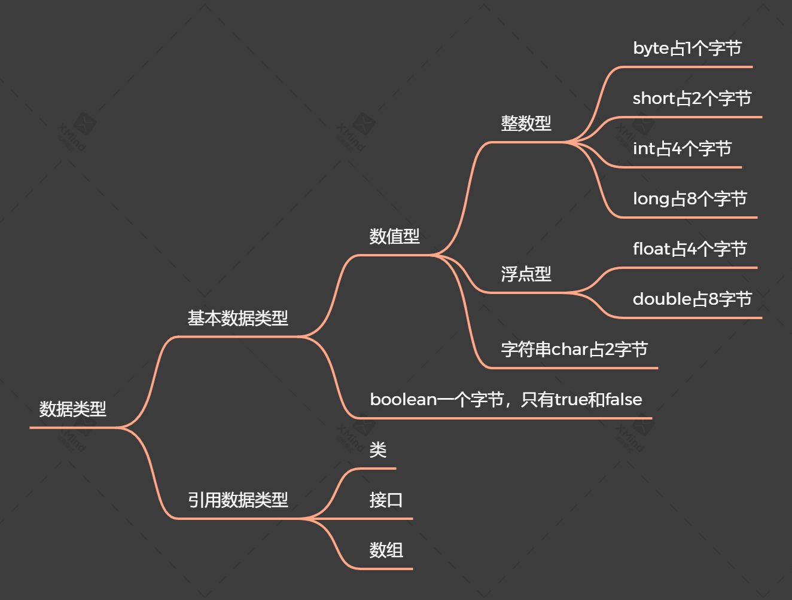
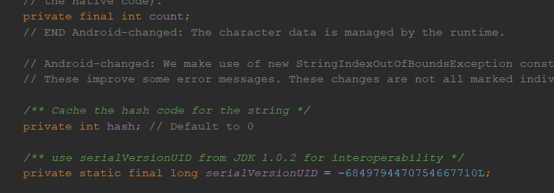

# **java基础**

## 第1课java基础语法

javac：用来编译java文件，将.java文件编译成虚拟机可以识别的字节码文件.class文件,

java：执行字节码文件.class文件

### 面试题1：jdk,jre,jvm的区别

- jdk,jre,jvm的区别，开发者使用

Jdk:java的开发工具，用户使用

jre:java运行时环境，

jvm:解析机器码

jdk(jre(jvm))

javec:编译成.class文件，class文件会解析成机器码会放到jvm（有window和linux）上（java到处运行）


### 数据类型，类型转换

**数据类型**

- 由于Java程序必须保证在所有机器上都能够得到相同的运行结果，所以各种数据类型的取值范围必须固定

- 在Java中，所有的数值类型所占据的字节数量与平台无关。

- java·是强类型语言（先定义在使用），分为基本数据类型，引用数据类型	



**字节**

- 位：计算机存储的最小单位
- 字节：计算机中数据处理的基本单位
- 字符：计算机中使用的字母，数字，字和符号

- 1B(byte,字节) = 8bit(位)
- 1bit 表示一位
- 1Byte表示一个自己1b= 8b;
- 1024B = 1Kb
- 1024Kb  = 1M;
- 1024M= 1G

### 运算符

### 包机制

### 字符串

#### **字符串的常见方法**

##### 字符串的其他方法1**

-  codePointAt:返回从给定位置开始的码点。
- offsetByCodePoints:返回从startIndex代码点开始，位移cpCount后的码点索引。
- compareTo:按照字典顺序，如果字符串位于other之前，返回一个负数；如果字符串位于other之后，返回一个正数；如果两个字符串相等，返回0。startsWith,endsWith:如果字符串以suffix开头或结尾，则返回true。
- int index0f(String str)：返回与字符串str匹配的第一个子串的开始位置，从0开始计算
- int index0f(String str, int fromIndex),返回与字符串str匹配的第一个子串的开始位置，从fromIndex开始计算
- int index0f(int cp),int index0f(int cp, int fromIndex):

 返回与字符串str或代码点cp匹配的第一个子串的开始位置。这个位置从索引0或fromIndex开始计算。如果在原始串中不存在str，返回-1

- ```
  String a = "Hello";
  System.out.println("charAt:" + a.charAt(2)); //输出：1
  System.out.println("codePointAt:" + a.codePointAt(2)); //输出：108
  System.out.println("offsetByCodePoints:" + a.offsetByCodePoints(2, 1));//输出：3
  System.out.println("compareTo:" + a.compareTo("e"));//输出：-29
  System.out.println("startsWith:" + a.startsWith("H"));//输出true
  System.out.println("endsWith:" + a.endsWith("H"));//输出false
  System.out.println("index0f(String str):" + a.indexOf("H"));//输出0 返回H所在的下标，从0开始计算
  System.out.println("index0f(String str, int fromIndex)" + a.indexOf("e", 2));//输出-1 返回e所在的第一个子串的开始位置从2开始计算
  System.out.println("index0f(int cp):" + a.indexOf(3));//
  System.out.println("index0f(int cp, int fromIndex):" + a.indexOf(1,2));//
  ```

##### 字符串其他方法2

-    equals:判断字符串相等， 不能用==来进行判断是否相等，==只会来判断是否在同一位置上

 * length:返回字符串的长度。

 * codePointCount:返回startIndex和endIndex-1之间的代码点数量。没有配成对的代用字符将计入代码点

 * replace:返回一个新字符串。这个字符串用newString代替原始字符串中所有的oldString

 * substring(int beginIndex):返回下标从beginIndex开始的值，包含该下标

 * substring(int beginIndex, int endIndex)：返回从返回下标从（beginIndex,endIndex]开始的值

 * 注意：substring的工作方式有一个优点：容易计算子串的长度。字符串s.substring（a，b）的长度为b-a。例如，子串“Hel”的长度为3-0=3。

 * toLowerCase:全部转换为小写

 * toUpperCase：全部转换为大写

 * trim:返回一个新字符串。这个字符串将删除了原始字符串头部和尾部的空格

 ```
 String a = "Hello";
 String b = "Hell";
 if (a.equals(b)) {
    System.out.println("true");
 } else {
    System.out.println("false");
 }
 System.out.println("length:" + a.length());//返回5
 System.out.println("codePointCount:" + a.codePointCount(1,4));//Hello:返回3
 System.out.println("replace:" + a.replace("e","E"));//Hello:返回HEllo
 System.out.println("substring(int beginIndex):" + a.substring(1));//Hello:返回ello
 System.out.println("substring(int beginIndex, int endIndex):" + a.substring(1,2));//Hello:返回e
 System.out.println("toLowerCase():" + a.toLowerCase());//Hello:hello
 System.out.println("toUpperCase():" + a.toUpperCase());//Hello:HELLO
 System.out.println("trim():" + a.trim());//Hello
 ```

#### 字符串的拼接：+

当一个非字符串拼接一个字符串的时候，后者会被转换为字符串，因此在开发中可以通过拼接来转换字符串。

#### 不可变字符串**

String类没有提供用于修改字符串的方法

注意：String的不可变原因：

查看源码可以看出

String类被final进行修饰，因此不可修改，String的成员变量也是用final进行修饰了




##### 字符串的判空

​    字符串有空串（长度为0的字符串）和null

#### 面试题2**==和equals的区别**

==：对比的是**栈**中的值，基本数据类型是变量值，引用数据类型是堆中内存对象的地址

equals：Object中默认也是采用==来进行比较，通常会重写

String

```
public boolean equals(Object anObject) {
    if (this == anObject) {
        return true;
    }
    if (anObject instanceof String) {
        String anotherString = (String)anObject;
        int n = length();
        if (n == anotherString.length()) {
            int i = 0;
            while (n-- != 0) {
                if (charAt(i) != anotherString.charAt(i))
                        return false;
                i++;
            }
            return true;
        }
    }
    return false;
}
```

面试3**String，StringBuilder，StringBuffer的区别**


## 第2课 Java流程控制

## 第3课 方法

## 第3课 数组

### 数组

### 数组的定义

同一种数据类型的集合	，数组就是一个容器

#### 数组的初始化

方式1：匿名数组，不需要进行new	
数据类型[] 数组名称 = {值，值，....} 
方式2
数据类型[] 数组名称 = new 数据类型[] {值，值，....}

#### 数组拷贝

去，就要使用Arrays类的copyOf方法

## 第4课，对象和类

### 面向对象

#### **面试题3**

1，面向对象和面向过程的区别：

面向过程：面向过程就是分析解决问题的步骤，并且通过函数来表达出来，即处理对象的一种手段，比如，打开冰箱这个动作，人吃饭这个动作通过吃，打开

面象对象：面向对象是把构成问题事务分解成各个对象，建立对象的目的不是为了完成一个步骤，而是为了描叙某个事物在整个解决问题的步骤中的行为。

在回答面向对象的时候要说出面向对象的几大特征

- **封装**

封装的意义在于，在于明确标出外部使用的成员变量和数据项，内部细节对外部调用透明，外部无需关心和修改内部的实现

1，javaBean:属性私有，提个getset对外访问	，因为属性的赋值只能有javaBean本身来决定，不能由外部来胡乱修改

- **继承**

继承基类的属性和方法，做出自己的改变，子类共性的属性和方法可以直接调用夫类的，而不需要自己在定义，只是执行的逻辑不同

- **多态**

  基与对象所属的类不同，外部对同一方法的调用，但是执行逻辑的不同

缺点：无法调用子类的特有的属性

#### 构造函数

- ​	作用

  可用于对对象进行初始化，要记住所有的Java对象都是在堆中构造的，构造器总是伴随着new操作符一起使用

  java类中系统会默认一个构造函数（无参数），当自定义以后，默认的构造函数就没有了，默认构造函数和类的权限一致。当类没有被public修饰，则默认函数也不会被修饰。即默认构造函数的权限随着类的权限变化而变化

- 与一般方法的区别：

  1，写法上不同

  2，	运行上不同	：构造函数对象已建立就运行，给对象进行初始化。一般方法是只有调用了才执行

  3，一个对象建立，构造函数只运行一次，一般方法可以被多次调用

注意：

- 构造代码块：作用:给对象进行初始化。

- 对象一建立就运行,而且优先于构造函数执行。

- 和构造函数的区别:构造代码块是给所有对象进行统一初始化，而构造函数是给对应的对象初始化。

构造代码快中定义的是不同对象共性的初始化内容。

​	**this**

* this:看上去是区分成员变量和局部变量1的同名清空
* this为什么可以解决：
* this特点：代表所在函数的引用，即是那个对象在调用this所在的函数，this就代表那个函数

```
class Person {
   private String age;
   private String name;

   public Person(String age, String name) {
      this.age = age;
      this.name = name;
   }

   public void speak() {
      System.out.println("age=:" + this.age+"-----"+"this.name=:" + name);
      show();
   }
   public  void show(){
      System.out.println("name=:" + this.name);
   } 
}
```

this的应用：当定义类中的功能时，该函数内部要用到该函数的对象时，这时候用this来表示对象,但凡本来功能,那个对象调用，**this就代表那个对象**

```
Person person1 = new Person("23");
Person person2 = new Person("2");
boolean p = person1.compare(person2);
。。。。。。。。。。。。。。。。
System.out.println("p=:" +p);
	public boolean compare(Person person) {
		return 	this.age == person.age;
	}

输出结果：false,this代表person1
```

#### static

##### 定义：

用于修饰成员（成员变量，成员函数），静态修饰内容被共享（有共同属性的时候可以用static）

注意： 成员被静态修饰以后就多了一种调用方式，除了被对象调用，还可以被类名调用 ,类名.静态成员(注意静态成员变量必须为public修饰)

```
public class PersonBean {

	private  String age;
	private String name;
	public  static  String country;
	------------
System.out.println("country=:" + PersonBean.country);
```

##### 用途：

* 用于修饰成员（成员变量，成员函数），静态修饰内容被共享（有共同属性的时候可以用static）
* 当成员被静态修饰以后就多了一种调用方式，除了被对象调用，还可以被类名调用   ,类名.静态成员(注意静态成员变量必须为public修饰)

##### 特点 

1. 随着 类的加载而加载。也就是说，静态随着类的消失而消失，因此生命周期最长。比如当person一加载到内存中，static 修饰的成员变量就已经开辟了空间
2. 优先于对象存在：静态是先存在的，类后存在的
3. 被所有对象共享
4. 可以直接被类名调用

##### 实例变量和类变量的区别

* 存放位置：类变量：随着类的加载而存在于方法区中，随着类的消失而消失。

  ​                 实例变量：随着类的建立存在于堆内存中

* 生命周期：类变量：生命周期最长，随着类的小时而消失

  ​                  实例变量：随着对象的消失而消失

##### 静态的使用注意事项：

1. 静态方法只能访问静态成员（因为：静态的内容是随着类的加载而加载，所以当类加载时，静态方法和静态成员是先进入内存的，

2. 而此时的非静态成员变量是不在内存里的，因此静态方法找不到其他非静态成员。），非静态成员既可以访问静态成员，也可以访问非静态方法

3. 由于静态是优先于对象存在的。所以静态方法中不能出现this

4. 主函数 是静态的

   - 主函数；可以被jvm调用，作为程序的入口

   -  主函数的定义：public:代表着改函数的访问权限最大

   ​                                 static:随着类的加载已经存在了

   ​                                 void:没有返回值

   ​                                 main:不是关键字

   ​                                 String[] args：函数的参数，参数类型是一个数组，该数组中的元素是字符串，字符串类型的数组

   - 主函数是固定格式的（只有 args可以修改（这是变量名） ）：jvm识别 ，注意jvm在调用主函数的时候，传入的是new String[0];   

##### 静态有利有弊

- 利：

  1，对共享数据进行单独空间的存储，节省空间，没有必要每一个对象存储一次

  2，可以直接被类名调用，

- 弊：生命周期过长，访问出现局限性，只能访问静态  

##### 什么是静态

静态修饰的有成员变量和函数

1. 什么时候定义静态变量(类变量)？

   当对象中出现共享数据时候，该数据被静态修饰，对象中特有数据要定义成非静态存在于堆内存中

2. 什么时候定义静态函数呢？

   当功能内部没有访问到非静态数据（对象的特有数据），那么定义为静态的。

##### 如何生成javacAPI文档

命令：使用命令输入javadoc -d javaapi -header 测试的API -doctitle 这是我的第一个文档注释 -version -author javadoc/Hello.java 进行文档生成。-d:文件存储位置; -head:文件头部名称; -version:显示版本; -author:显示作者; javadoc/Hello.java 处理的文件包以及java源文件.

**比如javac -d myHelp -author  -version  ArrarTool.java**

