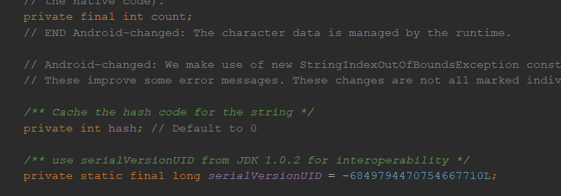

# java常用工具类

## 1，java异常

## 2，java包装类

## 3，java字符串

### 字符串

String 适用于描述字符串对象

#### **字符串的常见方法**

##### 字符串的其他方法1

-  codePointAt:返回从给定位置开始的码点。
-  offsetByCodePoints:返回从startIndex代码点开始，位移cpCount后的码点索引。
-  compareTo:按照字典顺序，如果字符串位于other之前，返回一个负数；如果字符串位于other之后，返回一个正数；如果两个字符串相等，返回0。startsWith,endsWith:如果字符串以suffix开头或结尾，则返回true。
-  int index0f(String str)：返回与字符串str匹配的第一个子串的开始位置，从0开始计算，如果返回-1，表示该str在字符串中不存在，所以，也可以用于判断是否存在于字符串中if(    a.indexOf("H") != -1)
-  int index0f(String str, int fromIndex),返回与字符串str匹配的第一个子串的开始位置，从fromIndex开始计算
-  int index0f(int cp),int index0f(int cp, int fromIndex):

 返回与字符串str或代码点cp匹配的第一个子串的开始位置。这个位置从索引0或fromIndex开始计算。如果在原始串中不存在str，返回-1

- ```
  String a = "Hello";
  System.out.println("charAt:" + a.charAt(2)); //输出：1
  System.out.println("codePointAt:" + a.codePointAt(2)); //输出：108
  System.out.println("offsetByCodePoints:" + a.offsetByCodePoints(2, 1));//输出：3
  System.out.println("compareTo:" + a.compareTo("e"));//输出：-29
  System.out.println("startsWith:" + a.startsWith("H"));//输出true
  System.out.println("endsWith:" + a.endsWith("H"));//输出false
  System.out.println("index0f(String str):" + a.indexOf("H"));//输出0 返回H所在的下标，从0开始计算
  System.out.println("index0f(String str, int fromIndex)" + a.indexOf("e", 2));//输出-1 返回e所在的第一个子串的开始位置从2开始计算
  System.out.println("index0f(int cp):" + a.indexOf(3));//
  System.out.println("index0f(int cp, int fromIndex):" + a.indexOf(1,2));//
  ```

##### 字符串其他方法2

-    equals:判断字符串相等， 不能用==来进行判断是否相等，==只会来判断是否在同一位置上

 * length:返回字符串的长度。

 * codePointCount:返回startIndex和endIndex-1之间的代码点数量。没有配成对的代用字符将计入代码点

 * replace:返回一个新字符串。这个字符串用newString代替原始字符串中所有的oldString

 * substring(int beginIndex):返回下标从beginIndex开始的值，包含该下标

 * substring(int beginIndex, int endIndex)：返回从返回下标从（beginIndex,endIndex]开始的值

 * 注意：substring的工作方式有一个优点：容易计算子串的长度。字符串s.substring（a，b）的长度为b-a。例如，子串“Hel”的长度为3-0=3。

 * toLowerCase:全部转换为小写

 * toUpperCase：全部转换为大写

 * trim:返回一个新字符串。这个字符串将删除了原始字符串头部和尾部的空格

 ```
String a = "Hello";
String b = "Hell";
if (a.equals(b)) {
   System.out.println("true");
} else {
   System.out.println("false");
}
System.out.println("length:" + a.length());//返回5
System.out.println("codePointCount:" + a.codePointCount(1,4));//Hello:返回3
System.out.println("replace:" + a.replace("e","E"));//Hello:返回HEllo
System.out.println("substring(int beginIndex):" + a.substring(1));//Hello:返回ello
System.out.println("substring(int beginIndex, int endIndex):" + a.substring(1,2));//Hello:返回e
System.out.println("toLowerCase():" + a.toLowerCase());//Hello:hello
System.out.println("toUpperCase():" + a.toUpperCase());//Hello:HELLO
System.out.println("trim():" + a.trim());//Hello
 ```

#### 字符串的拼接：+

当一个非字符串拼接一个字符串的时候，后者会被转换为字符串，因此在开发中可以通过拼接来转换字符串。

#### 不可变字符串**

String类没有提供用于修改字符串的方法

注意：String的不可变原因：

查看源码可以看出

String类被final进行修饰，因此不可修改，String的成员变量也是用final进行修饰了




##### 字符串的判空

​    字符串有空串（长度为0的字符串）和null

### 有关面试题


#### 面试题2**==和equals的区别**

==：对比的是**栈**中的值，基本数据类型是变量值，引用数据类型是堆中内存对象的地址

equals：Object中默认也是采用==来进行比较，通常会重写

String

```
public boolean equals(Object anObject) {
    if (this == anObject) {
        return true;
    }
    if (anObject instanceof String) {
        String anotherString = (String)anObject;
        int n = length();
        if (n == anotherString.length()) {
            int i = 0;
            while (n-- != 0) {
                if (charAt(i) != anotherString.charAt(i))
                        return false;
                i++;
            }
            return true;
        }
    }
    return false;
}
```

#### **String，StringBuilder，StringBuffer的区别**


## 4，java集合

## 5，java输入输出流

## 6，网络编程

## 7，多线程

## 8，IO

## 9，注解和反射